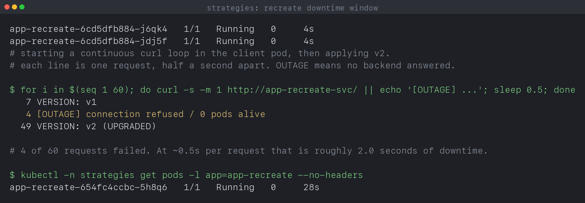
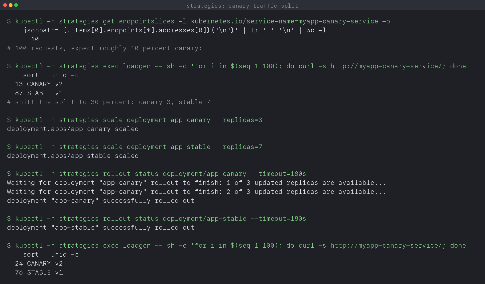

# Kubernetes Pods, ReplicaSets and Deployments

**Name:** Manasvi Sabbarwal
**Roll No:** 24BCS10406
**Cluster:** kind v0.33.0, 3 nodes (1 control-plane + 2 workers), Kubernetes v1.37.0

Covers Lecture 10: the controller chain, every pod lifecycle state, the four
deployment strategies, and the troubleshooting drills.

Every output block is quoted from a log file produced by a script in this
folder, run against a live cluster. Nothing is typed by hand.

| Script | Log | Covers |
|---|---|---|
| [`verify.sh`](verify.sh) | [`output.log`](output.log) | ReplicaSet, Deployment, rolling update, failed rollout, rollback, DaemonSet |
| [`verify-lifecycle.sh`](verify-lifecycle.sh) | [`output-lifecycle.log`](output-lifecycle.log) | all 12 pod lifecycle states and probes |
| [`verify-strategies.sh`](verify-strategies.sh) | [`output-strategies.log`](output-strategies.log) | blue-green, canary, recreate |
| [`verify-extras.sh`](verify-extras.sh) | [`output-extras.log`](output-extras.log) | transient phases, StatefulSet, selector rejection |

The previous lab ([`../01_K8s_Fundamentals`](../01_K8s_Fundamentals)) ended by
deleting a bare pod and watching nothing bring it back. This one starts there.

---

## 1. ReplicaSet: keep N pods alive

```bash
kubectl apply -f manifests/01-replicaset.yaml
kubectl -n workloads get rs web-rs
```

```text
$ kubectl -n workloads get rs web-rs
NAME     DESIRED   CURRENT   READY   AGE
web-rs   3         3         3       8s

$ kubectl -n workloads get pods -l app=web-rs -o wide
NAME           READY   STATUS    RESTARTS   AGE   IP            NODE              NOMINATED NODE   READINESS GATES
web-rs-mp5vp   1/1     Running   0          8s    10.244.1.21   svc-lab-worker    <none>           <none>
web-rs-p75dg   1/1     Running   0          8s    10.244.1.20   svc-lab-worker    <none>           <none>
web-rs-sg498   1/1     Running   0          8s    10.244.2.22   svc-lab-worker2   <none>           <none>
```

Three columns, three different meanings: `DESIRED` is what I asked for,
`CURRENT` is how many pod objects exist, `READY` is how many are passing their
readiness check. When something is wrong these three diverge, and which pair
diverges tells you where the problem is.

Every pod carries an owner reference back to the ReplicaSet:

```text
$ kubectl -n workloads get pods -l app=web-rs -o custom-columns=NAME:.metadata.name,OWNER:.metadata.ownerReferences[0].name,KIND:.metadata.ownerReferences[0].kind
NAME           OWNER    KIND
web-rs-mp5vp   web-rs   ReplicaSet
web-rs-p75dg   web-rs   ReplicaSet
web-rs-sg498   web-rs   ReplicaSet
```

This is not decoration. Garbage collection uses it: delete the ReplicaSet and
the pods go with it, because they are its dependents.

### Deleting a pod now does something different

```text
$ kubectl -n workloads delete pod web-rs-mp5vp
pod "web-rs-mp5vp" deleted from workloads namespace

$ kubectl -n workloads get pods -l app=web-rs
NAME           READY   STATUS    RESTARTS   AGE
web-rs-p75dg   1/1     Running   0          15s
web-rs-jdm4c   1/1     Running   0          15s
web-rs-p8nfg   1/1     Running   0          7s
```

A replacement appeared with a **new name** and an age of 7s. That is the
difference from the container restart in the previous lab: there, the pod
survived and the container inside it restarted. Here the pod is genuinely gone
and a new one was created.

The mechanism is a control loop, not an event handler. The ReplicaSet controller
watches pods matching its selector, counts them, compares to `spec.replicas` and
acts on the difference. Nothing tells it "a pod was deleted". It just notices
that 2 is not 3. That is why it also works after a node dies, or if someone
creates a matching pod by hand, in which case it deletes one.

```text
$ kubectl -n workloads scale rs/web-rs --replicas=5
replicaset.apps/web-rs scaled

$ kubectl -n workloads get rs web-rs
NAME     DESIRED   CURRENT   READY   AGE
web-rs   5         5         5       21s
```

---

## 2. Deployment: a controller over ReplicaSets

A ReplicaSet keeps pods alive but has no idea how to change them. Edit its
template and existing pods are left alone. That is what a Deployment adds.

```text
$ kubectl -n workloads get deployment web
NAME   READY   UP-TO-DATE   AVAILABLE   AGE
web    4/4     4            4           9s

$ kubectl -n workloads get rs -l app=web
NAME             DESIRED   CURRENT   READY   AGE
web-6789f69948   4         4         4       9s
```

I created one Deployment and a ReplicaSet appeared that I never asked for. The
suffix `6789f69948` is a hash of the pod template. That detail is the whole
mechanism, as section 3 shows.

The full ownership chain:

```text
$ kubectl -n workloads get pods -l app=web -o custom-columns=POD:.metadata.name,OWNER:.metadata.ownerReferences[0].name,KIND:.metadata.ownerReferences[0].kind | head -3
POD                    OWNER            KIND
web-6789f69948-mpms7   web-6789f69948   ReplicaSet
web-6789f69948-q6t9p   web-6789f69948   ReplicaSet

$ kubectl -n workloads get rs -l app=web -o custom-columns=RS:.metadata.name,OWNER:.metadata.ownerReferences[0].name,KIND:.metadata.ownerReferences[0].kind
RS               OWNER   KIND
web-6789f69948   web     Deployment
```

```text
Deployment  web
     |  owns
     v
ReplicaSet  web-6789f69948        (name = hash of the pod template)
     |  owns
     v
Pods        web-6789f69948-xxxxx
```

Three objects, three controllers, each one only responsible for the layer below
it. The Deployment controller never touches pods. It only ever scales
ReplicaSets up and down.

---

## 3. Rolling update

```bash
kubectl apply -f manifests/03-deployment-v2.yaml   # nginx:1.27 -> nginx:1.29
kubectl -n workloads rollout status deployment/web
```

```text
$ kubectl -n workloads rollout status deployment/web --timeout=180s
Waiting for deployment "web" rollout to finish: 2 out of 4 new replicas have been updated...
Waiting for deployment "web" rollout to finish: 2 out of 4 new replicas have been updated...
Waiting for deployment "web" rollout to finish: 1 old replicas are pending termination...
Waiting for deployment "web" rollout to finish: 1 old replicas are pending termination...
deployment "web" successfully rolled out
```

```text
$ kubectl -n workloads get rs -l app=web
NAME             DESIRED   CURRENT   READY   AGE
web-66d744c6cf   4         4         4       8s
web-6789f69948   0         0         0       12s
```

**Two ReplicaSets now.** The old one was not deleted, it was scaled to 0. The
new one has a different hash because the pod template changed. A rolling update
is just the Deployment controller moving replicas from one ReplicaSet to the
other, a few at a time, within the bounds of `maxUnavailable` and `maxSurge`.

Caught mid-rollout, one old pod was still alive alongside the new ones:

```text
$ kubectl -n workloads get pods -l app=web -o custom-columns=POD:.metadata.name,IMAGE:.spec.containers[0].image,VERSION:.metadata.labels.version
POD                    IMAGE               VERSION
web-66d744c6cf-8wb52   nginx:1.29-alpine   v2
web-66d744c6cf-c5hlt   nginx:1.29-alpine   v2
web-66d744c6cf-fc2tp   nginx:1.29-alpine   v2
web-66d744c6cf-gfp75   nginx:1.29-alpine   v2
web-6789f69948-s7mw9   nginx:1.27-alpine   v1
```

Both versions serving at once is not a bug, it is what a rolling update *is*.
It is also the thing people forget: during a rollout your API is running two
versions simultaneously, so a schema change has to be compatible with both.

```text
$ kubectl -n workloads rollout history deployment/web
REVISION  CHANGE-CAUSE
1         <none>
2         <none>
```

`CHANGE-CAUSE` is `<none>` because I did not annotate the change. In a real
setup you would set `kubernetes.io/change-cause` so the history is readable.

Keeping the old ReplicaSet around is what makes rollback instant: the object and
its template are still there, so undoing is another scale operation rather than
a rebuild. `revisionHistoryLimit: 5` in the manifest caps how many are kept.

---

## 4. A rollout that fails

Deliberately deploying a tag that does not exist:

```bash
kubectl apply -f manifests/04-deployment-broken.yaml   # nginx:this-tag-does-not-exist
```

```text
$ kubectl -n workloads rollout status deployment/web --timeout=20s || true
Waiting for deployment "web" rollout to finish: 2 out of 4 new replicas have been updated...
error: timed out waiting for the condition

$ kubectl -n workloads get pods -l app=web
NAME                   READY   STATUS             RESTARTS   AGE
web-66d744c6cf-c5hlt   1/1     Running            0          48s
web-66d744c6cf-fc2tp   1/1     Running            0          44s
web-66d744c6cf-gfp75   1/1     Running            0          48s
web-69d9b65857-257p9   0/1     ImagePullBackOff   0          40s
web-69d9b65857-qr9cl   0/1     ErrImagePull       0          40s

$ kubectl -n workloads get deployment web
NAME   READY   UP-TO-DATE   AVAILABLE   AGE
web    3/4     2            3           52s
```

This is the most useful result in this lab. **The app never went down.**

```text
$ kubectl -n workloads get pods -l app=web -o custom-columns=POD:.metadata.name,VERSION:.metadata.labels.version,STATUS:.status.phase,READY:.status.containerStatuses[0].ready
POD                    VERSION     STATUS    READY
web-66d744c6cf-c5hlt   v2          Running   true
web-66d744c6cf-fc2tp   v2          Running   true
web-66d744c6cf-gfp75   v2          Running   true
web-69d9b65857-257p9   v3-broken   Pending   false
web-69d9b65857-qr9cl   v3-broken   Pending   false
```

Three healthy v2 pods still `Running` and `READY=true`, two broken v3 pods stuck
at `Pending`. `maxUnavailable: 1` is what did this: the controller is only
allowed to take down one old pod at a time, and it will not take down the next
one until a replacement becomes Ready. The replacement never becomes Ready, so
the rollout stalls forever rather than proceeding to destroy the working pods.

A stalled rollout is the *safe* failure. If I had set `maxUnavailable: 4`, all
four working pods would have been removed before anyone discovered the image was
wrong.

`ErrImagePull` then `ImagePullBackOff` is the retry sequence: the first pull
fails, then the kubelet backs off exponentially rather than hammering the
registry. Same backoff idea as `CrashLoopBackOff`, different cause.

Note `STATUS: Pending`, not `Failed`. The pod is still waiting to start, since
there is no container to run yet. `kubectl get pods` prints the container's
reason, `.status.phase` prints the pod's, and they are different fields.

---

## 5. Rollback

```bash
kubectl -n workloads rollout undo deployment/web
```

```text
$ kubectl -n workloads rollout undo deployment/web
Warning: resource deployments/web was previously managed with 'kubectl apply'. Rolling back will not update the kubectl.kubernetes.io/last-applied-configuration annotation, which may cause unexpected behavior on future 'kubectl apply' operations. Consider using 'kubectl apply' with your previous configuration file instead.
deployment.apps/web rolled back

$ kubectl -n workloads get pods -l app=web -o custom-columns=POD:.metadata.name,IMAGE:.spec.containers[0].image,VERSION:.metadata.labels.version
POD                    IMAGE               VERSION
web-66d744c6cf-c5hlt   nginx:1.29-alpine   v2
web-66d744c6cf-fc2tp   nginx:1.29-alpine   v2
web-66d744c6cf-gfp75   nginx:1.29-alpine   v2
web-66d744c6cf-z8jzv   nginx:1.29-alpine   v2
```

Back to four v2 pods. Notice the ReplicaSet hash is `66d744c6cf`, the **same**
one from section 3. Nothing was rebuilt. The Deployment scaled the broken
ReplicaSet back to 0 and the old one back to 4. Three of the four pods even kept
their original names and ages, because they were never touched in the first place.

That warning is worth reading rather than ignoring. `rollout undo` changes the
live object but not the `last-applied-configuration` annotation, so the next
`kubectl apply` from your unchanged v3 file would happily redeploy the broken
version. Rollback is an emergency stop, not a fix. The fix is in the file.

```text
$ kubectl -n workloads rollout history deployment/web
REVISION  CHANGE-CAUSE
1         <none>
3         <none>
4         <none>
```

Revision 2 is gone and there is now a 4. Revisions are keyed by pod template:
rolling back to the v2 template re-registered it as the newest revision (4)
rather than keeping its old number. So the numbers are an ordering, not a stable
identifier, and `--to-revision` should be read off a fresh `history` rather than
remembered.

---

## 6. DaemonSet: one pod per node

```text
$ kubectl -n workloads get daemonset node-agent
NAME         DESIRED   CURRENT   READY   UP-TO-DATE   AVAILABLE   NODE SELECTOR   AGE
node-agent   2         2         2       2            2           <none>          1s

$ kubectl -n workloads get pods -l app=node-agent -o custom-columns=POD:.metadata.name,NODE:.spec.nodeName
POD                NODE
node-agent-42w89   svc-lab-worker
node-agent-chbld   svc-lab-worker2

$ kubectl get nodes
NAME                    STATUS   ROLES           AGE   VERSION
svc-lab-control-plane   Ready    control-plane   22m   v1.37.0
svc-lab-worker          Ready    <none>          22m   v1.37.0
svc-lab-worker2         Ready    <none>          22m   v1.37.0
```

`DESIRED 2` with **three** nodes in the cluster. I never specified 2 anywhere.
A DaemonSet has no `replicas` field at all, it derives the count from how many
nodes it is allowed to run on, and the control-plane node's
`node-role.kubernetes.io/control-plane:NoSchedule` taint excludes it. Add a
worker and a third pod appears by itself.

One on each worker, exactly. This is the shape every node level agent uses:
`kube-proxy` and `kindnet` from the previous lab are DaemonSets for this reason,
along with log collectors and monitoring agents.

---

## 7. Transient phases: ContainerCreating to Completed

A short lived batch pod with `restartPolicy: Never`, watched while it ran:

```bash
kubectl -n workloads get pods -w &
kubectl apply -f manifests/hello.yaml
```

```text
$ kubectl -n workloads get pods -w        # streamed while the pod ran
hello-pod              0/1   Pending             0     0s
hello-pod              0/1   Pending             0     0s
hello-pod              0/1   ContainerCreating   0     0s
hello-pod              0/1   ContainerCreating   0     1s
hello-pod              1/1   Running             0     2s
hello-pod              0/1   Completed           0     10s
hello-pod              0/1   Completed           0     11s

$ kubectl -n workloads logs hello-pod
Hello from Kubernetes
batch work done

$ kubectl -n workloads get pod hello-pod -o jsonpath='phase={.status.phase} exitCode={...} reason={...}'
phase=Succeeded exitCode=0 reason=Completed
```

Four states in eleven seconds. `-w` is the only way to see them: a plain
`get pods` a moment later shows just the end state.

`Pending` is before a node is picked. `ContainerCreating` is the kubelet
pulling the image and setting up the network namespace. `Running` is the
process. `Completed` is what `get pods` prints, but the actual **phase** is
`Succeeded`. Those are two different fields, which is worth knowing when you
script against them: `STATUS` in the table mixes the pod phase with the
container's waiting or terminated reason.

`READY` goes back to `0/1` at the end. A finished pod is not ready, and it
still exists and still holds its logs until you delete it. That is deliberate,
it is how you debug a job after the fact.

---

## 8. Every pod lifecycle state, reproduced

Twelve manifests in [`manifests/pod-lifecycle/`](manifests/pod-lifecycle),
each producing one state on purpose. Output from
[`output-lifecycle.log`](output-lifecycle.log), written by
[`verify-lifecycle.sh`](verify-lifecycle.sh).

The summary table at the end of the run, showing every state at once:

```text
$ kubectl -n lifecycle get pods -o custom-columns=NAME:...,PHASE:...,READY:...,RESTARTS:...,REASON:...
NAME                        PHASE       READY    RESTARTS   REASON
lifecycle-crashloop         Running     false    5          <none>
lifecycle-failed            Failed      false    0          <none>
lifecycle-image-error       Pending     false    0          ErrImagePull
lifecycle-init              Running     true     0          <none>
lifecycle-liveness          Running     true     2          <none>
lifecycle-multi-container   Running     true     0          <none>
lifecycle-pending           Pending     <none>   <none>     <none>
lifecycle-readiness         Running     true     0          <none>
lifecycle-running           Running     true     0          <none>
lifecycle-startup           Running     true     0          <none>
lifecycle-succeeded         Succeeded   false    0          <none>
```

Note `lifecycle-image-error` has **phase Pending** even though `get pods`
prints `ImagePullBackOff`. The phase stays Pending because no container ever
started. Again: the STATUS column is not the phase.

### 8.1 Pending: nothing can schedule it

Requesting 900Gi of memory and 200 CPUs:

```text
$ kubectl -n lifecycle get pod lifecycle-pending
NAME                READY   STATUS    RESTARTS   AGE
lifecycle-pending   0/1     Pending   0          8s

$ kubectl -n lifecycle describe pod lifecycle-pending | grep -A6 'Events:'
Events:
  Type     Reason            Age   From               Message
  ----     ------            ----  ----               -------
  Warning  FailedScheduling  9s    default-scheduler  0/3 nodes are available: 1 node(s) had untolerated taint(s), 2 Insufficient cpu, 2 Insufficient memory. preemption: 0/3 nodes are available: 3 Preemption is not helpful for scheduling.
```

That one event line is a complete explanation: of 3 nodes, 1 is excluded by the
control-plane taint and the other 2 do not have the resources. The scheduler
does not give up and it does not partially place the pod, it just keeps
retrying. A pod stuck in Pending is nearly always resources, taints or an
unbound PVC, and `describe` names which.

### 8.2 Succeeded and Failed: the same setup, different exit code

```text
$ kubectl -n lifecycle get pod lifecycle-succeeded
NAME                  READY   STATUS      RESTARTS   AGE
lifecycle-succeeded   0/1     Completed   0          10s
Succeeded exitCode=0

$ kubectl -n lifecycle get pod lifecycle-failed
NAME               READY   STATUS   RESTARTS   AGE
lifecycle-failed   0/1     Error    0          10s
Failed exitCode=1 reason=Error
```

Identical pods, `restartPolicy: Never` on both, the only difference is
`exit 0` versus `exit 1`. That single byte decides `Succeeded` vs `Failed`,
which is exactly how a Job decides whether to retry. Both show `RESTARTS 0`
because `Never` means never.

### 8.3 CrashLoopBackOff: the same failure with restartPolicy Always

```text
$ kubectl -n lifecycle get pod lifecycle-crashloop --no-headers
lifecycle-crashloop   0/1   Error     1 (6s ago)    10s
lifecycle-crashloop   1/1   Running   2 (14s ago)   21s
lifecycle-crashloop   0/1   Error     2 (24s ago)   31s
lifecycle-crashloop   0/1   Error     3 (30s ago)   51s
```

Checked again about five minutes later:

```text
$ kubectl -n lifecycle get pod lifecycle-crashloop --no-headers
lifecycle-crashloop   0/1   CrashLoopBackOff   5 (109s ago)   4m58s

$ kubectl -n lifecycle get pod lifecycle-crashloop -o jsonpath='{...state.waiting.reason}: {...state.waiting.message}'
CrashLoopBackOff: back-off 2m40s restarting failed container=crasher pod=lifecycle-crashloop_lifecycle(...)
```

This took me a second pass to capture properly, and the reason is the
interesting part. Early on the pod flips between `Error` and `Running`, because
the backoff is still short and it keeps getting restarted quickly. Only once
the backoff has grown does the pod spend most of its time **waiting**, and that
waiting state is what is called `CrashLoopBackOff`.

`back-off 2m40s` is the delay itself: 10s, 20s, 40s, 80s, 160s, doubling to a
5 minute cap. So `CrashLoopBackOff` is not a separate kind of failure, it is
the same crash plus a timer. A pod that has been crashlooping for an hour will
take up to 5 minutes to retry after you fix the underlying problem.

The crashed instance's logs need `--previous`, because the current container
is a fresh one:

```text
$ kubectl -n lifecycle logs lifecycle-crashloop --previous
starting up
crashing now
```

That flag is the single most useful thing for debugging a crashloop, since
plain `logs` often returns nothing at all.

### 8.4 ErrImagePull becomes ImagePullBackOff

```text
$ kubectl -n lifecycle get pod lifecycle-image-error      # at 6s
NAME                    READY   STATUS         RESTARTS   AGE
lifecycle-image-error   0/1     ErrImagePull   0          6s

$ kubectl -n lifecycle get pod lifecycle-image-error      # at 27s
NAME                    READY   STATUS             RESTARTS   AGE
lifecycle-image-error   0/1     ImagePullBackOff   0          27s
```

```text
$ kubectl -n lifecycle describe pod lifecycle-image-error | grep -A8 'Events:'
  Normal   Scheduled  27s                default-scheduler  Successfully assigned lifecycle/lifecycle-image-error to svc-lab-worker2
  Normal   BackOff    24s                kubelet            Back-off pulling image "nginx:this-tag-does-not-exist-24bcs10406"
  Warning  Failed     24s                kubelet            Error: ImagePullBackOff
  Normal   Pulling    10s (x2 over 25s)  kubelet            Pulling image "nginx:this-tag-does-not-exist-24bcs10406"
  Warning  Failed     8s (x2 over 24s)   kubelet            Failed to pull image ...: rpc error: code = NotFound desc = failed to resolve reference "docker.io/library/nginx:this-tag-does-not-exist-24bcs10406": not found
  Warning  Failed     8s (x2 over 24s)   kubelet            Error: ErrImagePull
```

`ErrImagePull` is the first attempt failing. `ImagePullBackOff` is the same
backoff timer as above, applied to pulling instead of running. Same pattern,
different subsystem.

The task asks why the API object succeeds while the container fails, and the
answer is visible in the object itself:

```text
$ kubectl -n lifecycle get pod lifecycle-image-error -o jsonpath='{.metadata.uid}'
e858bee5-d599-4cdf-a6cb-a4bb5dadb9f2
```

It has a UID, so it is a real, persisted object in etcd. The API server only
validated the YAML; it never checks that the image exists, because it does not
talk to registries at all. `Scheduled` succeeded too. Everything up to and
including placing the pod on a node worked. The failure happens later, on the
node, when the kubelet asks containerd for an image that is not there. Writing
the desired state and achieving it are separate steps, and only the first is
synchronous.

### 8.5 Readiness: Running is not Ready

The container starts immediately but only creates `/tmp/ready` after 20s:

```text
$ kubectl -n lifecycle get pod lifecycle-readiness ...   # polled every 5s
lifecycle-readiness   Running   false
lifecycle-readiness   Running   false
lifecycle-readiness   Running   false
lifecycle-readiness   Running   false
lifecycle-readiness   Running   true
lifecycle-readiness   Running   true
```

`PHASE` is `Running` the entire time while `READY` is false for the first four
polls. This is the distinction that matters for traffic: a service only sends
requests to pods that are **Ready**, not merely Running. It is why the rolling
updates earlier went one replica at a time, and why an app that needs 30s to
warm a cache should say so with a readiness probe instead of receiving traffic
it cannot serve.

### 8.6 Liveness: the kubelet restarts a hung container

The app deletes its own health file after 15s:

```text
$ kubectl -n lifecycle get pod lifecycle-liveness --no-headers   # polled every 8s
lifecycle-liveness   1/1   Running   0            9s
lifecycle-liveness   1/1   Running   0            25s
lifecycle-liveness   1/1   Running   0            41s
lifecycle-liveness   1/1   Running   0            49s
lifecycle-liveness   1/1   Running   1 (2s ago)   57s
```

```text
$ kubectl -n lifecycle describe pod lifecycle-liveness | grep -A8 'Events:'
  Warning  Unhealthy  32s (x3 over 38s)  kubelet  Liveness probe failed: cat: can't open '/tmp/healthy': No such file or directory
  Normal   Killing    32s                kubelet  Container unhealthy failed liveness probe, will be restarted
```

`RESTARTS` ticked 0 to 1 with nobody touching it. Note `x3 over 38s`: the probe
had to fail three times (`failureThreshold: 3`) before the kubelet acted. A
single failed probe does not kill anything, which is what stops a brief GC
pause from restarting a healthy process.

The difference from readiness in one line: **readiness removes you from the
service, liveness kills you.** Getting them backwards is genuinely dangerous.
A liveness probe that is really a readiness condition (a dependency being
temporarily down, say) turns a small outage into a cluster-wide restart storm,
because every replica fails the probe and gets killed at once.

### 8.7 Startup probe: protecting a slow boot

Deliberately hostile config: liveness with `failureThreshold: 1`, an app that
takes 25s to start.

```text
$ kubectl -n lifecycle get pod lifecycle-startup --no-headers   # polled every 6s
lifecycle-startup   0/1   Running   0   6s
lifecycle-startup   0/1   Running   0   12s
lifecycle-startup   0/1   Running   0   19s
lifecycle-startup   0/1   Running   0   25s
lifecycle-startup   1/1   Running   0   31s
lifecycle-startup   1/1   Running   0   43s
```

**RESTARTS stayed 0.** Without the startup probe that liveness config would
have killed the container at the 3 second mark and then again forever, because
the app cannot possibly answer before 25s. The startup probe suspends liveness
entirely until it first succeeds, so slow boot and hung process stop being the
same thing to the kubelet.

That is the whole reason it exists: before startup probes you had to set a
`initialDelaySeconds` long enough for the worst case boot, which meant a
genuinely hung process went undetected for that same long period. A startup
probe lets you keep liveness aggressive *and* allow a slow start.

### 8.8 Init containers run first, to completion

```text
$ kubectl -n lifecycle get pod lifecycle-init --no-headers
lifecycle-init   0/1   Init:0/1   0   5s
lifecycle-init   0/1   Init:0/1   0   10s
lifecycle-init   1/1   Running    0   15s

$ kubectl -n lifecycle logs lifecycle-init -c setup
init: preparing config
init: done

$ kubectl -n lifecycle logs lifecycle-init -c app
app sees:
ready for app
```

`Init:0/1` is its own status: zero of one init containers finished. The app
container did not exist yet, it was not merely waiting. The app then read a
file the init container wrote into the shared `emptyDir`, which is the usual
pattern: fetch config, run a migration, wait for a dependency, then hand over.

Init containers run **sequentially** and each must exit 0 before the next
starts. If one fails, the pod restarts it and the app never starts, which makes
them a hard gate rather than a best effort.

### 8.9 Multi-container pod: 2/2 and a sidecar

```text
$ kubectl -n lifecycle get pod lifecycle-multi-container
NAME                        READY   STATUS    RESTARTS   AGE
lifecycle-multi-container   2/2     Running   0          13s

$ kubectl -n lifecycle logs lifecycle-multi-container -c sidecar --tail=4
18:36:11 app request 2
18:36:14 app request 3
18:36:17 app request 4
18:36:20 app request 5
```

`READY 2/2` is two containers both passing their checks. The sidecar is
`tail -f` on a file the app writes to a shared volume, so it is reading the
app's output live. That is the log shipper pattern in miniature (Fluentd,
Filebeat), and the same shape as a service mesh proxy.

`-c <container>` stops being optional here. Without it `logs` picks the first
container and you can spend a while confused about why you are seeing the
wrong output.

### 8.10 Graceful termination

The container traps SIGTERM and drains for 10s:

```text
$ kubectl -n lifecycle logs -f lifecycle-termination   # streamed during the delete
app started
caught SIGTERM, draining for 10s
clean exit

# the delete took 11 seconds: the 10s drain, then exit
```

Deleting was not instant. Kubernetes sent SIGTERM, the app caught it, finished
its work and exited on its own, and only then did the pod disappear.
`terminationGracePeriodSeconds: 30` is the deadline, not a wait: the pod went
as soon as the process exited at ~10s.

If the process had ignored SIGTERM it would have been SIGKILLed at 30s with no
chance to clean up. This is what "graceful shutdown" actually means in
practice: finish in-flight requests, close connections, then exit. The pod is
also removed from service endpoints at the same moment SIGTERM is sent, so the
drain window is for requests already in progress.

---

## 9. StatefulSet: identity that survives deletion

```text
$ kubectl -n workloads get pods -l app=mysql --no-headers     # polled every 20s
mysql-0   0/1   Running   0     20s
mysql-0   1/1   Running   0     41s
mysql-1   0/1   Pending   0     2s
mysql-0   1/1   Running   0     61s
mysql-1   0/1   Running   0     22s
mysql-0   1/1   Running   0     81s
mysql-1   1/1   Running   0     42s
mysql-2   0/1   Running   0     4s
```

Read the ages down the column: `mysql-1` only appears once `mysql-0` is
`1/1`, and `mysql-2` only once `mysql-1` is `1/1`. **Strictly sequential**, and
gated on Ready, not merely created. A Deployment starts all its replicas at
once; this one waits. For a database that is the point, because
`mysql-1` may need `mysql-0` to be up to join it.

```text
$ kubectl -n workloads get pvc -l app=mysql
NAME           STATUS   VOLUME                                     CAPACITY   ACCESS MODES   STORAGECLASS   AGE
data-mysql-0   Bound    pvc-84e633f4-14a9-41e4-8872-b56da3c74f6f   1Gi        RWO            standard       2m2s
data-mysql-1   Bound    pvc-ec2850e7-484c-44fa-becf-1c34eb9f4e81   1Gi        RWO            standard       83s
data-mysql-2   Bound    pvc-26519e56-81d5-4a53-8941-f893c3d9e354   1Gi        RWO            standard       45s
```

One PVC per pod, named `<claimTemplate>-<pod>`, created automatically from
`volumeClaimTemplates`. Not one shared disk: three separate disks, because each
replica has its own data.

### The identity drill

```text
$ kubectl -n workloads get pod mysql-1 -o jsonpath='...'
before: name=mysql-1 uid=ad5bf167-2fbe-434c-97d6-be6d227e6306 node=svc-lab-worker

$ kubectl -n workloads delete pod mysql-1
pod "mysql-1" deleted from workloads namespace

after:  name=mysql-1 uid=49c8ceff-3681-47d9-b27d-82dea6de7771 node=svc-lab-worker

$ kubectl -n workloads get pvc data-mysql-1
NAME           STATUS   VOLUME                                     CAPACITY   AGE
data-mysql-1   Bound    pvc-ec2850e7-484c-44fa-becf-1c34eb9f4e81   1Gi        110s
```

Three things to read carefully. The **name is identical**: `mysql-1`, not a new
random suffix. The **UID is different**, so it genuinely is a new pod object,
not a restarted container. And the **PVC volume is the same**
`pvc-ec2850e7...`, with an age that predates the deletion, so the new pod
reattached the existing disk rather than getting a blank one.

Stable name plus stable storage is the entire contract of a StatefulSet. The
name is stable because the headless service gives each pod a DNS record derived
from it, so peers can find `mysql-1` again after it moves.

Contrast with the Deployment in the same namespace:

```text
$ kubectl -n workloads delete pod web-66d744c6cf-c5hlt
pod "web-66d744c6cf-c5hlt" deleted from workloads namespace

$ kubectl -n workloads get pods -l app=web --no-headers
web-66d744c6cf-8b5h9   1/1   Running   0     13s      <- new random name
web-66d744c6cf-fc2tp   1/1   Running   0     47m
web-66d744c6cf-gfp75   1/1   Running   0     47m
web-66d744c6cf-z8jzv   1/1   Running   0     47m
```

`c5hlt` is gone and `8b5h9` exists instead. The Deployment does not care which
pods they are, only that there are four. That is correct for something
stateless and completely wrong for a database, which is why the two controllers
both exist.

---

## 10. Blue-Green: two environments, one selector

Both environments deployed at once, six pods:

```text
$ kubectl -n strategies get pods -l app=myapp --show-labels --no-headers | sort
app-blue-78cf4f4c5b-2fxsz   1/1   Running   0   12s   app=myapp,...,slot=blue,version=v1
app-blue-78cf4f4c5b-9pmjr   1/1   Running   0   12s   app=myapp,...,slot=blue,version=v1
app-blue-78cf4f4c5b-tm62j   1/1   Running   0   12s   app=myapp,...,slot=blue,version=v1
app-green-c7cdd85d4-bwz6m   1/1   Running   0   12s   app=myapp,...,slot=green,version=v2
app-green-c7cdd85d4-v6v9z   1/1   Running   0   12s   app=myapp,...,slot=green,version=v2
app-green-c7cdd85d4-xt2zz   1/1   Running   0   12s   app=myapp,...,slot=green,version=v2
```

The service selects `slot: blue`:

```text
$ kubectl -n strategies describe svc myapp-service | grep -E 'Selector|Endpoints'
Selector:   app=myapp,slot=blue
Endpoints:  10.244.2.43:5678,10.244.1.41:5678,10.244.1.39:5678

$ ... for i in 1..6; do curl -s http://myapp-service/; done | sort | uniq -c
   6 BLUE ENVIRONMENT v1
```

The cutover, which is a one line selector change:

```text
$ kubectl apply -f manifests/strategies/bg-service-green.yaml
service/myapp-service configured

$ kubectl -n strategies describe svc myapp-service | grep -E 'Selector|Endpoints'
Selector:   app=myapp,slot=green
Endpoints:  10.244.1.38:5678,10.244.2.44:5678,10.244.1.40:5678

$ ... for i in 1..6; do curl -s http://myapp-service/; done | sort | uniq -c
   6 GREEN ENVIRONMENT v2
```

And the rollback:

```text
$ kubectl apply -f manifests/strategies/bg-service-blue.yaml
   6 BLUE ENVIRONMENT v1
```

**6/6 blue, then 6/6 green, then 6/6 blue.** Never a mixed response. Compare
that with the rolling update in section 3, where both versions served traffic
simultaneously for most of a minute. That is the defining difference: a rolling
update is gradual by design, blue-green is atomic by design.

What actually changed is just the endpoint list. The green pods were already
running and already passing readiness before any traffic moved, so the switch
is only kube-proxy repointing rules. Rollback is the same operation in reverse
and just as fast, which is the real selling point: your rollback path is the
thing you already tested.

The cost is in the pod list above. Six pods for a three pod app, so **double the
compute** for the whole window. And anything with shared state, a database
especially, still has to be compatible with both versions, since the switch is
instant but the data is not.

---

## 11. Canary: the pod ratio is the traffic split

One service whose selector (`app: myapp-canary`) matches **both** deployments,
so both tracks land in the same endpoint list.

```text
$ kubectl -n strategies get deploy app-stable app-canary
NAME         READY   UP-TO-DATE   AVAILABLE   AGE
app-stable   9/9     9            9           4s
app-canary   1/1     1            1           2s

$ kubectl -n strategies get endpointslices ... | wc -l
      10
```

100 requests at 9:1:

```text
$ ... for i in $(seq 1 100); do curl -s http://myapp-canary-service/; done | sort | uniq -c
  13 CANARY v2
  87 STABLE v1
```

Shifted to 3:7:

```text
  24 CANARY v2
  76 STABLE v1
```

Canary aborted, scaled to 0:

```text
$ ... for i in $(seq 1 20); do ... done | sort | uniq -c
  20 STABLE v1
```

13% where 10% was intended, and 24% where 30% was intended. The split is
**statistical, not enforced**, for the same reason as the load balancing in the
services lab: kube-proxy picks a backend at random per connection. Over 100
requests you get noise of a few percent in either direction.

That is the honest limitation of pod-ratio canarying. To send exactly 10%, or
to route by user ID, header or cookie, you need something reading the request:
an ingress controller with canary annotations, or a service mesh. Pod ratio
also means fine grained splits get expensive, because 1% needs 99 stable pods.

The abort is the good part: scaling the canary to 0 removes its IPs from the
endpoint list and traffic is 100% stable again within seconds, with no rollout
and no image pull. Deploy risk is bounded by the fraction of pods you gave it.

---

## 12. Recreate: measured downtime

`strategy.type: Recreate` with a curl loop running through the switch, one
request every 0.5s:

```text
$ for i in $(seq 1 60); do curl -s -m 1 http://app-recreate-svc/ || echo '[OUTAGE] ...'; sleep 0.5; done
   7 VERSION: v1
   4 [OUTAGE] connection refused / 0 pods alive
  49 VERSION: v2 (UPGRADED)

# 4 of 60 requests failed. At ~0.5s per request that is roughly 2.0 seconds of downtime.
```

The consecutive run of failures between the last v1 and the first v2 is the
whole point of this strategy, and it is real: about **2 seconds where the
service had no backends at all**. `uniq -c` collapses them into one line
precisely because they were consecutive.

The service and its ClusterIP existed the entire time. The DNS name resolved
the entire time. There were simply no endpoints, so connections were refused,
which is exactly the empty-endpoints failure from the services lab, briefly and
on purpose.

Two seconds is small here because http-echo starts instantly. A JVM app taking
40s to boot would give you 40s of hard downtime, because Recreate tears down
everything before starting anything.

Why use it at all: when two versions genuinely cannot coexist. An incompatible
schema migration, or a single-writer lock on a volume that a second pod cannot
take. In those cases a rolling update would corrupt something, and a short
controlled outage is the safer trade.

```text
$ kubectl -n strategies rollout undo deployment/app-recreate
$ kubectl -n strategies exec loadgen -- curl -s http://app-recreate-svc/
VERSION: v1
```

Rollback works normally, and takes the same outage again on the way back.

---

## 13. Immutable selectors

The API server rejecting a template that does not match its own selector:

```text
$ kubectl apply -f manifests/07-selector-mismatch.yaml
The Deployment "selector-error-demo" is invalid: spec.template.metadata.labels: Invalid value: {"app":"backend"}: `selector` does not match template `labels`
```

Nothing was created. This is admission time validation, so unlike the bad image
tag in section 4 the object never reaches etcd at all. The reason the rule
exists: a Deployment finds its own pods by selector, so a selector that does not
match its template would create pods it could not then see, and it would keep
creating more forever.

The fix is to make them agree, after which it deploys normally:

```text
$ kubectl apply -f manifests/08-selector-fixed.yaml
deployment.apps/selector-error-demo created

$ kubectl -n workloads get pods -l app=frontend --no-headers
selector-error-demo-9897f8555-nxl89   1/1   Running   0   1s
selector-error-demo-9897f8555-t2vgq   1/1   Running   0   1s
```

And trying to change the selector on the live object gives a second, different
error:

```text
$ kubectl -n workloads patch deployment selector-error-demo --type merge -p '{"spec":{"selector":{"matchLabels":{"app":"changed"}}}}'
The Deployment "selector-error-demo" is invalid: 
* spec.template.metadata.labels: Invalid value: {"app":"frontend"}: `selector` does not match template `labels`
* spec.selector: Invalid value: {"matchLabels":{"app":"changed"}}: field is immutable
```

`field is immutable`. The selector cannot be changed after creation, at all,
even to a valid value. It is how the Deployment identifies the pods it already
owns, so changing it would orphan every running pod. In practice: if you need a
different selector, you delete and recreate the Deployment, which means
planning for it rather than discovering it during an incident.

---

## 14. The concepts behind all of this

### 14.1 The four ports

```text
Client ──► nodePort 30080        on every node's IP, range 30000-32767
              │
              ▼
           port 80               the Service's own port, on the ClusterIP
              │
              ▼
           targetPort 8080       the port on the pod the Service forwards to
              │
              ▼
           containerPort 8080    what the process actually listens on
```

| Field | Lives on | Who reads it | Required |
|---|---|---|---|
| `containerPort` | Pod spec | documentation, and gives the port a name | no, purely informational |
| `targetPort` | Service | kube-proxy, to pick the pod side port | defaults to `port` |
| `port` | Service | clients inside the cluster | yes |
| `nodePort` | Service (NodePort/LoadBalancer) | external clients | no, auto-assigned |

The one that surprises people is `containerPort`: it opens nothing. A container
listening on 8080 is reachable on 8080 whether or not you declare it. Declaring
it is worth doing anyway, because a **named** port lets `targetPort: http`
follow the container if the number changes, which is what the services lab used.

`targetPort` must match what the process actually listens on. Getting it wrong
gives endpoints that exist but connections that hang or refuse, and that is the
single most common "my service does not work" cause after selector typos.

### 14.2 Labels and selectors

A **label** is a key/value pair on an object. A **selector** is a query over
labels. Labels are the data, selectors are the question.

```yaml
# label, on the pod
metadata:
  labels:
    app: hello-api
    tier: backend

# selector, on the service or controller
selector:
  app: hello-api          # matches the pod above
```

A selector must be a **subset** of the pod's labels, not an exact match. The
pods in the services lab carried `app`, `tier` and `pod-template-hash` while the
service selected only on `app`, and that is why it worked. This is also how
canarying worked in section 11: two deployments with different `track` labels,
one service selecting only the label they share.

Nothing links a service to a deployment except labels. There is no reference by
name and no foreign key, which is why a typo produces an empty endpoint list
with no error.

### 14.3 The four strategies

| Strategy | Downtime | Extra capacity | Both versions live | Rollback speed |
|---|---|---|---|---|
| RollingUpdate | none | `maxSurge` worth | yes, during the roll | one rollout |
| Recreate | yes, measured at ~2s here | none | never | one rollout, with the same outage |
| Blue-Green | none | 100%, double the pods | never, the switch is atomic | instant, a selector flip |
| Canary | none | one canary's worth | yes, deliberately and for as long as you like | instant, scale canary to 0 |

Demonstrated in sections 3, 12, 10 and 11 respectively.

### 14.4 maxSurge and maxUnavailable

For `replicas: 4`:

| Setting | Max pods during rollout | Min available | Behaviour |
|---|---|---|---|
| `maxSurge: 1, maxUnavailable: 0` | 5 | 4 | full capacity throughout, needs room for a 5th pod |
| `maxSurge: 1, maxUnavailable: 1` | 5 | 3 | what this lab used, faster, dips to 75% capacity |
| `maxSurge: 0, maxUnavailable: 1` | 4 | 3 | no extra pods, useful when quota is tight |
| `maxSurge: 0, maxUnavailable: 0` | invalid | invalid | rejected, nothing could ever change |

Percentages round in opposite directions on purpose: `maxSurge` rounds **up**
and `maxUnavailable` rounds **down**, so 25% of 4 replicas is a surge of 1 and
an unavailable of 1. Both round in the direction that favours availability.

`maxUnavailable: 0` is the setting that makes the failed rollout in section 4
completely harmless: the controller may not remove a single working pod until a
new one is Ready, so a broken image means nothing happens at all.

### 14.5 Requests, limits, and the units

**Request** is what the scheduler uses to place the pod, and is reserved for it.
**Limit** is the ceiling the kernel enforces at runtime. The Pending pod in
section 8.1 was a request failure: nothing to do with real usage, purely that
no node had 900Gi to promise.

The two resources behave differently when exceeded:

| | Over the limit | Result |
|---|---|---|
| CPU | throttled by cgroups | slow, survives |
| Memory | OOMKilled | container dies, restart counter increments |

CPU is compressible, memory is not. You cannot give a process 0.5 of the byte it
just asked for, so the kernel kills it.

Units:

- **CPU**: `1` = one core. `500m` = 0.5 of a core. `m` is millicores.
- **Memory**: `1G` = 10^9 bytes (decimal). `1Gi` = 2^30 = 1,073,741,824 bytes
  (binary). Same for `M` and `Mi`.

`Gi` and `Mi` are the ones to use, because that is what `free`, `top` and the
OOM killer work in. The gap is about 7% at gigabyte scale, which is enough to
make a container that looks correctly sized get OOMKilled under load.

---

## 15. Screenshots

Terminal captures of the runs above, taken from the log files in this folder.

| # | What it shows | Capture |
|---|---|---|
| 01 | `ContainerCreating` to `Running` to `Completed`, watched live | [k10-01-transient-phases.png](screenshots/k10-01-transient-phases.png) |
| 02 | `Pending` with the `FailedScheduling` event | [k10-02-pending.png](screenshots/k10-02-pending.png) |
| 03 | `Succeeded` vs `Failed`, same pod, different exit code | [k10-03-succeeded-failed.png](screenshots/k10-03-succeeded-failed.png) |
| 04 | `CrashLoopBackOff` with the backoff timer, and `logs --previous` | [k10-04-crashloopbackoff.png](screenshots/k10-04-crashloopbackoff.png) |
| 05 | `ErrImagePull` becoming `ImagePullBackOff` | [k10-05-imagepullbackoff.png](screenshots/k10-05-imagepullbackoff.png) |
| 06 | Readiness: `Running` while `READY` is false | [k10-06-readiness.png](screenshots/k10-06-readiness.png) |
| 07 | Liveness restarting a container, `RESTARTS` 0 to 1 | [k10-07-liveness.png](screenshots/k10-07-liveness.png) |
| 08 | Startup probe holding liveness off, 0 restarts | [k10-08-startup.png](screenshots/k10-08-startup.png) |
| 09 | `Init:0/1` and the init container's handover | [k10-09-init-container.png](screenshots/k10-09-init-container.png) |
| 10 | `2/2` multi container pod and the sidecar's log | [k10-10-multi-container.png](screenshots/k10-10-multi-container.png) |
| 11 | SIGTERM trap draining before exit | [k10-11-graceful-termination.png](screenshots/k10-11-graceful-termination.png) |
| 12 | Every lifecycle state in one table | [k10-12-all-states.png](screenshots/k10-12-all-states.png) |
| 13 | Blue-green cutover and rollback | [k10-13-blue-green-cutover.png](screenshots/k10-13-blue-green-cutover.png) |
| 14 | Canary split at 9:1 then 3:7 | [k10-14-canary-split.png](screenshots/k10-14-canary-split.png) |
| 15 | Recreate downtime window | [k10-15-recreate-outage.png](screenshots/k10-15-recreate-outage.png) |
| 16 | StatefulSet ordinals and per pod PVCs | [k10-16-statefulset-ordinals.png](screenshots/k10-16-statefulset-ordinals.png) |
| 17 | Identity drill: StatefulSet vs Deployment | [k10-17-identity-drill.png](screenshots/k10-17-identity-drill.png) |
| 18 | Immutable selector rejection | [k10-18-selector-mismatch.png](screenshots/k10-18-selector-mismatch.png) |





---

## 16. Which controller for which job

| Object | Guarantee | Pod identity | Use it for |
|---|---|---|---|
| bare Pod | none, gone when deleted | n/a | debugging only |
| ReplicaSet | N pods exist | interchangeable | almost never directly |
| Deployment | N pods, plus versioned rollouts and rollback | interchangeable | stateless apps, the default |
| DaemonSet | one pod per eligible node | tied to a node | node agents, log shippers, CNI |
| StatefulSet | ordered, stable names and storage | stable (`pod-0`, `pod-1`) | databases, anything with per-pod state |

You almost never write a ReplicaSet by hand. It is worth doing once to see that
a Deployment is not magic: it is a thing that creates ReplicaSets.

---

## 17. What I took away

- The controllers are level triggered loops, comparing desired to actual. They
  do not react to events, which is why they recover from situations nobody
  anticipated.
- A container restart keeps the pod, its name and its IP. A ReplicaSet
  replacement creates a new pod with a new name. Different failure, different
  blast radius.
- The ReplicaSet name is a hash of the pod template, so changing the template
  creates a new ReplicaSet and keeps the old one. That single fact explains
  rolling updates, rollback and revision history.
- `maxUnavailable` is what makes a bad rollout stall instead of causing an
  outage. A stuck rollout is the system protecting you.
- `rollout undo` fixes the cluster, not your YAML. The next `apply` will
  redeploy the bad version if you have not changed the file.
- A DaemonSet's replica count comes from the nodes and their taints, so
  "DESIRED 2" on a 3 node cluster is correct, not a bug.
- The `STATUS` column is not the pod phase. `ImagePullBackOff` shows in STATUS
  while the phase is still `Pending`, and `Completed` shows while the phase is
  `Succeeded`.
- `CrashLoopBackOff` is not a distinct failure, it is a crash plus a growing
  timer. It only appears once the backoff is long enough that the pod is mostly
  waiting, and `logs --previous` is the way to see why.
- Readiness removes a pod from a service. Liveness kills it. A liveness probe
  used where readiness belongs turns a dependency blip into a restart storm.
- A startup probe lets you keep liveness aggressive and still allow a slow boot,
  which were mutually exclusive before it existed.
- StatefulSet identity is the name plus the PVC, not the pod. Deleting
  `mysql-1` gave a new UID with the same name and the same disk.
- A rolling update overlaps versions on purpose, blue-green never does, and
  canary does for as long as you choose. Pick by whether your versions can
  coexist.
- Pod-ratio canary splits are statistical: 9:1 measured 13%, 3:7 measured 24%.
  Precise splits need a proxy that reads the request.
- `Recreate` downtime is real and measurable: 4 consecutive failed requests,
  about 2 seconds, with the service and DNS both still fine.
- A Deployment's selector is immutable, and the template must match it at
  admission time. Neither error can be worked around, only planned for.

---

## 18. Reproducing this

```bash
kind create cluster --name svc-lab --config ../cluster/kind-cluster.yaml
cd 02_K8s_Pods_ReplicaSets_Deployments
chmod +x verify.sh verify-lifecycle.sh verify-strategies.sh verify-extras.sh
./verify.sh             # controllers, rollouts, rollback, daemonset
./verify-lifecycle.sh   # the 12 lifecycle states, takes a few minutes
./verify-strategies.sh  # blue-green, canary, recreate
./verify-extras.sh      # transient phases, statefulset, selector rejection
```

`verify-lifecycle.sh` is the slow one: CrashLoopBackOff has to be given time to
back off far enough to show that status, and several probes are on timers.
`verify-extras.sh` pulls the MySQL image, so the first run takes longer.

## 19. Cleanup

```bash
kubectl delete namespace workloads lifecycle strategies
```

Deleting the `workloads` namespace also removes the StatefulSet's
PersistentVolumeClaims. Those are **not** removed by deleting the StatefulSet
alone, which is deliberate: the whole point of the claims is that they outlive
the pods, so Kubernetes will not throw your data away as a side effect.

```bash
kubectl -n workloads get pvc     # check before deleting the namespace
```
