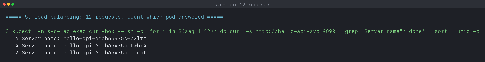
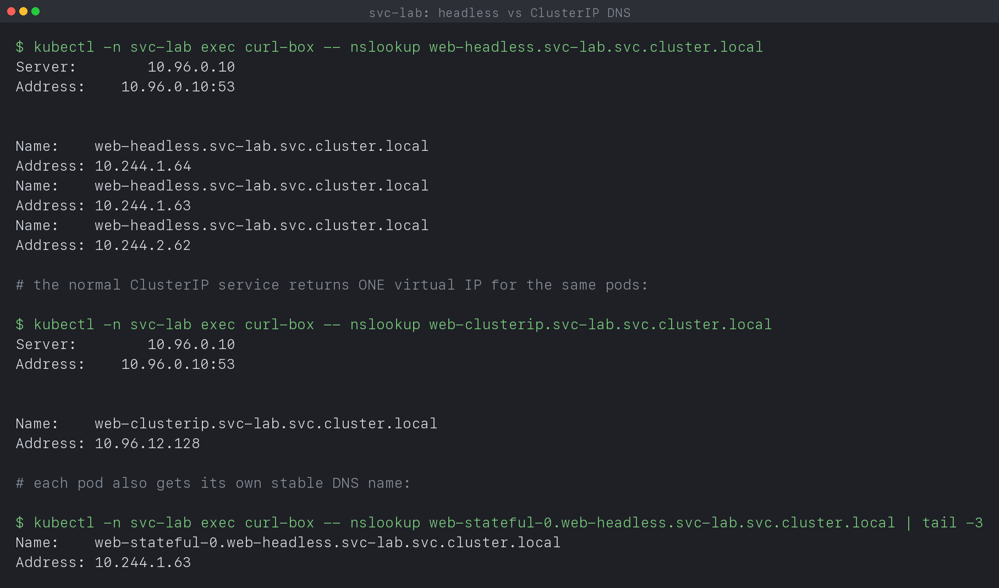

# Kubernetes Networking and Services

**Name:** Manasvi Sabbarwal
**Roll No:** 24BCS10406
**Cluster used:** kind v0.33.0, 3 nodes (1 control-plane + 2 workers), Kubernetes v1.37.0

This is the ClusterIP exercise from the class repo:
[session-11-kubernetes-services/01-clusterip](https://github.com/Nency-Ravaliya/devops-heros/tree/main/session-11-kubernetes-services/01-clusterip).

I wrote my own manifests instead of just applying the class ones. The reason is
that the class version uses a plain nginx image, and every nginx pod returns the
exact same welcome page, so you cannot actually see the service picking a
different pod each time. I wanted the output to prove the load balancing, not
just claim it.

What I changed and why:

| Change | Reason |
|---|---|
| Used `nginxdemos/nginx-hello:plain-text` as the backend | It prints the pod name and pod IP in the response body, so you can see which pod answered. |
| Put everything in a `svc-lab` namespace instead of `default` | Makes the FQDN `<service>.<namespace>.svc.cluster.local` actually mean something, and lets me test what a client in a different namespace sees. |
| Service port 9090, container port 8080, `targetPort` set to the named port `http` | Three different numbers, so it is obvious which field is which. Using the port name also means the service keeps working if I change the container port later. |
| Added a readiness probe to the deployment | A pod joins the service endpoints only when it is Ready, not when it is merely Running. Wanted to see that. |
| Ran it on a 2-worker cluster instead of a single node | The three backend pods get spread over both workers, so the service traffic really does cross a node boundary. |

Covers Lecture 11: all five service types, DNS and endpoints. Every output
block is quoted from a log file in this folder, produced by a script here and
run against a live cluster. Nothing is typed by hand.

| Script | Log | Covers |
|---|---|---|
| [`verify.sh`](verify.sh) | [`output.log`](output.log) | ClusterIP in depth, DNS, endpoints, load balancing, failure modes |
| [`verify-service-types.sh`](verify-service-types.sh) | [`output-service-types.log`](output-service-types.log) | NodePort, LoadBalancer, ExternalName, headless, no-selector |

---

## 1. Why services exist

Pods die. When a pod is rescheduled or restarted it comes back with a different
IP, so nothing can hardcode a pod IP. A ClusterIP service gives you a fixed
virtual IP and a fixed DNS name that sits in front of whichever pods currently
match its label selector.

```text
      curl-box pod
           |
   http://hello-api-svc:9090        (name never changes)
           |
           v
  +--------------------------+
  |  Service (ClusterIP)     |   virtual IP, handled by kube-proxy
  |  10.96.214.58 : 9090     |   (iptables / ipvs rules on every node)
  +--------------------------+
           |
  selector: app=hello-api  ->  EndpointSlice = list of Ready pod IPs
           |
   +-------+-------+-------+
   v               v       v
 pod:8080      pod:8080  pod:8080
```

One thing that confused me at first: the ClusterIP is not assigned to any
network interface anywhere. Nothing is listening on it. kube-proxy writes rules
on every node that rewrite packets headed for `10.96.214.58:9090` so they go to
one of the pod IPs on port 8080 instead. That is why the ClusterIP only works
inside the cluster. From my laptop it is just a random unroutable address, and
section 8 shows exactly that.

Where this is used in real setups: service to service calls (orders calling
payments), databases and caches running inside the cluster that should never be
public, internal metrics and logging endpoints, and as the backend that an
Ingress controller forwards traffic to.

---

## 2. Files

```text
01_K8s_Services/
├── README.md                     this file
├── verify.sh                     runs every check and writes output.log
├── output.log                    the raw terminal output, unedited
├── manifests/
│   └── 01-clusterip/
│       ├── 00-namespace.yaml
│       ├── 01-deployment.yaml
│       ├── 02-service.yaml
│       └── 03-client-pod.yaml
└── screenshots/                  terminal captures
```

| File | What it creates |
|---|---|
| [`00-namespace.yaml`](manifests/01-clusterip/00-namespace.yaml) | Namespace `svc-lab` |
| [`01-deployment.yaml`](manifests/01-clusterip/01-deployment.yaml) | Deployment `hello-api`, 3 replicas, label `app: hello-api`, container port 8080 |
| [`02-service.yaml`](manifests/01-clusterip/02-service.yaml) | Service `hello-api-svc`, type ClusterIP, 9090 to http (8080) |
| [`03-client-pod.yaml`](manifests/01-clusterip/03-client-pod.yaml) | Pod `curl-box`, a client inside the cluster to test from |
| [`verify.sh`](verify.sh) | Runs the ClusterIP checks and saves the raw output to `output.log` |
| [`02-nodeport/service.yaml`](manifests/02-nodeport/service.yaml) | NodePort service on 30080 |
| [`03-loadbalancer/service.yaml`](manifests/03-loadbalancer/service.yaml) | LoadBalancer service, stays `<pending>` locally |
| [`04-externalname/service.yaml`](manifests/04-externalname/service.yaml) | Two ExternalName CNAME aliases |
| [`05-headless/statefulset.yaml`](manifests/05-headless/statefulset.yaml) | Headless service plus a StatefulSet, and a ClusterIP over the same pods |
| [`06-no-selector/service.yaml`](manifests/06-no-selector/service.yaml) | A service with no selector and a hand written EndpointSlice |
| [`verify-service-types.sh`](verify-service-types.sh) | Runs all of the above into `output-service-types.log` |

The two fields that have to match, otherwise none of this works:

```yaml
# 01-deployment.yaml            # 02-service.yaml
template:                     spec:
  metadata:                     selector:
    labels:                       app: hello-api   # must match
      app: hello-api   # <----------------------------'
```

Checked on the running cluster, the pod labels and the service selector do line
up. This check and the `port-forward` one in section 8 were added to
`verify.sh` after the first run and captured a minute later against the same
cluster, so the pod names here are the replacements from section 7, not the
ones in section 3:

```text
$ kubectl -n svc-lab get pods --show-labels
NAME                         READY   STATUS    RESTARTS   AGE    LABELS
curl-box                     1/1     Running   0          100s   app=curl-box,tier=client
hello-api-6ddb65475c-c2hlm   1/1     Running   0          70s    app=hello-api,pod-template-hash=6ddb65475c,tier=backend
hello-api-6ddb65475c-j2vds   1/1     Running   0          70s    app=hello-api,pod-template-hash=6ddb65475c,tier=backend
hello-api-6ddb65475c-tl64v   1/1     Running   0          70s    app=hello-api,pod-template-hash=6ddb65475c,tier=backend

$ kubectl -n svc-lab get svc hello-api-svc -o jsonpath="{.spec.selector}"
{"app":"hello-api"}
```

Note the selector is only `app: hello-api`. The pods also carry `tier: backend`
and a `pod-template-hash`, and that is fine: a selector has to be a subset of
the pod labels, not an exact match. The `curl-box` pod has `app=curl-box` so it
is not picked up, which is what I wanted, the client should not be a backend of
the service it is calling.

If the labels do not match, Kubernetes still creates the service without
complaining. It just ends up with zero endpoints. That is the most common reason
a service "does not work".

---

## 3. Deploying it

```bash
kubectl apply -f manifests/01-clusterip/00-namespace.yaml
kubectl apply -f manifests/01-clusterip/
kubectl -n svc-lab rollout status deployment/hello-api
```

```text
$ kubectl apply -f manifests/01-clusterip/00-namespace.yaml
namespace/svc-lab created

$ kubectl apply -f manifests/01-clusterip/
namespace/svc-lab unchanged
deployment.apps/hello-api created
service/hello-api-svc created
pod/curl-box created

$ kubectl -n svc-lab rollout status deployment/hello-api --timeout=180s
Waiting for deployment "hello-api" rollout to finish: 0 of 3 updated replicas are available...
Waiting for deployment "hello-api" rollout to finish: 1 of 3 updated replicas are available...
Waiting for deployment "hello-api" rollout to finish: 2 of 3 updated replicas are available...
deployment "hello-api" successfully rolled out

$ kubectl -n svc-lab wait --for=condition=Ready pod/curl-box --timeout=180s
pod/curl-box condition met
```

The namespace gets applied on its own first. If you only run the second command
on a fresh cluster it is a race: `kubectl` can try to create the deployment in a
namespace that does not exist yet and the apply fails. Applying the namespace
first makes the second apply report `namespace/svc-lab unchanged`, which is the
harmless case.

The replicas going available one at a time is the readiness probe doing its job.
The pods were Running almost immediately, but each one only counts as available
once its first probe succeeds.

### Checking what got created

```bash
kubectl -n svc-lab get pods -o wide
kubectl -n svc-lab get svc hello-api-svc
kubectl -n svc-lab get endpointslices -l kubernetes.io/service-name=hello-api-svc
```

```text
$ kubectl -n svc-lab get pods -o wide
NAME                         READY   STATUS    RESTARTS   AGE   IP           NODE              NOMINATED NODE   READINESS GATES
curl-box                     1/1     Running   0          14s   10.244.1.2   svc-lab-worker    <none>           <none>
hello-api-6ddb65475c-b2ltm   1/1     Running   0          14s   10.244.2.3   svc-lab-worker2   <none>           <none>
hello-api-6ddb65475c-fwbx4   1/1     Running   0          14s   10.244.1.3   svc-lab-worker    <none>           <none>
hello-api-6ddb65475c-tdqpf   1/1     Running   0          14s   10.244.2.2   svc-lab-worker2   <none>           <none>

$ kubectl -n svc-lab get svc hello-api-svc
NAME            TYPE        CLUSTER-IP     EXTERNAL-IP   PORT(S)    AGE
hello-api-svc   ClusterIP   10.96.214.58   <none>        9090/TCP   14s

$ kubectl -n svc-lab get endpointslices -l kubernetes.io/service-name=hello-api-svc
NAME                  ADDRESSTYPE   PORTS   ENDPOINTS                          AGE
hello-api-svc-n595n   IPv4          8080    10.244.2.3,10.244.1.3,10.244.2.2   15s
```

Things to notice in this output:

- `EXTERNAL-IP` is `<none>`, so the service is internal only. That single column
  is the difference between ClusterIP and the other service types.
- The EndpointSlice lists port **8080**, not 9090, because the port translation
  happens at the service. Endpoints are always container ports.
- The pod IPs are on two different subnets, `10.244.1.x` and `10.244.2.x`. Each
  node gets its own pod CIDR, so you can tell from the IP which worker a pod is
  on. `curl-box` is on `svc-lab-worker` and two of the three backends are on
  `svc-lab-worker2`, so most of these requests are crossing nodes.

`describe` shows the same thing in one place, including the `targetPort` still
being the name rather than a number:

```text
$ kubectl -n svc-lab describe svc hello-api-svc
Name:                     hello-api-svc
Namespace:                svc-lab
Labels:                   app=hello-api
Annotations:              <none>
Selector:                 app=hello-api
Type:                     ClusterIP
IP Family Policy:         SingleStack
IP Families:              IPv4
IP:                       10.96.214.58
IPs:                      10.96.214.58
Port:                     http  9090/TCP
TargetPort:               http/TCP
Endpoints:                10.244.1.4:8080,10.244.2.6:8080,10.244.2.5:8080
Session Affinity:         None
Internal Traffic Policy:  Cluster
Events:                   <none>
```

Also, `kubectl get endpoints` still works but the Endpoints object is deprecated
now. EndpointSlices is what replaced it, and it is what the service controller
actually maintains.

---

## 4. Three ways to reach it

```bash
kubectl -n svc-lab exec curl-box -- curl -s http://hello-api-svc:9090
kubectl -n svc-lab exec curl-box -- curl -s http://10.96.214.58:9090
kubectl -n svc-lab exec curl-box -- curl -s http://hello-api-svc.svc-lab.svc.cluster.local:9090
```

```text
$ kubectl -n svc-lab exec curl-box -- curl -s http://hello-api-svc:9090
Server address: 10.244.2.2:8080
Server name: hello-api-6ddb65475c-tdqpf
Date: 17/Sep/2026:17:36:08 +0000
URI: /
Request ID: e3e09bccebb12ac86905c557d1087ed4

$ kubectl -n svc-lab exec curl-box -- curl -s http://10.96.214.58:9090
Server address: 10.244.1.3:8080
Server name: hello-api-6ddb65475c-fwbx4
Date: 17/Sep/2026:17:36:08 +0000
URI: /
Request ID: 812cb1204465c74716c582c07a29eb5a

$ kubectl -n svc-lab exec curl-box -- curl -s http://hello-api-svc.svc-lab.svc.cluster.local:9090
Server address: 10.244.1.3:8080
Server name: hello-api-6ddb65475c-fwbx4
Date: 17/Sep/2026:17:36:08 +0000
URI: /
Request ID: 295585373e60b3479957641fa236a125
```

All three reach the same service. The `Server address` line is the pod that
answered, and it is a different pod for the first request than for the other
two, which is already a hint that something is balancing.

The short name only works because of the search domains inside the client pod:

```bash
kubectl -n svc-lab exec curl-box -- cat /etc/resolv.conf
kubectl -n svc-lab exec curl-box -- nslookup hello-api-svc.svc-lab.svc.cluster.local
```

```text
$ kubectl -n svc-lab exec curl-box -- cat /etc/resolv.conf
search svc-lab.svc.cluster.local svc.cluster.local cluster.local
nameserver 10.96.0.10
options ndots:5

$ kubectl -n svc-lab exec curl-box -- nslookup hello-api-svc.svc-lab.svc.cluster.local
Server:		10.96.0.10
Address:	10.96.0.10:53

Name:	hello-api-svc.svc-lab.svc.cluster.local
Address: 10.96.214.58
```

The `search svc-lab.svc.cluster.local svc.cluster.local cluster.local` line means
the resolver keeps appending those suffixes to a short name until one of them
resolves. The nameserver `10.96.0.10` is CoreDNS, itself a ClusterIP service in
`kube-system`. The full form of the name is
`<service>.<namespace>.svc.cluster.local`.

`options ndots:5` is worth knowing about: any name with fewer than 5 dots gets
tried against the search list first, so `hello-api-svc` costs a few extra DNS
queries before it lands. Using the FQDN skips that, which is why busy services
are often addressed by the full name.

The important part of the `nslookup` result is that DNS returns the **ClusterIP**
`10.96.214.58`, one single address, not the three pod IPs. That is the
difference between a normal ClusterIP service and a headless one.

---

## 5. Test 1: does it really load balance

Twelve requests, counting which pod answered each one:

```bash
kubectl -n svc-lab exec curl-box -- sh -c \
  'for i in $(seq 1 12); do curl -s http://hello-api-svc:9090 | grep "Server name"; done' \
  | sort | uniq -c
```

```text
$ kubectl -n svc-lab exec curl-box -- sh -c 'for i in $(seq 1 12); do curl -s http://hello-api-svc:9090 | grep "Server name"; done' | sort | uniq -c
   6 Server name: hello-api-6ddb65475c-b2ltm
   4 Server name: hello-api-6ddb65475c-fwbx4
   2 Server name: hello-api-6ddb65475c-tdqpf
```

All three pods answered, so the service really is spreading requests. The split
is 6/4/2 rather than 4/4/4, which surprised me until I read that kube-proxy in
iptables mode picks a backend at random per connection, using probability rules,
not strict round robin. Over 12 requests random is visibly lumpy. It evens out
over thousands.

The other thing this proves is that it balances per connection, not per client.
Same client pod, same URL, twelve separate TCP connections, three different
backends. If I had used one keep-alive connection instead, every request would
have gone to the same pod, which is a real problem with gRPC and other long
lived connections.

---

## 6. Test 2: endpoints follow the pods on their own

```bash
kubectl -n svc-lab delete pod hello-api-6ddb65475c-b2ltm
kubectl -n svc-lab rollout status deployment/hello-api
kubectl -n svc-lab get endpointslices -l kubernetes.io/service-name=hello-api-svc
kubectl -n svc-lab exec curl-box -- curl -s -o /dev/null -w 'HTTP %{http_code}\n' http://hello-api-svc:9090
```

```text
$ kubectl -n svc-lab delete pod hello-api-6ddb65475c-b2ltm
pod "hello-api-6ddb65475c-b2ltm" deleted from svc-lab namespace

$ kubectl -n svc-lab rollout status deployment/hello-api --timeout=120s
Waiting for deployment "hello-api" rollout to finish: 2 of 3 updated replicas are available...
deployment "hello-api" successfully rolled out

$ kubectl -n svc-lab get endpointslices -l kubernetes.io/service-name=hello-api-svc
NAME                  ADDRESSTYPE   PORTS   ENDPOINTS                          AGE
hello-api-svc-n595n   IPv4          8080    10.244.1.3,10.244.2.2,10.244.2.4   23s

$ kubectl -n svc-lab exec curl-box -- curl -s -o /dev/null -w 'HTTP %{http_code}\n' http://hello-api-svc:9090
HTTP 200
```

Compare the endpoint list with the one in section 3. `10.244.2.3` (the pod I
deleted) is gone and `10.244.2.4` (the replacement) has taken its place, while
`10.244.1.3` and `10.244.2.2` stayed. I did not touch the service at all. The
client kept using the same URL and still got HTTP 200.

Notice the EndpointSlice name `hello-api-svc-n595n` did not change either, and
neither did the ClusterIP. The slice is an object that gets edited in place as
pods come and go. This is basically the whole point of a service: the identity
is stable, the membership is not.

---

## 7. Test 3: what a broken service looks like

Scaling the deployment to zero is the quickest way to reproduce the "no
endpoints" problem deliberately:

```bash
kubectl -n svc-lab scale deployment/hello-api --replicas=0
kubectl -n svc-lab get endpointslices -l kubernetes.io/service-name=hello-api-svc
kubectl -n svc-lab exec curl-box -- curl -s -m 5 http://hello-api-svc:9090
```

```text
$ kubectl -n svc-lab scale deployment/hello-api --replicas=0
deployment.apps/hello-api scaled

$ kubectl -n svc-lab get endpointslices -l kubernetes.io/service-name=hello-api-svc
NAME                  ADDRESSTYPE   PORTS     ENDPOINTS   AGE
hello-api-svc-n595n   IPv4          <unset>   <unset>     30s

$ kubectl -n svc-lab exec curl-box -- curl -s -m 5 -o /dev/null -w 'exit=%{exitcode} http=%{http_code}\n' http://hello-api-svc:9090
exit=7 http=000
command terminated with exit code 7

$ kubectl -n svc-lab scale deployment/hello-api --replicas=3
deployment.apps/hello-api scaled

$ kubectl -n svc-lab rollout status deployment/hello-api --timeout=120s
Waiting for deployment "hello-api" rollout to finish: 0 of 3 updated replicas are available...
Waiting for deployment "hello-api" rollout to finish: 1 of 3 updated replicas are available...
deployment "hello-api" successfully rolled out
```

The EndpointSlice still exists, it just shows `<unset>` for both PORTS and
ENDPOINTS now. That is the empty state, and it is exactly what a misconfigured
selector looks like too. So `<unset>` in that column is the single most useful
thing to look for when a service is not working.

The failure itself is worth reading carefully. curl exited **7**, which is
`CURLE_COULDNT_CONNECT`, and the HTTP code is `000` because there was never a
response. It failed instantly, it did not sit there until the 5 second timeout.
That matters for debugging:

- **exit 7, immediate** means the packet was rejected. DNS worked, the ClusterIP
  exists, kube-proxy had no backend to send it to, so it rejected the connection.
  The problem is endpoints.
- **exit 28, after the full timeout** would mean the packet went somewhere and
  nothing answered, which points at a network policy, a wrong `targetPort`, or an
  app that is not actually listening.
- **exit 6** would mean the name did not resolve at all, which is a DNS or
  namespace problem.

So: the name still resolves and the ClusterIP still exists even with zero pods.
A service does not "go down" when its backends do. If the name resolves and curl
still fails fast, look at endpoints, not DNS.

---

## 8. Test 4: how far a ClusterIP reaches

From a pod in the `default` namespace:

```bash
kubectl -n default run tmp-client --rm -i --restart=Never --image=curlimages/curl:8.7.1 \
  -- curl -s -m 5 http://hello-api-svc:9090

kubectl -n default run tmp-client2 --rm -i --restart=Never --image=curlimages/curl:8.7.1 \
  -- curl -s -m 5 http://hello-api-svc.svc-lab.svc.cluster.local:9090
```

```text
$ kubectl -n default run tmp-client --rm -i --restart=Never --image=curlimages/curl:8.7.1 -- curl -s -m 5 http://hello-api-svc:9090
pod "tmp-client" deleted from default namespace
pod default/tmp-client terminated (Error)

$ kubectl -n default run tmp-client2 --rm -i --restart=Never --image=curlimages/curl:8.7.1 -- curl -s -m 5 http://hello-api-svc.svc-lab.svc.cluster.local:9090
Server address: 10.244.2.5:8080
Server name: hello-api-6ddb65475c-c2hlm
Date: 17/Sep/2026:17:36:33 +0000
URI: /
Request ID: ed55168b5386a06691f738c5c5d1b9be
pod "tmp-client2" deleted from default namespace
```

The short name produced no body at all and the pod `terminated (Error)`. The
FQDN from the same namespace, with the same image, in the same second, returned
a normal response. The service did not change between the two, only the name
did.

The reason is the search list from section 4. A pod in `default` gets
`search default.svc.cluster.local svc.cluster.local cluster.local`, so
`hello-api-svc` is tried as `hello-api-svc.default.svc.cluster.local` first,
which does not exist. Nothing in that list ever produces the `svc-lab` form.
Short names are a same-namespace convenience, and anything calling across
namespaces needs at least `<service>.<namespace>`.

And from my laptop, outside the cluster:

```bash
curl -m 5 http://10.96.214.58:9090
```

```text
# From the laptop itself (outside the cluster) the ClusterIP is unreachable:

$ curl -s -m 5 http://10.96.214.58:9090 || echo 'failed as expected - ClusterIP is not routable from outside'
failed as expected - ClusterIP is not routable from outside
```

`10.96.0.0/12` is a made up range that only exists as iptables rules on the
cluster nodes. My Mac has no route to it and no rules for it, so the request
just dies. This is the defining property of ClusterIP, and it is a feature: an
internal database service is not one firewall mistake away from being public.

If you want to see the app in a browser while developing, you have to tunnel:

```bash
kubectl -n svc-lab port-forward svc/hello-api-svc 9090:9090
# then open http://localhost:9090
```

```text
$ kubectl -n svc-lab port-forward svc/hello-api-svc 9090:9090 &
Forwarding from 127.0.0.1:9090 -> 8080
Forwarding from [::1]:9090 -> 8080

$ curl -s http://localhost:9090
Server address: 127.0.0.1:8080
Server name: hello-api-6ddb65475c-c2hlm
Date: 17/Sep/2026:17:37:41 +0000
URI: /
Request ID: 32623a3dd97de771ace1d96a2c3df084
```

Same ClusterIP that was unreachable a moment ago, now reachable on
`localhost:9090`. Two details in this output give away how it works.
`Forwarding from 127.0.0.1:9090 -> 8080` shows it resolved the service down to a
container port, and `Server address: 127.0.0.1:8080` shows the backend saw the
connection as coming from inside its own pod. The traffic went through the API
server and out of the kubelet, it never touched the ClusterIP or kube-proxy at
all. It also picked one pod and stayed on it, so there is no load balancing here.

`port-forward` is a debugging tunnel, not a way to expose an app. For actual
external access you need NodePort, LoadBalancer or Ingress, which is the next
part of the session.

---

## 9. The other four service types

Everything above used ClusterIP. The remaining four types are in
[`output-service-types.log`](output-service-types.log), written by
[`verify-service-types.sh`](verify-service-types.sh).

All five, side by side, at the end of that run:

```text
$ kubectl -n svc-lab get svc
NAME                 TYPE           CLUSTER-IP      EXTERNAL-IP                                           PORT(S)          AGE
external-api         ExternalName   <none>          api.github.com                                        <none>           19s
external-legacy-db   ClusterIP      10.96.13.232    <none>                                                3306/TCP         0s
hello-api-lb         LoadBalancer   10.96.28.115    <pending>                                             80:30081/TCP     24s
hello-api-nodeport   NodePort       10.96.119.216   <none>                                                9090:30080/TCP   35s
hello-api-svc        ClusterIP      10.96.214.58    <none>                                                9090/TCP         77m
legacy-db            ExternalName   <none>          my-postgres-prod.abc123.us-east-1.rds.amazonaws.com   <none>           19s
web-clusterip        ClusterIP      10.96.12.128    <none>                                                80/TCP           18s
web-headless         ClusterIP      None            <none>                                                80/TCP           18s
```

Three columns tell you almost everything: whether there is a `CLUSTER-IP`,
whether it is `None`, and whether `PORT(S)` carries a second number.

---

## 10. NodePort

```text
$ kubectl -n svc-lab get svc hello-api-nodeport
NAME                 TYPE       CLUSTER-IP      EXTERNAL-IP   PORT(S)          AGE
hello-api-nodeport   NodePort   10.96.119.216   <none>        9090:30080/TCP   11s

$ kubectl -n svc-lab get svc hello-api-nodeport -o jsonpath='type={.spec.type} clusterIP={...} nodePort={...}'
type=NodePort clusterIP=10.96.119.216 nodePort=30080
```

A NodePort **still has a ClusterIP**. It is a superset, not an alternative: the
node port forwards to the ClusterIP, which forwards to the pods. `9090:30080`
is those two layers printed together.

The defining property is that the port opens on **every** node, including ones
running no backend pods:

```text
$ docker exec svc-lab-control-plane curl -s -m 5 http://localhost:30080 | head -2
Server address: 10.244.2.6:8080
Server name: hello-api-6ddb65475c-j2vds

$ docker exec svc-lab-worker curl -s -m 5 http://localhost:30080 | head -2
Server address: 10.244.1.4:8080
Server name: hello-api-6ddb65475c-tl64v

$ docker exec svc-lab-worker2 curl -s -m 5 http://localhost:30080 | head -2
Server address: 10.244.2.6:8080
Server name: hello-api-6ddb65475c-j2vds

# and from one node to another node's IP, to prove it is not node local:
$ docker exec svc-lab-worker curl -s -m 5 http://172.22.0.3:30080 | head -2
Server address: 10.244.2.6:8080
Server name: hello-api-6ddb65475c-j2vds
```

The control-plane node answered, and it hosts no `hello-api` pod at all
(the taint keeps them off). Its kube-proxy still has the rules, so it forwarded
across to a worker. That is what "every node" means, and it is why a NodePort
works behind a dumb TCP load balancer that does not know where the pods are.

Worth noting the first run of this script produced **empty** responses here,
because kube-proxy had not yet written the rules on all three nodes when the
service was one second old. Adding a short wait fixed it. The service object
existing and the dataplane being programmed are not the same instant.

### Why it fails from the Mac

```text
$ curl -s -m 5 http://localhost:30080 || echo 'failed as expected from the host'
failed as expected from the host
```

This is the same class of problem the course notes describe for minikube with
the Docker driver, and the cause is identical. The nodes are Docker containers
on an internal bridge network (`172.22.0.0/16` here). Port 30080 is open on the
node's own network namespace, not on macOS. The Docker VM does not route that
bridge to the host, so there is nothing listening on `localhost:30080`.

Two fixes, depending on the tool:

| Cluster | Fix |
|---|---|
| kind | create the cluster with `extraPortMappings` for the node port, which publishes it like `docker run -p` |
| minikube (docker driver) | `minikube service <svc> --url` opens a proxy on `127.0.0.1`, or `minikube tunnel` adds host routes (needs sudo) |
| any | `kubectl port-forward`, which goes through the API server and ignores the node network entirely |

On bare metal Linux none of this applies, because the node IP is a real address
on a real interface. The gotcha is specific to running the "nodes" inside a
container runtime on a non-Linux host.

---

## 11. LoadBalancer

```text
$ kubectl -n svc-lab get svc hello-api-lb
NAME           TYPE           CLUSTER-IP     EXTERNAL-IP   PORT(S)        AGE
hello-api-lb   LoadBalancer   10.96.103.71   <pending>     80:30081/TCP   5s
```

`EXTERNAL-IP` is `<pending>`, and on this cluster it will stay that way
forever. That is not a failure, it is the correct behaviour: `type:
LoadBalancer` is a **request to a cloud controller**, and no cloud controller
is running. On EKS, GKE or AKS the provider's controller watches for this type,
provisions a real load balancer, and writes its address back into
`status.loadBalancer`. Nothing here does that, so the field stays empty.

The important part is that the layers underneath were still created:

```text
$ kubectl -n svc-lab describe svc hello-api-lb | grep -E 'Type|IP:|Port|NodePort|Endpoints'
Type:                     LoadBalancer
IP:                       10.96.103.71
Port:                     http  80/TCP
TargetPort:               http/TCP
NodePort:                 http  30081/TCP
Endpoints:                10.244.1.4:8080,10.244.2.5:8080,10.244.2.6:8080
```

```text
# the NodePort it allocated:
$ docker exec svc-lab-worker curl -s -m 5 http://localhost:30081 | head -2
Server address: 10.244.1.4:8080
Server name: hello-api-6ddb65475c-tl64v

# and its ClusterIP:
$ kubectl -n svc-lab exec curl-box -- curl -s -m 5 http://10.96.103.71/ | head -2
Server address: 10.244.1.4:8080
Server name: hello-api-6ddb65475c-tl64v
```

So a LoadBalancer is literally **ClusterIP plus NodePort plus an external
request**. Each type wraps the previous one:

```text
LoadBalancer  = NodePort   + a cloud provisioned external IP
NodePort      = ClusterIP  + the same port opened on every node
ClusterIP     = a virtual IP and DNS name, internal only
```

Knowing this makes the `<pending>` case easy to work with locally: the service
is fully functional inside the cluster, only the last mile is missing. On
minikube, `minikube tunnel` fills it in by creating host routes, though it
needs sudo and so was not run here.

---

## 12. ExternalName

```text
$ kubectl -n svc-lab get svc external-api legacy-db
NAME           TYPE           CLUSTER-IP   EXTERNAL-IP                                           PORT(S)   AGE
external-api   ExternalName   <none>       api.github.com                                        <none>    0s
legacy-db      ExternalName   <none>       my-postgres-prod.abc123.us-east-1.rds.amazonaws.com   <none>    0s
```

No `CLUSTER-IP`, no `PORT(S)`, and:

```text
$ kubectl -n svc-lab get endpointslices -l kubernetes.io/service-name=external-api
No resources found in svc-lab namespace.
```

No endpoints, ever. This type does not proxy anything. It is a CoreDNS entry
and nothing else:

```text
$ kubectl -n svc-lab exec curl-box -- nslookup external-api.svc-lab.svc.cluster.local
Server:		10.96.0.10
Address:	10.96.0.10:53

external-api.svc-lab.svc.cluster.local	canonical name = api.github.com
Name:	api.github.com
Address: 20.207.73.85
```

`canonical name =` is a **CNAME**. CoreDNS answers the in-cluster name with a
redirect to the external one, the pod's resolver follows it, and the traffic
then leaves the cluster directly. kube-proxy is not involved and no packet is
rewritten.

The second service proves it is pure DNS and involves no connectivity at all:

```text
$ kubectl -n svc-lab exec curl-box -- nslookup legacy-db.svc-lab.svc.cluster.local
legacy-db.svc-lab.svc.cluster.local	canonical name = my-postgres-prod.abc123.us-east-1.rds.amazonaws.com
```

That RDS hostname is made up and does not resolve to anything, yet the service
was created happily and the CNAME is returned. Kubernetes never checks the
target.

Two consequences worth knowing:

- **Ports are not remapped.** There is no proxy, so a pod must use whatever
  port the external service actually listens on. `port:` on an ExternalName
  service is ignored.
- **TLS will complain.** The certificate presented is for the real hostname, so
  anything verifying the name it dialled needs the external name, not the
  in-cluster alias.

The real use is migration and environment parity: an app can always call
`legacy-db`, and whether that resolves to an RDS instance in prod or a pod in
dev is a one line change with no rebuild.

---

## 13. Headless service

`clusterIP: None`, deployed next to a normal ClusterIP service selecting the
**same three pods**, so the difference is only in the DNS answer.

```text
$ kubectl -n svc-lab get svc web-headless web-clusterip
NAME            TYPE        CLUSTER-IP     EXTERNAL-IP   PORT(S)   AGE
web-headless    ClusterIP   None           <none>        80/TCP    12s
web-clusterip   ClusterIP   10.96.12.128   <none>        80/TCP    12s
```

The side by side, which is the whole point of this task:

```text
# headless returns one A record per pod:
$ kubectl -n svc-lab exec curl-box -- nslookup web-headless.svc-lab.svc.cluster.local
Name:	web-headless.svc-lab.svc.cluster.local
Address: 10.244.1.64
Name:	web-headless.svc-lab.svc.cluster.local
Address: 10.244.1.63
Name:	web-headless.svc-lab.svc.cluster.local
Address: 10.244.2.62

# the normal ClusterIP service returns ONE virtual IP for the same pods:
$ kubectl -n svc-lab exec curl-box -- nslookup web-clusterip.svc-lab.svc.cluster.local
Name:	web-clusterip.svc-lab.svc.cluster.local
Address: 10.96.12.128
```

Three A records against one. Those three are exactly the pod IPs from
`get pods -o wide`. With a headless service the client gets the whole
membership list and decides for itself; with a ClusterIP the client gets one
address and kube-proxy decides. That is the difference between **service
discovery** and **load balancing**, and it is why every clustered database
wants the headless form: Kafka, Cassandra and friends need to know their peers
individually, not be balanced across them.

Each pod also gets its own name:

```text
$ kubectl -n svc-lab exec curl-box -- nslookup web-stateful-0.web-headless.svc-lab.svc.cluster.local | tail -3
Name:	web-stateful-0.web-headless.svc-lab.svc.cluster.local
Address: 10.244.1.63

$ ... web-stateful-1 ...   Address: 10.244.2.62
$ ... web-stateful-2 ...   Address: 10.244.1.64
```

### The name survives, the IP does not

```text
$ kubectl -n svc-lab get pod web-stateful-0 -o jsonpath='before: {.status.podIP}'
before: 10.244.1.63

$ kubectl -n svc-lab delete pod web-stateful-0
$ kubectl -n svc-lab get pod web-stateful-0 -o jsonpath='after:  {.status.podIP}'
after:  10.244.1.65
```

Different IP, same name, and the DNS record now points at the new address. This
is precisely why the stable name matters: peers configured with
`web-stateful-0.web-headless` keep working across a reschedule, which they
could not do with a hardcoded pod IP.

```text
$ kubectl -n svc-lab get endpointslices -l kubernetes.io/service-name=web-headless
NAME                 ADDRESSTYPE   PORTS   ENDPOINTS                             AGE
web-headless-sx67b   IPv4          8080    10.244.2.62,10.244.1.64,10.244.1.65   18s
```

Headless services **do** still have EndpointSlices. The controller tracks
membership as normal. What is missing is the virtual IP in front of them, which
is also what CoreDNS reads to build those A records.

### The port trap I hit

This one cost me a while, and it is a direct consequence of "no proxy":

```text
$ kubectl -n svc-lab exec curl-box -- curl -s -m 5 http://web-stateful-0.web-headless:80
command terminated with exit code 7

# the same pod, addressed on its REAL container port, works:
$ kubectl -n svc-lab exec curl-box -- curl -s -m 5 http://web-stateful-0.web-headless:8080
Server address: 10.244.1.65:8080
Server name: web-stateful-0

# and the normal ClusterIP service on port 80 works, because it DOES proxy:
$ kubectl -n svc-lab exec curl-box -- curl -s -m 5 http://web-clusterip:80
Server address: 10.244.1.65:8080
Server name: web-stateful-0
```

Both services declare `port: 80, targetPort: 8080`. The ClusterIP one honours
that and remaps. The headless one **cannot**, because DNS handed back the pod's
own IP and there is no kube-proxy rule in the path to rewrite the port. So
`port:` on a headless service is documentation only, and clients must use the
container's real port.

`Server name: web-stateful-0` on the direct call also confirms the request
reached that specific pod, which no ClusterIP service can guarantee.

---

## 14. A Service with no selector

Every service so far found its backends by label. This one has no selector at
all, and its endpoints are written by hand.

```text
$ kubectl -n svc-lab get svc external-legacy-db -o jsonpath='selector={.spec.selector}'
selector=

$ kubectl -n svc-lab get endpointslices -l kubernetes.io/service-name=external-legacy-db
NAME                        ADDRESSTYPE   PORTS   ENDPOINTS       AGE
external-legacy-db-manual   IPv4          3306    192.168.1.150   0s
```

The EndpointSlice is an ordinary object, so nothing stops you writing one
yourself. The only thing linking it to the service is the label:

```yaml
metadata:
  labels:
    kubernetes.io/service-name: external-legacy-db
```

With a selector, the endpoints controller owns that object and would overwrite
anything you put there. With no selector, the controller leaves it alone, which
is what makes manual endpoints possible at all.

```text
$ kubectl -n svc-lab exec curl-box -- nslookup external-legacy-db.svc-lab.svc.cluster.local | tail -3
Name:	external-legacy-db.svc-lab.svc.cluster.local
Address: 10.96.13.232
```

It has a normal ClusterIP and a normal DNS name. A pod connecting to
`external-legacy-db:3306` gets kube-proxy rules pointing at `192.168.1.150`,
which is outside the cluster entirely. (That address does not exist on this
network, so a real connection would time out. The wiring is the point, not the
destination.)

This is the honest alternative to ExternalName when you need a real IP rather
than a DNS alias: it gives you port remapping and a stable cluster-internal
name in front of a database, a mainframe, or anything else not yet migrated.

---

## 15. Choosing a type

```text
Does anything outside the cluster need to reach it?
│
├── NO ──► Do clients need individual pods (peer discovery, a clustered DB)?
│           ├── YES ──► HEADLESS  (clusterIP: None)
│           └── NO  ──► CLUSTERIP (the default)
│
└── YES ─► Is the target a third party hostname (RDS, an external API)?
            ├── YES ──► EXTERNALNAME (or a no-selector service for a raw IP)
            └── NO  ──► On a cloud provider?
                         ├── YES, HTTP/HTTPS ──► one INGRESS behind one
                         │                       LOADBALANCER, apps stay ClusterIP
                         ├── YES, raw TCP/UDP ──► LOADBALANCER per service
                         └── NO (on prem, dev) ──► NODEPORT
```

### Why the HTTP branch says "one"

A managed load balancer is billed per load balancer, roughly $18 to $25 a
month before traffic. `type: LoadBalancer` on each of 50 microservices means 50
of them:

```text
ANTI-PATTERN                          BETTER
service A -> LB 1  ($25/mo)           internet -> 1 LB ($25/mo)
service B -> LB 2  ($25/mo)                            |
service C -> LB 3  ($25/mo)                     Ingress controller
   ... x50                                     (routes by host and path)
                                                 |      |      |
                                            svc A   svc B   svc C
                                              (all ClusterIP)
50 x $25 = $1,250 / month             $25 / month
```

The saving is real but it is not the main argument. One entry point is also one
place for TLS certificates, one set of access logs, one place for rate limiting
and auth, and one DNS record to manage. Fifty load balancers means fifty of
each. That is what
[`../04_K8s_Ingress_ConfigMaps_Secrets`](../04_K8s_Ingress_ConfigMaps_Secrets)
demonstrates, where a single controller fronted two services by hostname.

`type: LoadBalancer` per service remains correct for non-HTTP traffic, since an
Ingress only understands HTTP and HTTPS. A Postgres or Kafka endpoint has
nothing to route on, so it needs its own.

---

## 16. Workload controllers and the services they need

| | Deployment | StatefulSet | DaemonSet |
|---|---|---|---|
| Workload | stateless apps, APIs | clustered databases, queues | node level agents |
| Pod names | `<name>-<hash>-<random>` | `<name>-0`, `-1`, `-2` | `<name>-<random>`, one per node |
| Identity | disposable, new name each time | stable, survives deletion | tied to its node |
| Start order | all at once | strictly sequential, gated on Ready | parallel across nodes |
| Storage | shared or ephemeral | one PVC per pod via `volumeClaimTemplates` | usually hostPath |
| Usual service | ClusterIP, or behind an Ingress | **headless**, for per pod DNS | none, or a local ClusterIP |
| Scaling | any number, any node | ordinal, added and removed at the tail | follows the node count |
| Examples | nginx, a Go or Node API | Kafka, MongoDB, Postgres | Fluentd, node-exporter, CNI |

The pairing in the "usual service" row is the part that ties this lab to the
last one. A Deployment's pods are interchangeable, so one virtual IP in front
of them is exactly right. A StatefulSet's pods are not interchangeable, so a
virtual IP would defeat the purpose and it wants the headless form instead.

Both halves of that were measured: deleting a Deployment pod in
[`../02_K8s_Pods_ReplicaSets_Deployments`](../02_K8s_Pods_ReplicaSets_Deployments)
produced a new random name, while deleting `web-stateful-0` here brought back
the same name on a new IP with DNS following it.

---

## 17. Troubleshooting notes

| What you see | What is actually wrong | How to check |
|---|---|---|
| EndpointSlice shows `<unset>` | Service selector does not match the pod labels, or no pod is Ready | `kubectl -n svc-lab get pods --show-labels` and compare with `kubectl -n svc-lab get svc hello-api-svc -o jsonpath='{.spec.selector}'` |
| Pods are Running but still not in endpoints | Readiness probe is failing, Running is not Ready | `kubectl -n svc-lab describe pod <pod>` and read the Events |
| curl exits 7 immediately | No endpoints behind the service | `kubectl -n svc-lab get endpointslices -l kubernetes.io/service-name=hello-api-svc` |
| curl exits 28 after the full timeout | `targetPort` does not match the port the container listens on, or a NetworkPolicy is dropping it | `kubectl -n svc-lab get svc hello-api-svc -o yaml` against the container port |
| curl exits 6 | Name does not resolve: wrong namespace in the name, or CoreDNS is down | `kubectl -n kube-system get pods -l k8s-app=kube-dns` |
| Works by ClusterIP but not by name | DNS problem only, the service itself is fine | Compare `nslookup` with a direct IP curl |
| Works inside the namespace, fails from another one | Short name, needs the FQDN | Retry with `<svc>.<namespace>.svc.cluster.local` |

---

## 18. What I took away

- A service is not a process running somewhere. It is a set of packet rules that
  kube-proxy programs on every node from the EndpointSlice. Nothing listens on
  the ClusterIP.
- `port`, `targetPort` and the container port are three separate numbers.
  Endpoints always show the container port, never the service port.
- Readiness, not liveness, decides whether a pod gets traffic. That is why the
  rollout went available one replica at a time.
- Balancing is random per connection, not round robin, and it is per connection,
  so anything holding one long lived connection will pin itself to one pod.
- The service survives its pods. Delete one and the endpoint list edits itself
  while the name, the ClusterIP and the client all stay untouched.
- The curl exit code tells you which layer broke: 6 is DNS, 7 is no endpoints,
  28 is ports or policy.
- Short DNS names are just the search domains in `/etc/resolv.conf`. Anything
  crossing namespaces uses the full name.
- The types nest: LoadBalancer contains NodePort contains ClusterIP. A
  LoadBalancer sitting at `<pending>` still works perfectly from inside.
- A NodePort opens on every node, including ones with no backend pod. The
  control-plane node served requests it had to forward elsewhere.
- Creating a service and having kube-proxy program it are different moments.
  The first run of the NodePort test returned nothing because it was one second
  old.
- ExternalName is only a CNAME. No IP, no endpoints, no proxying, and no
  validation that the target exists.
- Headless gives one A record per pod, ClusterIP gives one VIP for the same
  pods. Discovery versus load balancing.
- **A headless service cannot remap ports**, because nothing is in the path to
  do it. `port: 80, targetPort: 8080` works on a ClusterIP and silently does
  not on a headless service.
- A service with no selector lets you write EndpointSlices by hand and point a
  cluster DNS name at something outside the cluster.

---

## 19. Screenshots

Terminal captures of the same run, straight from [`output.log`](output.log).

| Step | Capture |
|---|---|
| Deploy the namespace, deployment, service and client pod | [`k11-01-deploy.png`](screenshots/k11-01-deploy.png) |
| Pods, service and EndpointSlice after the rollout | [`k11-02-created.png`](screenshots/k11-02-created.png) |
| Reaching the service by short name, ClusterIP and FQDN | [`k11-03-three-ways.png`](screenshots/k11-03-three-ways.png) |
| `resolv.conf` search domains and the CoreDNS lookup | [`k11-04-dns.png`](screenshots/k11-04-dns.png) |
| 12 requests split across all three pods | [`k11-05-load-balancing.png`](screenshots/k11-05-load-balancing.png) |
| Deleting a pod, the EndpointSlice updates itself | [`k11-06-endpoints-follow-pods.png`](screenshots/k11-06-endpoints-follow-pods.png) |
| Scaled to zero: empty endpoints and curl exit 7 | [`k11-07-empty-endpoints.png`](screenshots/k11-07-empty-endpoints.png) |
| Cross-namespace short name vs FQDN, and from the laptop | [`k11-08-clusterip-scope.png`](screenshots/k11-08-clusterip-scope.png) |
| NodePort answering on all three nodes, and failing from the Mac | [`k11-09-nodeport.png`](screenshots/k11-09-nodeport.png) |
| LoadBalancer stuck at `<pending>` with its inner layers working | [`k11-10-loadbalancer.png`](screenshots/k11-10-loadbalancer.png) |
| ExternalName returning a CNAME, with no ClusterIP and no endpoints | [`k11-11-externalname.png`](screenshots/k11-11-externalname.png) |
| Headless returning 3 pod IPs vs ClusterIP returning 1 VIP | [`k11-12-headless-vs-clusterip.png`](screenshots/k11-12-headless-vs-clusterip.png) |
| The headless port trap: 80 refused, 8080 works | [`k11-13-headless-port-gotcha.png`](screenshots/k11-13-headless-port-gotcha.png) |
| A service with no selector and hand written endpoints | [`k11-14-no-selector.png`](screenshots/k11-14-no-selector.png) |
| All five service types in one table | [`k11-15-all-types.png`](screenshots/k11-15-all-types.png) |





---

## 20. Reproducing this

```bash
kind create cluster --name svc-lab --config ../cluster/kind-cluster.yaml
cd 03_K8s_Networking_Services
chmod +x verify.sh verify-service-types.sh
./verify.sh                 # ClusterIP in depth
./verify-service-types.sh   # the other four types
```

`verify.sh` writes everything to `output.log`, which is what this README quotes.

## 21. Cleanup

```bash
kubectl delete namespace svc-lab
kind delete cluster --name svc-lab
```

Deleting the namespace takes the deployment, service, EndpointSlice and client
pod with it in one go. Deleting the kind cluster removes the nodes as well.
