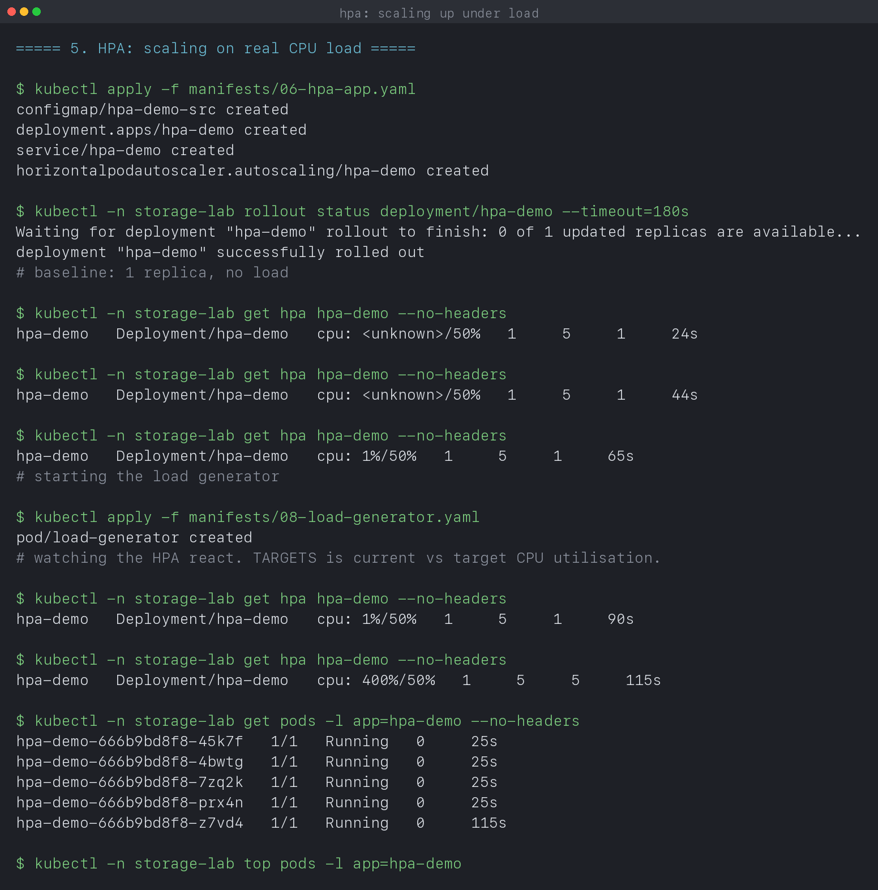

# Kubernetes Storage, HPA and Probes

**Name:** Manasvi Sabbarwal
**Roll No:** 24BCS10406
**Cluster:** kind v0.33.0, 3 nodes (1 control-plane + 2 workers), Kubernetes v1.37.0

Volumes and persistent storage, autoscaling on real CPU load, and the three
probe types working together. Every output block is quoted from
[`output.log`](output.log), written by [`verify.sh`](verify.sh).

Written notes on the volume types are in
[`01-kubernetes-volumes/`](01-kubernetes-volumes/README.md).

The HPA section needs metrics-server, which kind does not ship:

```bash
kubectl apply -f https://github.com/kubernetes-sigs/metrics-server/releases/latest/download/components.yaml
kubectl -n kube-system patch deployment metrics-server --type=json \
  -p='[{"op":"add","path":"/spec/template/spec/containers/0/args/-","value":"--kubelet-insecure-tls"}]'
```

The patch is needed because kind's kubelets serve self-signed certificates and
metrics-server refuses them by default.

---

## 1. emptyDir: scratch space that dies with the pod

```text
$ kubectl -n storage-lab exec vol-emptydir -c reader -- cat /scratch/note.txt
written by the writer
```

Two containers, one volume, so the reader sees the writer's file. The lifetime
is the **pod**, not the container: a container restart keeps the data, deleting
the pod loses it. That makes it right for caches, scratch files and handing
data to a sidecar, and wrong for anything you want to keep.

---

## 2. PersistentVolume and PersistentVolumeClaim

A PV is a piece of storage that exists. A PVC is a request for storage. They
are separate objects on purpose: whoever runs the cluster provides PVs, and
whoever deploys an app writes a PVC without caring what backs it.

```text
$ kubectl get pv static-pv
NAME        CAPACITY   ACCESS MODES   RECLAIM POLICY   STATUS      CLAIM   STORAGECLASS   AGE
static-pv   500Mi      RWO            Retain           Available           manual         0s
```

`Available` means no claim has taken it. After applying the PVC:

```text
$ kubectl get pv static-pv
NAME        CAPACITY   ACCESS MODES   RECLAIM POLICY   STATUS   CLAIM                    STORAGECLASS   AGE
static-pv   500Mi      RWO            Retain           Bound    storage-lab/static-pvc   manual         4s

$ kubectl -n storage-lab get pvc static-pvc
NAME         STATUS   VOLUME      CAPACITY   ACCESS MODES   STORAGECLASS   AGE
static-pvc   Bound    static-pv   500Mi      RWO            manual         4s
```

Both sides now record the binding, and it is **exclusive**: one PVC takes the
whole PV, even if it asked for less than the capacity. Binding needs the access
mode, the capacity and the storage class to be compatible. The `manual` class
here is not a real provisioner, it is just a label that stops the default
dynamic provisioner from interfering.

`RECLAIM POLICY: Retain` means deleting the claim leaves the data alone, and
the PV goes to `Released` rather than being reused. `Delete` is the other
common value and is what the dynamic class uses in section 4.

---

## 3. Data outlives the pod

```text
$ kubectl -n storage-lab exec static-writer -- cat /data/log.txt
written at 2026-10-07T14:59:48+00:00

$ kubectl -n storage-lab delete pod static-writer
$ kubectl apply -f manifests/04-pod-static.yaml

# the earlier line is still there, plus a new one from the replacement pod
$ kubectl -n storage-lab exec static-writer -- cat /data/log.txt
written at 2026-10-07T14:59:48+00:00
written at 2026-10-07T15:00:20+00:00
```

The pod was destroyed and a new one wrote a second line to the same file. That
is the whole point of a PVC: the storage belongs to the claim, not to the pod.

### The gotcha this exposed

The first time I ran this, the second read failed with
`cat: can't open '/data/log.txt': No such file or directory`. The replacement
pod had been scheduled onto the **other worker**, and a `hostPath` volume is a
directory on one specific node. The volume was fine; the pod was simply looking
at a different machine.

The fix is `nodeAffinity` on the PV:

```yaml
nodeAffinity:
  required:
    nodeSelectorTerms:
      - matchExpressions:
          - key: kubernetes.io/hostname
            operator: In
            values: [svc-lab-worker]
```

which makes the scheduler place any consumer on the node that actually holds
the data:

```text
$ kubectl -n storage-lab get pod static-writer -o jsonpath='scheduled on: {.spec.nodeName}'
scheduled on: svc-lab-worker
```

This is also the reason `hostPath` is a teaching tool and not production
storage. It pins a workload to one machine and the data dies with that machine.
Real clusters use network storage (EBS, Ceph, NFS) where any node can attach
the volume.

---

## 4. StorageClass and dynamic provisioning

```text
$ kubectl get storageclass
NAME                 PROVISIONER             RECLAIMPOLICY   VOLUMEBINDINGMODE      ALLOWVOLUMEEXPANSION   AGE
standard (default)   rancher.io/local-path   Delete          WaitForFirstConsumer   false                  19d
```

A StorageClass removes the manual step. Instead of an admin pre-creating PVs,
the class names a provisioner that creates one on demand.

The `VOLUMEBINDINGMODE` column is the interesting part:

```text
$ kubectl apply -f manifests/05-dynamic-pvc.yaml
persistentvolumeclaim/dynamic-pvc created

$ kubectl -n storage-lab get pvc dynamic-pvc
NAME          STATUS    VOLUME   CAPACITY   ACCESS MODES   STORAGECLASS   AGE
dynamic-pvc   Pending                                      standard       6s
```

**Pending, and that is correct.** `WaitForFirstConsumer` deliberately delays
provisioning until a pod actually mounts the claim. The reason is scheduling:
if the volume were created immediately it might land on a node the pod cannot
run on, and then neither can move. Waiting lets the scheduler pick the node
first and the storage follow.

I got this wrong on the first run and wrote that the provisioner had already
created a PV. It had not. Adding a consumer is what completes it:

```text
$ kubectl apply -f manifests/05b-dynamic-consumer.yaml
pod/dynamic-user created

$ kubectl -n storage-lab get pvc dynamic-pvc
NAME          STATUS   VOLUME                                     CAPACITY   ACCESS MODES   STORAGECLASS   AGE
dynamic-pvc   Bound    pvc-0ac54ed3-db6c-4fe7-ac7c-ad27b3a6239e   1Gi        RWO            standard       10s

$ kubectl get pv -o custom-columns=NAME:.metadata.name,CLAIM:.spec.claimRef.name,SC:.spec.storageClassName | grep -E 'NAME|dynamic'
NAME                                       CLAIM          SC
pvc-0ac54ed3-db6c-4fe7-ac7c-ad27b3a6239e   dynamic-pvc    standard

$ kubectl -n storage-lab exec dynamic-user -- cat /data/hello.txt
dynamic volume works
```

Nobody wrote that PV. The name is generated, the claim reference points back,
and the file is readable from inside the pod. Compare with section 2, where I
had to write the PV by hand and pick its path myself.

A `Pending` PVC is therefore not automatically a fault. On a
`WaitForFirstConsumer` class it is the normal state until something mounts it.
On an `Immediate` class it means something is actually wrong.

---

## 5. HorizontalPodAutoscaler

The HPA watches a metric and changes `spec.replicas` on a Deployment. It needs
two things to work: metrics-server running, and **CPU requests set on the
container**, because utilisation is measured as a percentage of the request.

```yaml
resources:
  requests:
    cpu: "100m"      # the HPA divides by this
targetpercent: 50    # scale out above 50% of 100m
```

### Baseline, no load

```text
$ kubectl -n storage-lab get hpa hpa-demo --no-headers
hpa-demo   Deployment/hpa-demo   cpu: <unknown>/50%   1     5     1     24s
hpa-demo   Deployment/hpa-demo   cpu: <unknown>/50%   1     5     1     44s
hpa-demo   Deployment/hpa-demo   cpu: 1%/50%         1     5     1     65s
hpa-demo   Deployment/hpa-demo   cpu: 1%/50%         1     5     1     90s
```

`<unknown>` for the first 45 seconds is normal. metrics-server scrapes on an
interval, so the HPA has nothing to divide until the first sample lands. An HPA
stuck at `<unknown>` for minutes usually means metrics-server is missing or
crashing, which is worth checking before blaming the HPA.

### Under load

```text
$ kubectl apply -f manifests/08-load-generator.yaml
pod/load-generator created

hpa-demo   Deployment/hpa-demo   cpu: 400%/50%   1     5     5     115s
hpa-demo   Deployment/hpa-demo   cpu: 260%/50%   1     5     5     2m56s
```

Four concurrent request loops pushed one replica to **400% of its request**,
and the HPA went straight to the 5 replica ceiling. It does not step up one at
a time: the controller computes
`ceil(currentReplicas x currentMetric / targetMetric)`, which here is
`ceil(1 x 400 / 50) = 8`, clamped to `maxReplicas: 5`.

Spreading the same work over five pods brought utilisation down to 260%, still
above target, so it stayed at the ceiling. That is the honest result: the load
generator is stronger than five replicas can absorb.

```text
$ kubectl -n storage-lab top pods -l app=hpa-demo
NAME                        CPU(cores)   MEMORY(bytes)
hpa-demo-666b9bd8f8-clcrh   221m         11Mi
hpa-demo-666b9bd8f8-fs9v8   188m         11Mi
hpa-demo-666b9bd8f8-hflb8   382m         12Mi
hpa-demo-666b9bd8f8-l6fm5   159m         11Mi
```

### Scaling back down

```text
$ kubectl -n storage-lab delete pod load-generator

hpa-demo   Deployment/hpa-demo   cpu: 1%/50%   1     5     5     3m26s
hpa-demo   Deployment/hpa-demo   cpu: 1%/50%   1     5     1     3m56s
```

CPU dropped immediately but the replica count stayed at 5 for another half
minute before collapsing to 1. That delay is the **stabilisation window**, set
to 30s in this manifest. The default is 300s, deliberately long: scaling up
fast protects users, scaling down slowly protects you from thrashing when load
is spiky. Scale-down also goes in one step once the window passes.

### A note on the image

The usual `registry.k8s.io/hpa-example` is amd64 only. On Apple Silicon it
starts under emulation, Apache logs normally, and then never answers a request,
so the HPA sits at 0% forever with no obvious error. I replaced it with a small
multi-arch Python server that hashes in a loop, which produces real,
measurable CPU on this hardware.

---

## 6. Probes

All three on one deployment, which is the combination the mini project asks
for:

```text
$ kubectl -n storage-lab describe pod -l app=web-app | grep -E 'Startup:|Readiness:|Liveness:'
    Liveness:     http-get http://:http/ delay=0s timeout=1s period=10s successThreshold=1 failureThreshold=3
    Readiness:    http-get http://:http/ delay=0s timeout=1s period=5s  successThreshold=1 failureThreshold=3
    Startup:      http-get http://:http/ delay=0s timeout=1s period=2s  successThreshold=1 failureThreshold=30
```

| Probe | Question | On failure |
|---|---|---|
| Startup | has it finished booting? | keep waiting, up to `failureThreshold x period` |
| Readiness | can it serve traffic right now? | removed from service endpoints, left running |
| Liveness | is it wedged? | container killed and restarted |

The periods encode the intent. Startup polls every 2s with 30 allowed failures,
giving a 60s budget to boot. Readiness polls every 5s because endpoint
membership should react quickly. Liveness polls every 10s and needs 3 failures,
so a restart takes 30s of sustained failure and a single blip does nothing.

Startup is the one that makes the other two safe: while it is running, liveness
is suspended entirely, so a slow boot cannot be mistaken for a hang. The
isolated demonstrations of each probe, including a liveness probe restarting a
container and a startup probe preventing that, are in
[`../02_K8s_Pods_ReplicaSets_Deployments`](../02_K8s_Pods_ReplicaSets_Deployments).

---

## 7. Mini project: all three together

```text
$ kubectl -n storage-lab get deploy,svc,hpa -l app=web-app
NAME                      READY   UP-TO-DATE   AVAILABLE   AGE
deployment.apps/web-app   2/2     2            2           30s

NAME                  TYPE        CLUSTER-IP      EXTERNAL-IP   PORT(S)   AGE
service/web-service   ClusterIP   10.96.243.191   <none>        80/TCP    30s

NAME                                          REFERENCE            TARGETS              MINPODS   MAXPODS   REPLICAS   AGE
horizontalpodautoscaler.autoscaling/web-app   Deployment/web-app   cpu: <unknown>/50%   2         5         2          30s
```

```text
$ kubectl -n storage-lab get pvc web-data
NAME       STATUS   VOLUME                                     CAPACITY   ACCESS MODES   STORAGECLASS   AGE
web-data   Bound    pvc-8a81fa37-790e-43fa-9d65-cf5d48e07476   500Mi      RWO            standard       6s

$ kubectl -n storage-lab exec <pod> -- sh -c 'echo persisted > /data/app.txt; cat /data/app.txt'
persisted
```

One deployment with persistent storage, an autoscaler and a full health triage.
Worth noting the tension built into this: the PVC is `ReadWriteOnce`, so every
replica mounts the same volume from the same node. An HPA that scales to 5 and
a RWO volume do not naturally agree, and in production you would either use a
`ReadWriteMany` volume or give each replica its own through a StatefulSet.

---

## 8. What I took away

- emptyDir belongs to the pod, a PVC outlives it. Container restart and pod
  deletion are different events with different consequences.
- Binding is exclusive, and needs access mode, capacity and class to agree.
- `hostPath` is node-local. Without `nodeAffinity` a rescheduled pod finds an
  empty directory, which I hit for real.
- `WaitForFirstConsumer` makes a `Pending` PVC the normal state until a pod
  mounts it, so Pending is not automatically a fault.
- The HPA measures CPU as a share of the **request**, so an unset request means
  no autoscaling.
- `<unknown>` on a fresh HPA just means metrics have not arrived yet.
- Scale-up is immediate and computed in one jump. Scale-down waits out the
  stabilisation window, 30s here against a 300s default.
- Startup suspends liveness, which is what lets you keep liveness aggressive.
- RWO storage and a multi-replica HPA pull in opposite directions.

---

## 9. Screenshots

| What it shows | Capture |
|---|---|
| PV `Available` then `Bound`, both sides recording it | [k13-01-pv-pvc-binding.png](screenshots/k13-01-pv-pvc-binding.png) |
| Data surviving pod deletion, and the node it was pinned to | [k13-02-persistence.png](screenshots/k13-02-persistence.png) |
| `Pending` until a consumer arrives, then a PV created automatically | [k13-03-dynamic-provisioning.png](screenshots/k13-03-dynamic-provisioning.png) |
| HPA at 400% going straight to 5 replicas | [k13-04-hpa-scale-up.png](screenshots/k13-04-hpa-scale-up.png) |
| Scale-down after the stabilisation window | [k13-05-hpa-scale-down.png](screenshots/k13-05-hpa-scale-down.png) |
| PVC, all three probes and an HPA on one deployment | [k13-06-mini-project.png](screenshots/k13-06-mini-project.png) |



---

## 10. Reproducing this

```bash
kind create cluster --name svc-lab --config ../cluster/kind-cluster.yaml
kubectl apply -f https://github.com/kubernetes-sigs/metrics-server/releases/latest/download/components.yaml
kubectl -n kube-system patch deployment metrics-server --type=json \
  -p='[{"op":"add","path":"/spec/template/spec/containers/0/args/-","value":"--kubelet-insecure-tls"}]'

cd 05_K8s_Storage_HPA_Probes
chmod +x verify.sh && ./verify.sh
```

The HPA section takes several minutes: it waits for metrics, for the scale-up,
and then for the stabilisation window on the way back down.

## 11. Cleanup

```bash
kubectl delete namespace storage-lab
kubectl delete pv static-pv
```

The `Retain` policy means `static-pv` is not removed with the namespace, and
its directory stays on the node. That is the policy working as designed.
