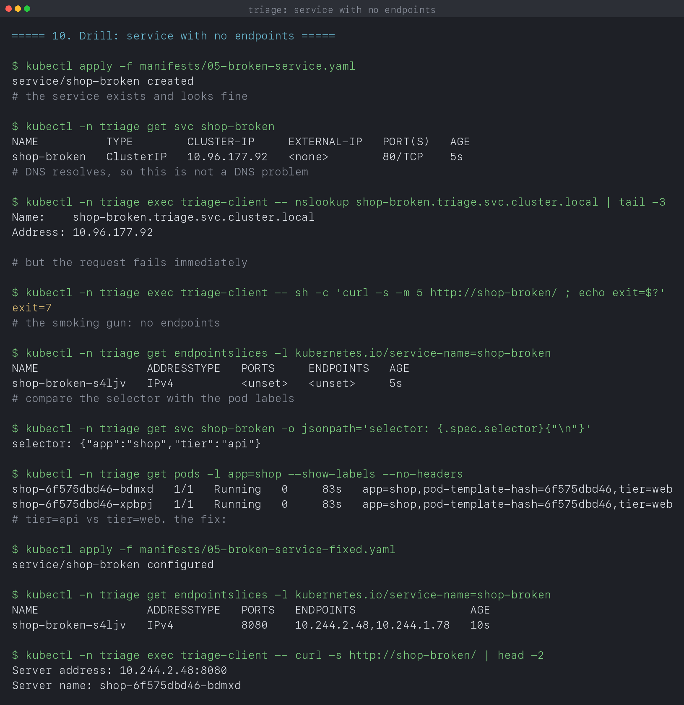

# Kubernetes Troubleshooting

**Name:** Manasvi Sabbarwal
**Roll No:** 24BCS10406
**Cluster:** kind v0.33.0, 3 nodes (1 control-plane + 2 workers), Kubernetes v1.37.0

Six faults, each broken on purpose, diagnosed with the standard commands and
then fixed. Every output block is quoted from [`output.log`](output.log),
written by [`verify.sh`](verify.sh).

---

## 1. The four commands, and what each one is for

| Command | Answers | Use when |
|---|---|---|
| `get` | what exists and what state is it in | always first |
| `describe` | why is it in that state | the pod never started |
| `logs` | what did the application say | the pod started and then failed |
| `exec` | what does it look like from inside | the pod is running but behaving oddly |

The split between `describe` and `logs` is the one that matters. A container
that never started has no logs to read, so `describe` and its Events are the
only source. A container that started and then died has logs, and they usually
name the cause outright. Section 7 shows `logs` returning nothing useful while
`describe` has the answer; section 6 shows the opposite.

```text
$ kubectl -n triage get pods -o wide
NAME                    READY   STATUS    RESTARTS   AGE   IP            NODE
shop-6f575dbd46-4wmcj   1/1     Running   0          45s   10.244.1.48   svc-lab-worker
shop-6f575dbd46-rcvss   1/1     Running   0          45s   10.244.2.30   svc-lab-worker2
```

`-o wide` adds the IP and node, which is what you need the moment one replica
out of several is misbehaving.

Events are the cluster's own timeline, and worth reading before anything else
when you have no idea where to start:

```bash
kubectl -n triage get events --sort-by=.lastTimestamp
```

They expire after about an hour by default, so a pod that broke overnight will
have none left. That is a common surprise.

---

## 2. CrashLoopBackOff: the app started and died

```text
$ kubectl -n triage get pod broken-crashloop --no-headers
broken-crashloop   0/1   CrashLoopBackOff   1 (13s ago)   15s
```

```text
$ kubectl -n triage logs broken-crashloop --previous
FATAL: config file /etc/app/config.yaml not found
```

The answer in one line. **`--previous` is the important flag**: the current
container is a fresh one that may not have failed yet, so plain `logs` often
returns nothing. The crashed instance's output is only reachable with
`--previous`.

```text
$ kubectl -n triage describe pod broken-crashloop | grep -E 'Reason|Exit Code|Restart Count'
      Reason:       CrashLoopBackOff
      Reason:       Error
      Exit Code:    1
    Restart Count:  1
```

Two `Reason` lines because they describe different things: the container is
currently **waiting** with reason `CrashLoopBackOff`, and it last **terminated**
with reason `Error` and exit code 1.

`CrashLoopBackOff` is not itself a fault, it is a crash plus a growing retry
delay (10s, 20s, 40s, up to 5 minutes). So after fixing the cause you may wait
a few minutes for the next attempt, which looks like the fix not working.

---

## 3. ImagePullBackOff: the app never started

A single typo in the tag, `alpne` instead of `alpine`:

```text
$ kubectl -n triage get pod broken-image --no-headers
broken-image   0/1   ImagePullBackOff   0     21s

$ kubectl -n triage logs broken-image
Error from server (BadRequest): container "app" in pod "broken-image" is waiting
to start: trying and failing to pull image
```

**Logs are useless here**, and that is diagnostic in itself: no container ever
ran, so there is nothing to have logged. `describe` carries it:

```text
$ kubectl -n triage describe pod broken-image | grep -A4 'Events:'
  Normal   Scheduled  20s   default-scheduler  Successfully assigned triage/broken-image to svc-lab-worker2
  Normal   BackOff    18s   kubelet            Back-off pulling image "nginx:1.29-alpne"
```

Note `Scheduled` succeeded. The API server accepted the pod and the scheduler
placed it; only the kubelet's pull failed. Kubernetes never checks that an
image exists at admission time, because it does not talk to registries at all.

```text
$ kubectl apply -f manifests/03-imagepull-fixed.yaml
$ kubectl -n triage get pod broken-image --no-headers
broken-image   1/1   Running   0     2s
```

The other causes of this status, when the tag is correct, are a private
registry with no `imagePullSecret`, a rate limit, or an architecture mismatch.

---

## 4. Pending: the scheduler could not place it

```text
$ kubectl -n triage get pod broken-pending --no-headers
broken-pending   0/1   Pending   0     10s

$ kubectl -n triage describe pod broken-pending | grep -A4 'Events:'
  Warning  FailedScheduling  10s  default-scheduler  0/3 nodes are available: 1 node(s) had untolerated taint(s), 2 Insufficient memory. preemption: 0/3 nodes are available: 3 Preemption is not helpful for scheduling.
```

That single line is a complete explanation, and it accounts for **every** node:
one excluded by the control-plane taint, two without enough memory. The
scheduler never partially places a pod and never gives up, it just keeps
retrying, which is why Pending can persist indefinitely.

```text
$ kubectl -n triage get pod broken-pending -o wide --no-headers
broken-pending   1/1   Running   0   1s   10.244.2.52   svc-lab-worker2
```

The usual causes are all visible in that message format: insufficient
resources, an untolerated taint, an unsatisfiable `nodeSelector`, or a PVC that
cannot bind.

---

## 5. OOMKilled: the kernel stopped it

A container asking for 200M against a 64Mi limit:

```text
$ kubectl -n triage get pod broken-oom --no-headers
broken-oom   0/1   OOMKilled   2 (17s ago)   25s

$ kubectl -n triage get pod broken-oom -o jsonpath='reason={...lastState.terminated.reason} exitCode={...exitCode}'
reason=OOMKilled exitCode=137
```

**Exit 137 is the signature**: 128 + 9, meaning killed by SIGKILL. The kernel's
OOM killer did this, not Kubernetes, because memory is not compressible. A
process over its CPU limit is merely throttled and survives; a process over its
memory limit is killed outright.

This also explains a confusing production symptom: a container that restarts
periodically with no error in its own logs. The application never got a chance
to log anything, because SIGKILL cannot be caught.

---

## 6. A service with no endpoints

The hardest of these, because every individual object looks healthy.

```text
$ kubectl -n triage get svc shop-broken
NAME          TYPE        CLUSTER-IP     EXTERNAL-IP   PORT(S)   AGE
shop-broken   ClusterIP   10.96.130.47   <none>        80/TCP    5s
```

Fine. DNS resolves, so it is not a DNS problem:

```text
$ kubectl -n triage exec triage-client -- nslookup shop-broken.triage.svc.cluster.local | tail -3
Name:	shop-broken.triage.svc.cluster.local
Address: 10.96.130.47
```

Also fine. Yet:

```text
$ kubectl -n triage exec triage-client -- sh -c 'curl -s -m 5 http://shop-broken/ ; echo exit=$?'
exit=7
```

The smoking gun is the endpoint list:

```text
$ kubectl -n triage get endpointslices -l kubernetes.io/service-name=shop-broken
NAME                ADDRESSTYPE   PORTS     ENDPOINTS   AGE
shop-broken-8rh8z   IPv4          <unset>   <unset>     6s
```

`<unset>` means no backends. Comparing the selector with the labels finds it:

```text
$ kubectl -n triage get svc shop-broken -o jsonpath='selector: {.spec.selector}'
selector: {"app":"shop","tier":"api"}

$ kubectl -n triage get pods -l app=shop --show-labels --no-headers
shop-6f575dbd46-4wmcj   1/1   Running   0   2m45s   app=shop,pod-template-hash=6f575dbd46,tier=web
shop-6f575dbd46-rcvss   1/1   Running   0   2m45s   app=shop,pod-template-hash=6f575dbd46,tier=web
```

`tier=api` against `tier=web`. Nothing links a service to pods except labels,
so a typo produces an empty endpoint list and no error anywhere.

```text
$ kubectl apply -f manifests/05-broken-service-fixed.yaml
$ kubectl -n triage get endpointslices -l kubernetes.io/service-name=shop-broken
NAME                ADDRESSTYPE   PORTS   ENDPOINTS                 AGE
shop-broken-8rh8z   IPv4          8080    10.244.1.48,10.244.2.30   11s
```

---

## 7. Endpoints exist but the port is wrong

This drill corrected an assumption of mine, which is why it is worth keeping.

```text
$ kubectl -n triage get endpointslices -l kubernetes.io/service-name=shop-wrongport
NAME                   ADDRESSTYPE   PORTS   ENDPOINTS                 AGE
shop-wrongport-mbdrm   IPv4          9999    10.244.1.48,10.244.2.30   5s
```

Endpoints are present, so the selector is right. I expected the request to hang
until the timeout, giving exit 28 and a clean way to tell this apart from
section 6. It did not:

```text
$ kubectl -n triage exec triage-client -- sh -c 'curl -s -m 5 http://shop-wrongport/ ; echo exit=$?'
exit=7
```

**Exit 7 again, identical to the empty service.** The reason is that the pod is
reachable and nothing is listening on 9999, so it answers with a TCP reset
rather than silence. A reset is a refused connection, not a timeout. You would
only get exit 28 if packets were being dropped, by a NetworkPolicy or a
firewall.

So the exit code cannot distinguish these two faults, and the endpoint list is
what separates them:

```text
$ kubectl -n triage get svc shop-wrongport -o jsonpath='targetPort={.spec.ports[0].targetPort}'
targetPort=9999

$ kubectl -n triage get deploy shop -o jsonpath='containerPort={...containerPort}'
containerPort=8080
```

---

## 8. A triage order that works

```text
1. kubectl get pods            is it Running and Ready?
   Pending            -> describe, read FailedScheduling
   ImagePullBackOff   -> describe, check the image name
   CrashLoopBackOff   -> logs --previous
   OOMKilled          -> raise the memory limit or fix the leak
   Running but 0/1    -> readiness probe is failing, describe it

2. if the pods are healthy but callers fail:
   get endpointslices             <unset> -> selector or labels wrong
                                  present -> targetPort or policy wrong
   nslookup from a client pod     fails   -> wrong namespace or CoreDNS
```

| Symptom | Likely cause | Command that confirms it |
|---|---|---|
| Pending | resources, taints, unbound PVC | `describe pod`, read Events |
| ImagePullBackOff | bad tag, private registry, wrong arch | `describe pod`, read Events |
| CrashLoopBackOff | the app exits non-zero | `logs --previous` |
| OOMKilled, exit 137 | over the memory limit | `get pod -o jsonpath` on lastState |
| Running but never Ready | readiness probe failing | `describe pod` |
| curl exit 7, endpoints `<unset>` | selector does not match labels | `get endpointslices` |
| curl exit 7, endpoints present | `targetPort` wrong | compare service and container port |
| curl exit 6 | name does not resolve | `nslookup` from a pod |

---

## 9. What I took away

- `describe` is for pods that never started, `logs` is for pods that started
  and died. Reaching for the wrong one wastes the first few minutes.
- `--previous` is essential for a crashloop, because plain `logs` reads a
  container that has not failed yet.
- `FailedScheduling` accounts for every node in one line, including why each
  was rejected.
- Exit 137 means SIGKILL, so the app could not log anything on its way out.
- An object existing and an object working are different. The service, its DNS
  and its ClusterIP were all fine with zero backends.
- **curl exit 7 covers two different faults.** I assumed a wrong `targetPort`
  would time out; it refuses instead, exactly like an empty service. The
  endpoint list is what tells them apart.
- Events expire after roughly an hour, so an overnight failure leaves none.

---

## 10. Screenshots

| Drill | Capture |
|---|---|
| CrashLoopBackOff, diagnosed with `logs --previous` | [k14-01-crashloop.png](screenshots/k14-01-crashloop.png) |
| ImagePullBackOff from a one character typo | [k14-02-imagepull.png](screenshots/k14-02-imagepull.png) |
| Pending, with FailedScheduling accounting for all 3 nodes | [k14-03-pending.png](screenshots/k14-03-pending.png) |
| OOMKilled with exit code 137 | [k14-04-oomkilled.png](screenshots/k14-04-oomkilled.png) |
| A healthy looking service with no endpoints | [k14-05-no-endpoints.png](screenshots/k14-05-no-endpoints.png) |
| Endpoints present, wrong `targetPort`, same exit 7 | [k14-06-wrong-targetport.png](screenshots/k14-06-wrong-targetport.png) |



---

## 11. Reproducing this

```bash
kind create cluster --name svc-lab --config ../cluster/kind-cluster.yaml
cd 06_K8s_Troubleshooting
chmod +x verify.sh && ./verify.sh
```

## 12. Cleanup

```bash
kubectl delete namespace triage
```
