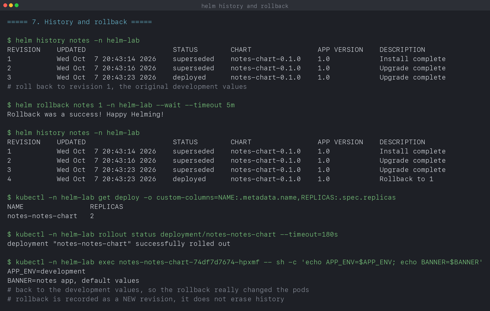

# Helm

**Name:** Manasvi Sabbarwal
**Roll No:** 24BCS10406
**Helm:** v4.3.0
**Cluster:** kind v0.33.0, 3 nodes, Kubernetes v1.37.0

A chart written from scratch, then installed, upgraded, overridden and rolled
back on a live cluster. Every output block is quoted from
[`output.log`](output.log), written by [`verify.sh`](verify.sh).

The chart is [`notes-chart/`](notes-chart).

---

## 1. What Helm is for

Plain manifests have no notion of a release or a version. Deploying the same
app to dev and prod means either two near-identical copies of every YAML file,
or a templating script of your own. Changing something and wanting it back
means finding the old YAML in Git and reapplying it.

Helm adds three things:

- **Templating**, so one chart renders differently per environment.
- **A release**, a named, versioned install that Helm tracks.
- **History**, so `rollback` is one command instead of an archaeology exercise.

---

## 2. Chart structure

```text
notes-chart/
├── Chart.yaml           metadata: name, version, appVersion
├── values.yaml          default values, the public interface of the chart
├── values-prod.yaml     an overlay with only the differences
└── templates/
    ├── _helpers.tpl     reusable named templates
    ├── deployment.yaml
    ├── service.yaml
    └── NOTES.txt        printed after install
```

```text
$ cat notes-chart/Chart.yaml
apiVersion: v2
name: notes-chart
description: A notes app packaged as a Helm chart for the session 15 exercises
type: application
version: 0.1.0
appVersion: "1.0"
```

Two different versions, and mixing them up is a common mistake. `version` is
the **chart's** version, bumped when you change the templates. `appVersion` is
the **application's** version, which moves when the image moves. They are
independent.

```text
$ helm lint notes-chart
==> Linting notes-chart
[INFO] Chart.yaml: icon is recommended

1 chart(s) linted, 0 chart(s) failed
```

---

## 3. Templating

`helm template` renders locally without touching the cluster, which is the
fastest way to see what a change actually does:

```text
$ diff <(helm template notes notes-chart) <(helm template notes notes-chart -f notes-chart/values-prod.yaml)
36c36
<   replicas: 2
---
>   replicas: 4
56c56
<               value: "development"
---
>               value: "production"
58c58
<               value: "notes app, default values"
---
>               value: "notes app, production overlay"
```

One chart, two environments, three lines of difference. `values-prod.yaml`
contains only the deltas; everything else is inherited from `values.yaml`.
That is the layering: defaults in the chart, overlay per environment,
`--set` for one-off overrides at the command line.

The templates themselves are ordinary YAML with substitutions:

```yaml
spec:
  replicas: {{ .Values.replicaCount }}
  template:
    spec:
      containers:
        - name: {{ .Chart.Name }}
          image: "{{ .Values.image.repository }}:{{ .Values.image.tag }}"
          env:
            {{- range $key, $value := .Values.env }}
            - name: {{ $key }}
              value: {{ $value | quote }}
            {{- end }}
```

The `range` is what makes `env` a map in values rather than a list the user has
to format correctly. `| quote` matters more than it looks: a value like `"1.0"`
or `"true"` becomes a number or a boolean in YAML without it, and the container
spec then fails validation.

`_helpers.tpl` holds the naming and label logic once:

```
{{- define "notes-chart.fullname" -}}
{{- printf "%s-%s" .Release.Name (include "notes-chart.name" .) | trunc 63 | trimSuffix "-" }}
{{- end }}
```

`trunc 63` is not decoration. Kubernetes object names are limited to 63
characters, and a long release name plus a long chart name overflows it. Every
generated chart includes this for that reason.

---

## 4. Install

```text
$ helm install notes notes-chart -n helm-lab --wait --timeout 5m
NAME: notes
LAST DEPLOYED: Wed Oct  7 20:43:14 2026
NAMESPACE: helm-lab
STATUS: deployed
REVISION: 1
```

```text
$ helm list -n helm-lab
NAME 	NAMESPACE	REVISION	STATUS  	CHART            	APP VERSION
notes	helm-lab 	1       	deployed	notes-chart-0.1.0	1.0
```

`--wait` makes install block until the pods are actually Ready, so a failing
deployment shows up here rather than looking successful and breaking later.

The release is stored **in the cluster**, not on your laptop:

```text
$ kubectl -n helm-lab get secret -l owner=helm
NAME                          TYPE                 DATA   AGE
sh.helm.release.v1.notes.v1   helm.sh/release.v1   1      1s
```

One secret per revision, holding the rendered manifests and the values used.
That is what makes history and rollback possible from any machine, and it is
why deleting those secrets by hand breaks a release permanently.

```text
$ helm get values notes -n helm-lab
USER-SUPPLIED VALUES:
null
```

Empty, because I supplied none and took the defaults. `--all` shows the full
computed set, which is the one to read when debugging what a release actually
rendered with.

---

## 5. Upgrade

```text
$ helm upgrade notes notes-chart -n helm-lab -f notes-chart/values-prod.yaml --wait
Release "notes" has been upgraded. Happy Helming!
REVISION: 2
```

```text
$ kubectl -n helm-lab get deploy -o custom-columns=NAME:.metadata.name,REPLICAS:.spec.replicas
NAME                REPLICAS
notes-notes-chart   4

$ kubectl -n helm-lab exec <pod> -- sh -c 'echo APP_ENV=$APP_ENV; echo BANNER=$BANNER'
APP_ENV=production
BANNER=notes app, production overlay
```

Both the replica count and the environment variables changed, confirmed from
inside a running pod rather than from the manifest.

A third revision with a command-line override on top of the file:

```text
$ helm upgrade notes notes-chart -n helm-lab -f notes-chart/values-prod.yaml --set replicaCount=3 --wait
REVISION: 3

$ kubectl -n helm-lab get deploy -o custom-columns=NAME:.metadata.name,REPLICAS:.spec.replicas
NAME                REPLICAS
notes-notes-chart   3
```

Precedence runs `values.yaml` < `-f overlay` < `--set`. Worth knowing that
`--set` values are **not** remembered on the next upgrade unless you pass them
again or use `--reuse-values`, which is a common way to lose a setting by
accident.

---

## 6. History and rollback

```text
$ helm history notes -n helm-lab
REVISION	UPDATED                 	STATUS    	CHART            	DESCRIPTION
1       	Wed Oct  7 20:43:14 2026	superseded	notes-chart-0.1.0	Install complete
2       	Wed Oct  7 20:43:16 2026	superseded	notes-chart-0.1.0	Upgrade complete
3       	Wed Oct  7 20:43:23 2026	deployed  	notes-chart-0.1.0	Upgrade complete
```

```text
$ helm rollback notes 1 -n helm-lab --wait
Rollback was a success! Happy Helming!

$ helm history notes -n helm-lab
REVISION	UPDATED                 	STATUS    	CHART            	DESCRIPTION
1       	Wed Oct  7 20:43:14 2026	superseded	notes-chart-0.1.0	Install complete
2       	Wed Oct  7 20:43:16 2026	superseded	notes-chart-0.1.0	Upgrade complete
3       	Wed Oct  7 20:43:23 2026	superseded	notes-chart-0.1.0	Upgrade complete
4       	Wed Oct  7 20:43:23 2026	deployed  	notes-chart-0.1.0	Rollback to 1
```

**Rollback is a new revision, not an undo.** Revision 3 is still there, marked
superseded, and the rollback is recorded as revision 4 described as
`Rollback to 1`. History is append-only, so you can roll forward again to 3 if
the rollback was itself a mistake.

The pods really changed back:

```text
$ kubectl -n helm-lab get deploy -o custom-columns=NAME:.metadata.name,REPLICAS:.spec.replicas
NAME                REPLICAS
notes-notes-chart   2

$ kubectl -n helm-lab exec <pod> -- sh -c 'echo APP_ENV=$APP_ENV; echo BANNER=$BANNER'
APP_ENV=development
BANNER=notes app, default values
```

Back to 2 replicas and the development values, which is revision 1.

One practical warning: Helm rolls back the manifests it manages. It does not
roll back a database migration or anything else with side effects, so a schema
change still needs its own plan.

### A bug I hit writing this

My first version captured the pod name before running the rollback, then
`exec`ed into it afterwards:

```text
error: cannot exec into a container in a completed pod; current phase is Succeeded
```

The rollback had replaced the pods, so the captured name pointed at one that
was terminating. Fixing it by waiting for the new rollout first also exposed a
second issue: `kubectl wait --for=condition=Ready pod -l <selector>` matches
the terminating pods too, and they never become Ready, so it hangs until the
timeout. `kubectl rollout status deployment/<name>` is the correct check,
because it waits for the deployment rather than for a set of pods that is still
changing.

---

## 7. Package and uninstall

```text
$ helm package notes-chart -d /tmp
Successfully packaged chart and saved it to: /tmp/notes-chart-0.1.0.tgz
```

A `.tgz` named `<chart>-<version>.tgz` is the distributable unit, which is what
a chart repository serves.

```text
$ helm uninstall notes -n helm-lab --wait
release "notes" uninstalled

$ helm list -n helm-lab
NAME	NAMESPACE	REVISION	STATUS	CHART	APP VERSION

$ kubectl -n helm-lab get all
No resources found in helm-lab namespace.
```

Uninstall removes every object the release created, tracked by release metadata
rather than by label matching. By default it also discards the history, so
rollback after uninstall is not possible unless you pass `--keep-history`.

---

## 8. What I took away

- `version` and `appVersion` are different things, and only the first changes
  when you edit templates.
- `helm template` renders locally, so you can diff two value sets without
  touching a cluster. That diff is the clearest way to review a change.
- `| quote` prevents YAML from turning `"1.0"` into a float, and `trunc 63`
  exists because of the Kubernetes name limit.
- Release state lives in cluster secrets, one per revision, which is why
  history works from any machine.
- `--set` beats `-f`, which beats `values.yaml`, and `--set` is forgotten on
  the next upgrade unless repeated.
- Rollback appends a revision rather than erasing one, so it is reversible.
- `--wait` is what makes a failed install look failed.
- `kubectl rollout status` is the right readiness check after a Helm change;
  `kubectl wait` on a label selector hangs on pods that are terminating.

---

## 9. Screenshots

| What it shows | Capture |
|---|---|
| One chart rendering two environments, as a diff | [k15-01-templating.png](screenshots/k15-01-templating.png) |
| `helm install` and the release secret in the cluster | [k15-02-install.png](screenshots/k15-02-install.png) |
| Upgrade to the production overlay, verified inside a pod | [k15-03-upgrade.png](screenshots/k15-03-upgrade.png) |
| History and a rollback recorded as revision 4 | [k15-04-rollback.png](screenshots/k15-04-rollback.png) |
| Uninstall removing every object | [k15-05-uninstall.png](screenshots/k15-05-uninstall.png) |



---

## 10. Reproducing this

```bash
kind create cluster --name svc-lab --config ../cluster/kind-cluster.yaml
cd 07_Helm
chmod +x verify.sh && ./verify.sh
```

## 11. Cleanup

```bash
helm uninstall notes -n helm-lab
kubectl delete namespace helm-lab
```
