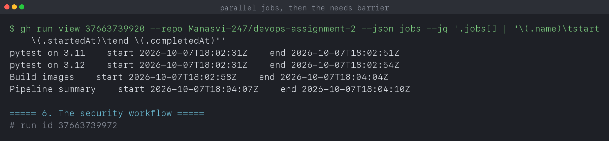

# CI/CD and GitHub Actions

**Name:** Manasvi Sabbarwal
**Roll No:** 24BCS10406

Two pipelines that run on this repository for real, on GitHub's runners. Every
output block is quoted from [`output.log`](output.log), captured from the
actual runs by [`capture-runs.sh`](capture-runs.sh).

| Workflow | File | Trigger |
|---|---|---|
| CI | [`../.github/workflows/ci.yml`](../.github/workflows/ci.yml) | push and pull request on the app folder, or manual |
| Trigger concepts | [`../.github/workflows/demo-triggers.yml`](../.github/workflows/demo-triggers.yml) | manual only |
| Security | [`../.github/workflows/security.yml`](../.github/workflows/security.yml) | covered in [`../09_DevSecOps`](../09_DevSecOps) |

---

## 1. CI and CD

**Continuous integration** is the part that runs on every change: build it, test
it, and say quickly whether it is broken. **Continuous delivery** is what
happens after that passes: produce a deployable artifact and get it somewhere.
Continuous deployment goes one step further and ships it without a human.

The split matters because they fail differently. A broken CI blocks one
developer's change. A broken CD blocks everyone's release.

```text
push ──► test ──► build image ──► scan ──► publish ──► deploy
         └── CI ─────────────┘    └──────── CD ──────────────┘
```

This repository implements the CI half plus scanning. Deployment is covered by
Argo CD in [`../12_Monitoring_Observability_GitOps`](../12_Monitoring_Observability_GitOps),
which pulls rather than being pushed to.

---

## 2. Triggers, and not wasting runner minutes

```yaml
on:
  push:
    branches: [main]
    paths:
      - '13_Final_Project_TaskBoard/**'
      - '.github/workflows/ci.yml'
  pull_request:
    branches: [main]
    paths:
      - '13_Final_Project_TaskBoard/**'
  workflow_dispatch:
```

The `paths` filter is deliberate. This repo holds thirteen lab folders, and a
push that only edits a Kubernetes README has no reason to build a Python image.
Without it, every commit would spend minutes testing code that did not change.

`workflow_dispatch` adds a manual button so the pipeline can still be run on
demand. [`demo-triggers.yml`](../.github/workflows/demo-triggers.yml) is
dispatch **only**, which is how you add a workflow that demonstrates something
without it firing on every push.

Other triggers worth knowing: `schedule` for cron, `release` for publishing,
and `workflow_call` to make one workflow reusable from another.

---

## 3. Jobs run in parallel unless you say otherwise

```yaml
jobs:
  test:
    strategy:
      matrix:
        python: ['3.11', '3.12']
  build:
    needs: test
  summary:
    needs: [test, build]
    if: always()
```

The timing from a real run proves it:

```text
$ gh run view 37663739920 --json jobs
pytest on 3.11     start 2026-10-07T18:02:31Z   end 2026-10-07T18:02:51Z
pytest on 3.12     start 2026-10-07T18:02:31Z   end 2026-10-07T18:02:54Z
Build images       start 2026-10-07T18:02:58Z   end 2026-10-07T18:04:04Z
Pipeline summary   start 2026-10-07T18:04:07Z   end 2026-10-07T18:04:10Z
```

Both test jobs started at **18:02:31**, the same second, because neither
declares `needs`. `Build images` started at **18:02:58**, after the slower test
job finished at 18:02:54. Nothing in the file says "wait"; `needs: test` is the
whole mechanism.

`if: always()` on the summary is what makes it run even when an earlier job
failed. Without it, a failing test would skip the summary too, and you would
lose the report exactly when you need it.

---

## 4. The matrix

```yaml
strategy:
  fail-fast: false
  matrix:
    python: ['3.11', '3.12']
```

One job definition, two real jobs:

```text
$ gh run view 37663739920 --log | grep -E 'collected|passed'
pytest on 3.11  collecting ... collected 10 items
pytest on 3.11  ======================== 10 passed, 3 warnings in 0.61s ========
pytest on 3.12  collecting ... collected 10 items
pytest on 3.12  ======================== 10 passed, 3 warnings in 0.57s ========
```

`fail-fast: false` matters. The default cancels every other matrix job the
moment one fails, which is efficient but unhelpful: if 3.11 breaks you usually
want to know whether 3.12 broke the same way. Turning it off costs a few runner
minutes and buys a complete picture.

---

## 5. Caching and artifacts

```yaml
- uses: actions/setup-python@v5
  with:
    cache: pip
    cache-dependency-path: 13_Final_Project_TaskBoard/backend/requirements.txt
```

The cache key is derived from the requirements file, so it invalidates
automatically when a dependency changes. A cache keyed on something that never
changes is worse than no cache, because it serves stale content forever.

Artifacts are how a job hands something to you rather than to another job:

```text
$ gh api repos/.../actions/runs/37663739920/artifacts
pytest-report-py3.11                   437 bytes
pytest-report-py3.12                   440 bytes
Manasvi-247~...~XZU346.dockerbuild   38037 bytes
Manasvi-247~...~3WTNIA.dockerbuild   47012 bytes
```

The two `.dockerbuild` artifacts were produced by the build action without me
asking. The two pytest reports are mine, uploaded with `if: always()` so the
report survives a failing test run, which is the only time you really want it.

---

## 6. Secrets

```yaml
- name: Use a secret
  env:
    TOKEN: ${{ secrets.DEMO_TOKEN }}
  run: |
    if [ -z "$TOKEN" ]; then
      echo "DEMO_TOKEN is not set, so secrets are not configured yet"
    else
      echo "DEMO_TOKEN is set and has ${#TOKEN} characters"
    fi
```

Two rules that are easy to get wrong:

- Secrets reach a step through `env`, not by interpolating into a shell string.
  `run: echo ${{ secrets.X }}` puts the value into the command line, where it
  can land in process listings.
- The runner **masks** known secret values in logs, replacing them with `***`.
  That is a safety net, not a control: it only masks exact matches, so a
  base64'd or substring'd secret prints in full.

`secrets.GITHUB_TOKEN` is provided automatically per run and expires with it,
which is why the gitleaks job uses it rather than a personal token.

---

## 7. The runs, including the ones that failed

```text
$ gh run list --limit 10
completed  success  fix(security): run trivy from its image ...   Security  push
completed  success  fix(security): run trivy from its image ...   CI        push
completed  failure  fix(ci): use the tag format the trivy ...     Security  push
completed  failure  fix(ci): make the pipeline pass              Security  push
completed  success  fix(ci): make the pipeline pass              CI        push
completed  failure  docs: add readme for every remaining ...      CI        push
completed  failure  docs: add readme for every remaining ...      Security  push
```

The failures are left in rather than tidied away, because debugging them is the
part worth recording. Three real bugs:

**The first CI failure, `no such table: tasks`.** The test module built its
`TestClient` at import time. FastAPI only fires startup events when the client
is used as a context manager, so `create_all` never ran and the table never
existed. Two tests passed because they do not touch the database. A
`conftest.py` that creates the schema fixed it, and the suite grew from 3 cases
to 10 covering every endpoint.

**The first summary-job failure, `No such file or directory`.** I had set a
workflow-level `defaults.run.working-directory`, which applies to every job.
The summary job has no checkout step, so that directory does not exist on its
runner. Workflow-level defaults apply everywhere, including jobs that never
create the path.

**Two Security failures, `Unable to resolve action`.** I pinned
`aquasecurity/trivy-action@0.28.0`, which does not exist, then guessed
`@0.33.1`, which also does not because the tags carry a `v` prefix. Guessing a
version twice is slower than checking once:

```bash
gh api repos/aquasecurity/trivy-action/git/ref/tags/v0.33.1 --jq .ref
```

I now verify every action reference resolves before pushing. The fix in the end
was to drop the marketplace action and run Trivy from its own image, which
removed the failure mode entirely.

### Both green

```text
$ gh run view 37663739920 --json jobs
success  pytest on 3.11
success  pytest on 3.12
success  Build images
success  Pipeline summary

$ gh run view 37663739972 --json jobs
success  SAST (bandit)
success  SCA (pip-audit)
success  Secret scanning (gitleaks)
success  Image scan (trivy) and security gate
```

---

## 8. What I took away

- `paths` filters are the difference between a pipeline that runs when it
  matters and one that burns minutes on every commit.
- Jobs are parallel by default. `needs` is the only thing that orders them, and
  the start timestamps prove it rather than the YAML implying it.
- `fail-fast: false` is usually right for a matrix: you want the whole picture,
  not the first failure.
- `if: always()` is what keeps a summary or an artifact upload alive when the
  thing you want to inspect has just failed.
- Workflow-level `defaults` apply to every job, including ones with no
  checkout.
- Cache keys must derive from the thing they cache, or they go stale silently.
- Secrets go through `env`, and log masking is a net rather than a control.
- Verify an action tag exists before pushing. Two runs were spent on a tag I
  assumed, and depending on fewer third party actions removed the problem for
  good.

---

## 9. Reproducing this

The workflows run automatically on a push that touches the app folder. To run
them by hand:

```bash
gh workflow run ci.yml
gh workflow run demo-triggers.yml -f environment=staging -f run_slow_job=true
```

To regenerate the captured evidence in `output.log`:

```bash
cd 08_CICD_GitHub_Actions
chmod +x capture-runs.sh && ./capture-runs.sh
```

## 10. Screenshots

| What it shows | Capture |
|---|---|
| Every run, including the failures and the fixes | [s16-01-run-history.png](screenshots/s16-01-run-history.png) |
| All four CI jobs green | [s16-02-jobs-green.png](screenshots/s16-02-jobs-green.png) |
| The matrix: 10 tests on two Python versions | [s16-03-matrix.png](screenshots/s16-03-matrix.png) |
| Artifacts the run produced | [s16-04-artifacts.png](screenshots/s16-04-artifacts.png) |
| Timestamps proving parallel jobs and the `needs` barrier | [s16-05-job-timing.png](screenshots/s16-05-job-timing.png) |


