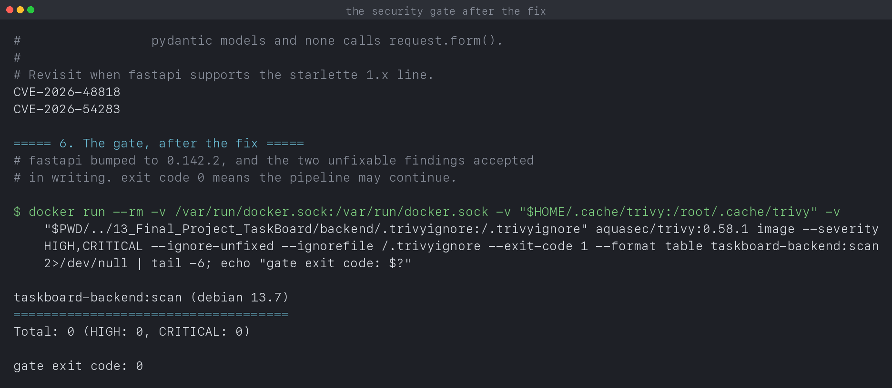
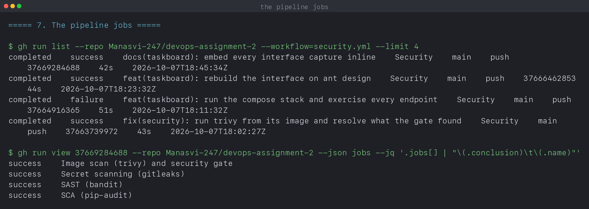

# Complete CI/CD and DevSecOps

**Name:** Manasvi Sabbarwal
**Roll No:** 24BCS10406

Four scanners wired into a pipeline, and a gate that stops a vulnerable image
going any further. Every output block is quoted from
[`output.log`](output.log), written by [`capture-scans.sh`](capture-scans.sh),
which runs the same tools locally that the pipeline runs on GitHub.

The pipeline is [`../.github/workflows/security.yml`](../.github/workflows/security.yml).
The application it scans is the TaskBoard backend in
[`../13_Final_Project_TaskBoard`](../13_Final_Project_TaskBoard).

---

## 1. The flow

```text
code ──► SAST ──► SCA ──► secret scan ──► docker build ──► image scan ──► gate
         bandit   pip-audit  gitleaks                        trivy        trivy
```

Each tool looks at a different thing, which is why four of them are needed:

| Stage | Tool | Looks at | Catches |
|---|---|---|---|
| SAST | bandit | the Python we wrote | insecure patterns in our own code |
| SCA | pip-audit | `requirements.txt` | known CVEs in what we depend on |
| Secret scan | gitleaks | the whole git history | credentials committed by accident |
| Image scan | trivy | the built image | CVEs in the OS packages too |

The four jobs run in parallel because none depends on another. Only the gate
is sequential, and only within the image scan job.

---

## 2. SAST

```text
$ bandit -r app -f txt
Test results:
	No issues identified.

Code scanned:
	Total lines of code: 121

Run metrics:
	Total issues (by severity):
		Undefined: 0
		Low: 0
		Medium: 0
		High: 0
```

Clean, which is the expected result for 121 lines that do not build SQL by hand
or shell out. Worth saying plainly that a clean SAST report is weak evidence on
its own: bandit matches known bad patterns, so it finds `eval` on user input or
`subprocess` with `shell=True`, and it cannot find a logic flaw in an
authorisation check.

The value here is the ratchet. The scan is clean now, so anything that appears
later arrived with a specific commit and is attributable.

---

## 3. SCA

```text
$ pip-audit -r requirements.txt --format columns
Found 12 known vulnerabilities in 2 packages
Name      Version ID              Fix Versions
--------- ------- --------------- ------------
pytest    8.3.4   PYSEC-2026-1845 9.0.3
starlette 0.52.1  PYSEC-2026-161  1.0.1
starlette 0.52.1  PYSEC-2026-2281 1.1.0
starlette 0.52.1  PYSEC-2026-2280 1.1.0
starlette 0.52.1  PYSEC-2026-249  1.3.1
starlette 0.52.1  PYSEC-2026-248  1.3.0
```

The important detail: **`starlette` is not in `requirements.txt`**. It arrives
as a dependency of FastAPI. This is what SCA is for, because the vulnerable
code is in something nobody chose and nobody can see by reading the manifest.

`pytest` is a test dependency, so it never reaches the runtime image. Worth
separating from the rest when deciding what to act on.

---

## 4. Secret scanning

```text
$ gitleaks detect --source=/repo --no-banner --redact
INF 24 commits scanned.
INF no leaks found
```

Clean now, but it was not on the first run. A full history scan reported **8
detections across 5 files**:

| File | Rule |
|---|---|
| `04_K8s_Ingress_ConfigMaps_Secrets/README.md` and `output.log` | `generic-api-key` |
| `12_Monitoring_Observability_GitOps/README.md`, `output.log`, `verify.sh` | `curl-auth-user` |

Both are credentials published on purpose. The first is the base64 value the
session 12 lab exists to decode, in a lab whose whole point is that base64 is
not encryption. The second is Grafana's documented `admin:admin` default,
passed to curl so a healthcheck can authenticate against a container the same
script creates and destroys.

The scanner is right to flag them, and the right answer is not to silence the
rule. [`../.gitleaksignore`](../.gitleaksignore) lists each detection by
**fingerprint** with the reason, so a new and genuine secret in the same file
still fails. A blanket rule exclusion would have hidden the next one too.

The other thing this proves: gitleaks reads **history**, not the working tree.
Deleting a secret in a later commit does not remove it from the repository, and
the only real remedy once a credential is pushed is to rotate it.

---

## 5. Image scanning

The image carries far more than the application:

```text
$ trivy image --severity HIGH,CRITICAL taskboard-backend:scan
taskboard-backend:scan (debian 13.7)
Total: 44 (HIGH: 44, CRITICAL: 0)

Python (python-pkg)
Total: 2 (HIGH: 2, CRITICAL: 0)
```

44 findings in the Debian base against 2 in the Python packages. Almost
everything an image scan reports comes from the base image, not from code
anyone wrote, which is the argument for a smaller base: fewer packages means
fewer CVEs, and most of those 44 are in libraries this service never calls.

Critically, **every one of the 44 has no fix available**, which is what
`--ignore-unfixed` filters on. A gate that fails on unfixable findings is a
gate people disable within a week.

---

## 6. The gate

```yaml
- name: Security gate, fail on HIGH or CRITICAL
  run: |
    docker run --rm ... aquasec/trivy:0.58.1 image \
      --severity HIGH,CRITICAL \
      --ignore-unfixed \
      --ignorefile /.trivyignore \
      --exit-code 1 \
      taskboard-backend:scan
```

`--exit-code 1` is the entire mechanism. A non zero exit fails the job, and a
failed job stops the workflow, which is what prevents a vulnerable image being
pushed to a registry.

### It failed, which is the point

On the first working run the gate failed on **3 HIGH findings in starlette**.
That is the gate doing its job, and the fix is worth recording because the
obvious one did not work.

Bumping `fastapi` from 0.115.6 to 0.142.2 cleared one. The other two are fixed
only in the starlette 1.x line, and no FastAPI release resolves to it. Pinning
it directly:

```text
ERROR: Cannot install -r requirements.txt (line 1) and starlette==1.3.1
because these package versions have conflicting dependencies.
ERROR: ResolutionImpossible
```

So **two of the three could not be fixed by upgrading at all.** That is a
common real situation, and the honest response is a written, time bounded
exception rather than deleting the gate. From
[`.trivyignore`](../13_Final_Project_TaskBoard/backend/.trivyignore):

```text
# CVE-2026-48818  SSRF and NTLM credential theft via UNC paths in StaticFiles.
#                 Not reachable here: this service mounts no StaticFiles, the
#                 frontend is served by a separate nginx container.
#
# CVE-2026-54283  request.form() limits ignored for urlencoded bodies, a DoS.
#                 Not reachable here: every endpoint takes JSON through
#                 pydantic models and none calls request.form().
#
# Revisit when fastapi supports the starlette 1.x line.
```

Each entry names why it is unreachable **in this service** and when to look
again. That is the difference between accepting a risk and ignoring it.

```text
$ trivy image --severity HIGH,CRITICAL --ignore-unfixed --ignorefile /.trivyignore --exit-code 1 ...
taskboard-backend:scan (debian 13.7)
====================================
Total: 0 (HIGH: 0, CRITICAL: 0)

gate exit code: 0
```

---

## 7. The pipeline

```text
$ gh run view 37669284688 --json jobs
success	SAST (bandit)
success	SCA (pip-audit)
success	Secret scanning (gitleaks)
success	Image scan (trivy) and security gate
```

```text
$ gh run list --workflow=security.yml --limit 4
completed  success  docs(taskboard): embed every interface capture inline      Security  push
completed  success  feat(taskboard): rebuild the interface on ant design       Security  push
completed  failure  feat(taskboard): run the compose stack and exercise ...    Security  push
completed  success  fix(security): run trivy from its image and resolve ...    Security  push
```

The failure is left in the history. It is the run where the gate caught the
starlette findings, which is the only run that proves the gate works.

### Running trivy from its image

The marketplace action could not install its binary, and before that I pinned
two tags that do not exist, because the published tags carry a `v` prefix. The
job now runs trivy from `aquasec/trivy:0.58.1` directly:

```yaml
run: |
  docker run --rm \
    -v /var/run/docker.sock:/var/run/docker.sock \
    aquasec/trivy:0.58.1 image --severity HIGH,CRITICAL ...
```

One less dependency, a pinned version, and the command is visible in the
workflow rather than hidden behind action inputs.

---

## 8. What is not here

The session asks for a container registry push and a Kubernetes deployment
after the gate. Neither is in this pipeline.

The registry step would be `docker/login-action` with `secrets.GITHUB_TOKEN`
followed by a push to `ghcr.io`, gated on the scan passing. The deployment
would then apply the manifests against a cluster the runner can reach, which a
GitHub hosted runner cannot do for a kind cluster on this laptop without a
tunnel. Argo CD solves that properly by pulling from Git instead, and that is
demonstrated in
[`../12_Monitoring_Observability_GitOps`](../12_Monitoring_Observability_GitOps).

Saying so plainly is better than a workflow step that was never run.

---

## 9. What I took away

- The four scanners do not overlap. SAST reads our code, SCA reads the
  manifest, gitleaks reads history, trivy reads the built image.
- The vulnerable dependency was `starlette`, which appears in no file I wrote.
- Not every CVE can be fixed. Two had fixes that no compatible release ships,
  so the answer was a written exception with a date, not a disabled gate.
- Most image findings come from the base image and most have no fix, which is
  why `--ignore-unfixed` is the difference between a usable gate and an ignored
  one.
- `--exit-code 1` is the whole gate. Everything else is reporting.
- A clean SAST run means no known bad patterns, not that the code is safe.
- Secret scanning reads history, so deleting a committed secret does not
  unpublish it. Rotate it instead.

---

## 10. Screenshots

| What it shows | Capture |
|---|---|
| SAST and SCA, including the dependency nobody declared | [s17-01-sast-sca.png](screenshots/s17-01-sast-sca.png) |
| Secret scanning clean, and the image scan split by source | [s17-02-secrets-and-image.png](screenshots/s17-02-secrets-and-image.png) |
| The gate passing after the fix, with its documented exceptions | [s17-03-gate.png](screenshots/s17-03-gate.png) |
| All four jobs green, and the run where the gate caught something | [s17-04-pipeline.png](screenshots/s17-04-pipeline.png) |





---

## 11. Reproducing this

```bash
cd 09_DevSecOps
chmod +x capture-scans.sh && ./capture-scans.sh
```

The pipeline runs on any push touching the application folder, or with
`gh workflow run security.yml`.
