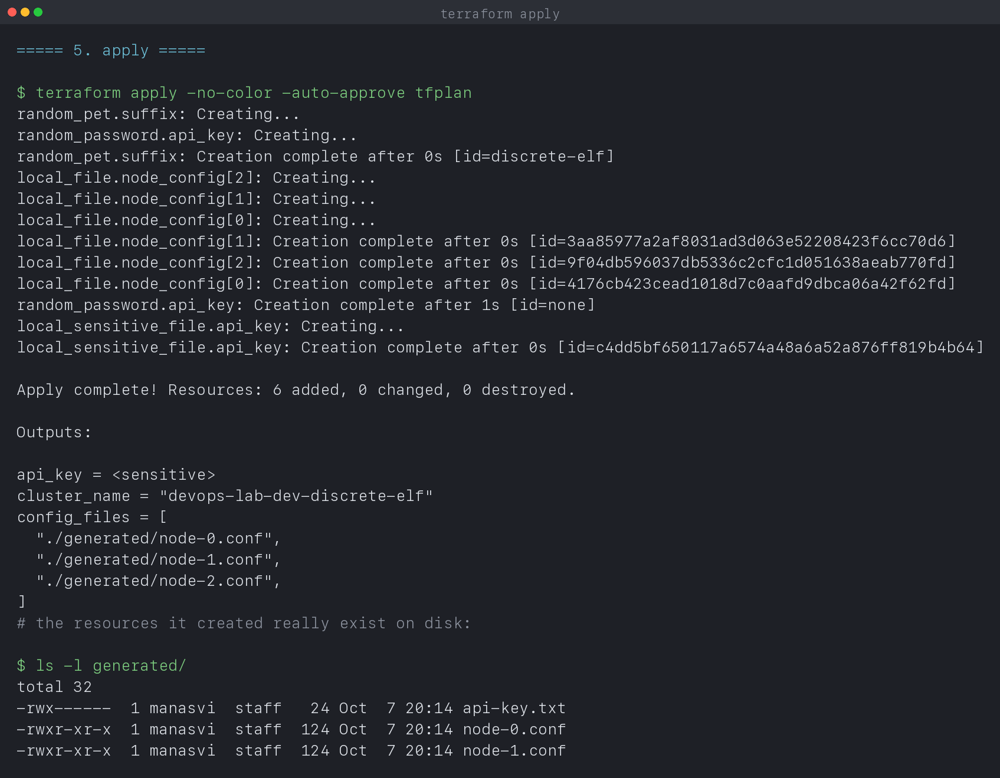
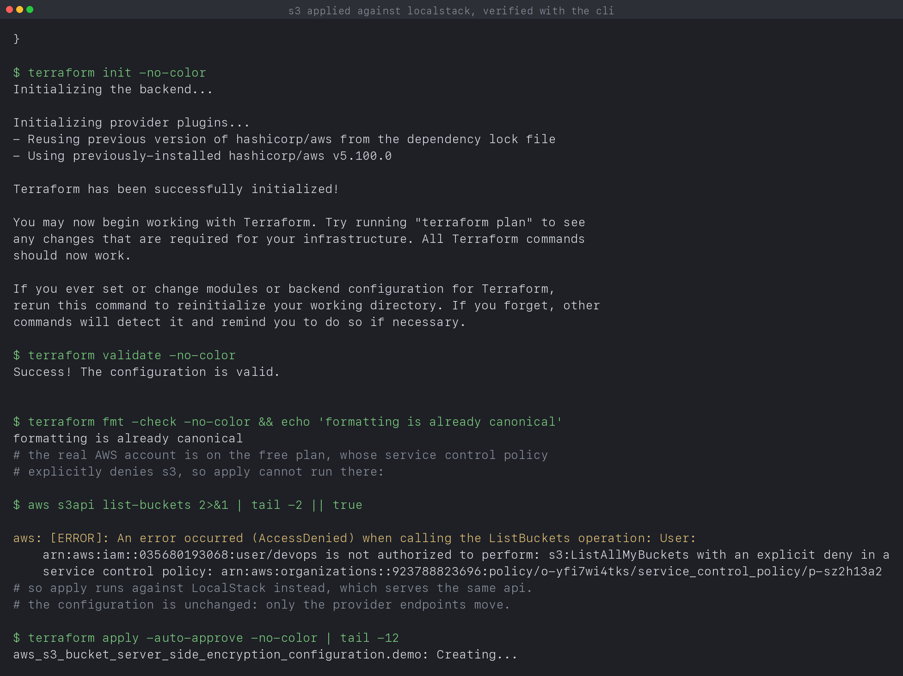

# Terraform and Infrastructure as Code

**Name:** Manasvi Sabbarwal
**Roll No:** 24BCS10406
**Terraform:** v1.16.4

The full Terraform workflow, run for real: `init`, `validate`, `plan`, `apply`,
state inspection, drift detection and `destroy`. Every output block is quoted
from [`output.log`](output.log), written by [`verify.sh`](verify.sh).

Two configurations in this folder:

| Directory | Provider | Applied |
|---|---|---|
| [`local-demo/`](local-demo) | `local` and `random` | yes, the whole lifecycle |
| [`aws-s3-demo/`](aws-s3-demo) | `aws` | yes, against LocalStack, see section 11 |

The lifecycle is identical whichever provider you use, which is the point of
the abstraction. `local-demo` creates real files on disk, so every stage of the
workflow can be shown end to end without a cloud account.

---

## 1. What infrastructure as code buys you

Three things, all visible in this run:

- **Declarative.** The configuration says what should exist. Terraform works
  out the order and the API calls. `main.tf` never mentions creating anything
  in sequence, yet section 5 shows `random_pet` created before the files that
  interpolate it.
- **A plan before a change.** Section 4 prints exactly what will happen before
  anything is touched. Nothing else in ops gives you that for free.
- **State.** Terraform records what it built, so it can tell the difference
  between "create this" and "this already exists", which is what makes section
  7 a no-op and section 8 a correction.

---

## 2. Providers and init

```text
$ terraform init -no-color
- Installing hashicorp/local v2.9.1...
- Installed hashicorp/local v2.9.1 (signed by HashiCorp)
- Installing hashicorp/random v3.9.1...
- Installed hashicorp/random v3.9.1 (signed by HashiCorp)

Terraform has been successfully initialized!
```

A provider is the plugin that knows how to talk to one API. Terraform core
knows nothing about S3 or local files; it only knows how to build a graph and
call providers.

`init` also writes `.terraform.lock.hcl`, which pins exact versions and their
checksums:

```hcl
provider "registry.terraform.io/hashicorp/local" {
  version     = "2.9.1"
  constraints = "~> 2.5"
  hashes = [ ... ]
}
```

`constraints` is what I asked for (`~> 2.5`, meaning any 2.x at or above 2.5).
`version` is what was actually selected. The lock file belongs in Git, so that
a colleague running `init` months later gets byte-identical providers rather
than a newer one that behaves differently.

---

## 3. Variables, resources and outputs

```hcl
variable "environment" {
  type    = string
  default = "dev"

  validation {
    condition     = contains(["dev", "staging", "prod"], var.environment)
    error_message = "environment must be dev, staging or prod."
  }
}
```

Validation blocks fail at plan time rather than halfway through an apply, which
is the cheapest place to catch a typo.

```hcl
resource "local_file" "node_config" {
  count    = var.instance_count
  filename = "${path.module}/generated/node-${count.index}.conf"
  ...
}
```

`count` turns one block into N resources addressed as `[0]`, `[1]`, `[2]`. You
can see all three being created in parallel in section 5.

Outputs are the documented interface of a configuration:

```hcl
output "api_key" {
  value     = random_password.api_key.result
  sensitive = true
}
```

---

## 4. plan

```text
$ terraform plan -no-color -out=tfplan
Terraform will perform the following actions:
...
Plan: 6 to add, 0 to change, 0 to destroy.
```

`-out=tfplan` writes the plan to a file. That matters in a pipeline: the plan
you review is then the exact plan you apply, with no chance of the world moving
underneath you between the two steps. Section 5 applies that saved file rather
than re-planning.

---

## 5. apply

```text
$ terraform apply -no-color -auto-approve tfplan
random_pet.suffix: Creating...
random_password.api_key: Creating...
random_pet.suffix: Creation complete after 0s [id=discrete-elf]
local_file.node_config[2]: Creating...
local_file.node_config[1]: Creating...
local_file.node_config[0]: Creating...
local_file.node_config[1]: Creation complete after 0s [id=3aa85977a2af8031ad3d063e52208423f6cc70d6]
local_file.node_config[2]: Creation complete after 0s [id=9f04db596037db5336c2cfc1d051638aeab770fd]
local_file.node_config[0]: Creation complete after 0s [id=4176cb423cead1018d7c0aafd9dbca06a42f62fd]
random_password.api_key: Creation complete after 1s [id=none]
local_sensitive_file.api_key: Creating...
local_sensitive_file.api_key: Creation complete after 0s [id=c4dd5bf650117a6574a48a6a52a876ff819b4b64]

Apply complete! Resources: 6 added, 0 changed, 0 destroyed.

Outputs:

api_key = <sensitive>
cluster_name = "devops-lab-dev-discrete-elf"
config_files = [
  "./generated/node-0.conf",
  "./generated/node-1.conf",
  "./generated/node-2.conf",
]
```

Read the ordering carefully. `random_pet` and `random_password` start together
because neither depends on anything. The three `node_config` files start only
after `random_pet` finishes, because their content interpolates
`random_pet.suffix.id`. `local_sensitive_file` waits for `random_password` for
the same reason.

I never declared any of that ordering. Terraform built a dependency graph from
the interpolations and ran everything it could in parallel. `depends_on` exists
for the rare case where a dependency is real but invisible to the graph.

`api_key = <sensitive>` is the `sensitive = true` flag doing its job: the value
is in state and on disk, but Terraform will not print it into a terminal or a
CI log by accident.

The resources are genuinely real:

```text
$ ls -l generated/
-rwx------  1 manasvi  staff   24 Oct  7 20:14 api-key.txt
-rwxr-xr-x  1 manasvi  staff  124 Oct  7 20:14 node-0.conf
-rwxr-xr-x  1 manasvi  staff  124 Oct  7 20:14 node-1.conf
-rwxr-xr-x  1 manasvi  staff  124 Oct  7 20:14 node-2.conf

$ cat generated/node-0.conf
# generated by terraform, do not edit
project     = devops-lab
environment = dev
node_id     = 0
cluster     = discrete-elf
```

---

## 6. State

```text
$ terraform state list
local_file.node_config[0]
local_file.node_config[1]
local_file.node_config[2]
local_sensitive_file.api_key
random_password.api_key
random_pet.suffix
```

State is the mapping from a name in your configuration to a real object. It is
why Terraform knows `random_pet.suffix` means the thing with id
`discrete-elf`, and why it does not create a second one on the next run.

Two practical consequences:

- **State contains secrets in plain text.** `random_password.api_key` is in
  there unencrypted, regardless of the `sensitive` flag on the output. A state
  file is as sensitive as the credentials it describes, which is why real
  projects use a remote backend with encryption and locking rather than a local
  file in Git. `.gitignore` in both directories excludes `*.tfstate`.
- **State can drift from reality**, which is section 8.

---

## 7. Idempotency

```text
$ terraform plan -no-color | tail -5
No changes. Your infrastructure matches the configuration.

Terraform has compared your real infrastructure against your configuration
and found no differences, so no changes are needed.
```

Running apply twice does not create six more files. Terraform refreshes the
real state, compares it with the desired state, and does nothing if they match.
That is what makes it safe to run on a schedule or in CI on every merge.

---

## 8. Drift detection

Editing a managed file behind Terraform's back:

```text
$ echo 'edited outside terraform' >> generated/node-0.conf

$ terraform plan -no-color | tail -12
      + directory_permission = "0777"
      + file_permission      = "0777"
      + filename             = "./generated/node-0.conf"
      + id                   = (known after apply)
    }

Plan: 1 to add, 0 to change, 0 to destroy.
```

Terraform noticed and planned to put it back. Note it says **add**, not
**change**: the `local_file` provider identifies a file by the hash of its
contents, so a file with different contents is not a modified resource, it is a
missing one. Other providers would report this as an in-place update.

This is the loop that makes IaC trustworthy. Manual changes are not permanent;
the next apply reverts them. If you want a change to stick, it goes in the
configuration.

---

## 9. Changing a variable

```text
$ terraform plan -no-color -var='instance_count=5' | tail -8
Plan: 2 to add, 0 to change, 0 to destroy.
```

Two more files for indices 3 and 4, and the existing three untouched. `count`
appends at the tail, which is also its weakness: removing an item from the
middle of a `count` list renumbers everything after it and Terraform destroys
and recreates them. `for_each` keys resources by a stable string instead, and
is the better choice when the collection changes.

---

## 10. destroy

```text
$ terraform destroy -no-color -auto-approve
random_pet.suffix: Refreshing state... [id=discrete-elf]
local_file.node_config[0]: Refreshing state... [id=4176cb423cead1018d7c0aafd9dbca06a42f62fd]
...
Destroy complete! Resources: 5 destroyed.
```

**Six were created and five were destroyed**, which looks wrong until you read
the refresh lines. Terraform refreshes before destroying, found that
`node_config[0]` no longer matched its recorded hash (section 8 edited it), and
dropped it from state as already gone. It then destroyed the five it still
tracked.

That is correct behaviour, and a useful reminder: Terraform only destroys what
is in state. Anything it has lost track of has to be cleaned up by hand, which
is the usual cause of orphaned cloud resources that still bill.

---

## 11. The AWS configuration

[`aws-s3-demo/`](aws-s3-demo) declares an S3 bucket with versioning, a public
access block and server side encryption. It initialises and validates against
the real AWS provider:

```text
$ terraform init -no-color
- Installed hashicorp/aws v5.100.0 (signed by HashiCorp)

$ terraform validate -no-color
Success! The configuration is valid.
```

### Why it does not apply to the real account

```text
$ aws s3api list-buckets
An error occurred (AccessDenied) when calling the ListBuckets operation:
User: arn:aws:iam::035680193068:user/devops is not authorized to perform:
s3:ListAllMyBuckets with an explicit deny in a service control policy:
arn:aws:organizations::923788823696:policy/o-yfi7wi4tks/service_control_policy/p-sz2h13a2
```

The account exists and the credentials work, but it sits on the AWS free plan,
which places it inside an AWS managed Organization whose Service Control Policy
denies S3 and EC2 outright.

IAM policies **grant** permissions. An SCP sets the **maximum** any principal in
the account may do, and an explicit Deny in an SCP beats every Allow beneath it,
including `AdministratorAccess` and the account root user. That policy lives in
AWS's organization, not mine, so there is nothing to change. Attaching more IAM
permissions would make no difference whatsoever.

### So apply runs against LocalStack

LocalStack implements the same AWS APIs in a container. Only the provider
endpoints move; `main.tf` is untouched:

```hcl
provider "aws" {
  access_key                  = var.use_localstack ? "test" : null
  skip_credentials_validation = var.use_localstack
  s3_use_path_style           = var.use_localstack

  dynamic "endpoints" {
    for_each = var.use_localstack ? [1] : []
    content {
      s3  = var.localstack_endpoint
      ec2 = var.localstack_endpoint
      sts = var.localstack_endpoint
    }
  }
}
```

```text
$ terraform apply -auto-approve -no-color
Apply complete! Resources: 4 added, 0 changed, 0 destroyed.

Outputs:

bucket_arn = "arn:aws:s3:::devops-course-24bcs10406-demo"
bucket_name = "devops-course-24bcs10406-demo"
bucket_region = "ap-south-1"

$ terraform state list
aws_s3_bucket.demo
aws_s3_bucket_public_access_block.demo
aws_s3_bucket_server_side_encryption_configuration.demo
aws_s3_bucket_versioning.demo
```

Read back with the AWS CLI rather than taking Terraform's word for it:

```text
$ aws --endpoint-url=http://localhost:4566 s3 ls
2026-10-07 23:37:02 devops-course-24bcs10406-demo

$ aws ... s3api get-bucket-versioning --bucket devops-course-24bcs10406-demo
{
    "Status": "Enabled"
}

$ aws ... s3api get-bucket-encryption ... --query '...ApplyServerSideEncryptionByDefault'
+---------------+----------+
|  SSEAlgorithm |  AES256  |
+---------------+----------+

$ aws ... s3api get-public-access-block --bucket devops-course-24bcs10406-demo
||  BlockPublicAcls        |  True ||
||  BlockPublicPolicy      |  True ||
||  IgnorePublicAcls       |  True ||
||  RestrictPublicBuckets  |  True ||
```

All four settings took effect. Note these are four **separate resources**, not
arguments on the bucket. Before AWS provider v4 several of them were inline
arguments, and splitting them out is why older tutorials no longer apply
cleanly. It also means you can forget one: a bucket with no
`aws_s3_bucket_public_access_block` is not blocked by that resource's absence,
it simply has whatever the account default is.

```text
$ terraform destroy -auto-approve -no-color
Destroy complete! Resources: 4 destroyed.
```

To target a real account instead, `terraform apply -var use_localstack=false`
with credentials configured. Nothing else changes.

## 12. What I took away

- The workflow is the same for every provider. Learning `init / plan / apply /
  destroy` once covers local files and AWS equally.
- Terraform derives ordering from interpolations. The parallel creation in
  section 5 was never written down anywhere.
- `-out=tfplan` makes the reviewed plan and the applied plan the same artifact,
  which is the only safe way to do this in a pipeline.
- The lock file pins providers. Without it in Git, two people get two different
  infrastructures from one configuration.
- State holds secrets in plain text whatever the `sensitive` flag says.
- Drift is detected on refresh and corrected on apply, so manual changes do not
  survive. Terraform only manages what is in state.
- An explicit Deny in an SCP cannot be overridden from inside the account, so
  no amount of IAM permission would have helped.
- LocalStack serves the same AWS APIs, so the identical configuration applies
  for real and the AWS CLI reads it back. Only the provider endpoints move.
- The S3 bucket settings are separate resources rather than arguments, so one
  can be silently omitted.

---

## 13. Screenshots

| What it shows | Capture |
|---|---|
| `init` downloading and pinning providers | [tf-01-init.png](screenshots/tf-01-init.png) |
| `apply` creating 6 resources, with the dependency ordering visible | [tf-02-apply.png](screenshots/tf-02-apply.png) |
| State listing, and a second plan finding no changes | [tf-03-state-idempotent.png](screenshots/tf-03-state-idempotent.png) |
| Drift detected after editing a managed file by hand | [tf-04-drift.png](screenshots/tf-04-drift.png) |
| `destroy`, and why it removed 5 of 6 | [tf-05-destroy.png](screenshots/tf-05-destroy.png) |
| AWS config valid, and the SCP denial on the real account | [tf-06-aws-validate.png](screenshots/tf-06-aws-validate.png) |
| The same config applied against LocalStack, verified with the CLI | [tf-07-localstack-apply.png](screenshots/tf-07-localstack-apply.png) |





---

## 14. Reproducing this

```bash
cd 10_Terraform_IaC
chmod +x verify.sh && ./verify.sh
```

The `local-demo` section needs no credentials. The `aws-s3-demo` section runs
`init` and `validate`, which also need none.
