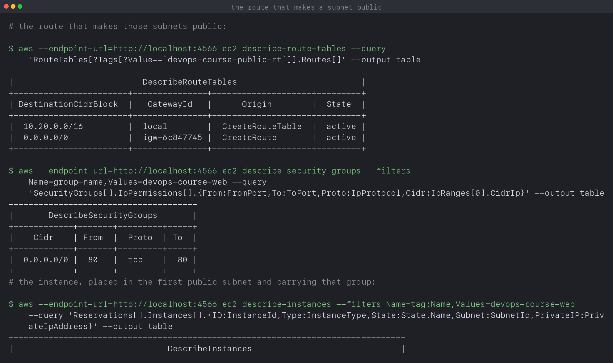

# Cloud and Terraform in Action

**Name:** Manasvi Sabbarwal
**Roll No:** 24BCS10406
**Terraform:** v1.16.4, AWS provider v5.100.0

A VPC with two public subnets across two availability zones, an internet
gateway, a route table, a security group, an EC2 instance and an S3 bucket,
built with Terraform and then checked independently with the AWS CLI. Every output block is quoted from
[`output.log`](output.log), written by [`verify.sh`](verify.sh).

---

## 1. Where this actually runs

The configuration in [`vpc/`](vpc) is ordinary AWS Terraform. It is applied
against **LocalStack**, which implements the real AWS APIs in a container, so
`terraform apply` genuinely creates resources and the AWS CLI genuinely reads
them back.

```text
$ curl -s http://localhost:4566/_localstack/health
ec2: available
s3: available
```

The provider block switches target with one variable:

```hcl
provider "aws" {
  region = var.aws_region

  access_key                  = var.use_localstack ? "test" : null
  skip_credentials_validation = var.use_localstack

  dynamic "endpoints" {
    for_each = var.use_localstack ? [1] : []
    content {
      ec2 = var.localstack_endpoint
      sts = var.localstack_endpoint
      iam = var.localstack_endpoint
    }
  }
}
```

Nothing in `main.tf` changes between the two. Running against a real account is
`terraform apply -var use_localstack=false` with credentials configured.

**Why not a real account.** I created one, and the credentials work
(`arn:aws:iam::035680193068:user/devops`), but it sits on the AWS free plan,
which places the account inside an AWS managed Organization whose Service
Control Policy explicitly denies EC2 and S3:

```text
$ aws ec2 describe-vpcs --region ap-south-1
An error occurred (UnauthorizedOperation) ... is not authorized to perform:
ec2:DescribeVpcs with an explicit deny in a service control policy:
arn:aws:organizations::923788823696:policy/o-yfi7wi4tks/service_control_policy/p-sz2h13a2
```

IAM policies **grant**; an SCP sets the **ceiling** and never grants anything.
An explicit Deny in an SCP beats every Allow beneath it, including
`AdministratorAccess` and the account root user, and that policy lives in AWS's
organization rather than mine. So no IAM change could have helped. LocalStack
gives the same API surface without that constraint.

---

## 2. Cloud service models, briefly

| Model | You manage | They manage | Here |
|---|---|---|---|
| IaaS | OS, runtime, app | hardware, network, virtualisation | EC2, VPC |
| PaaS | app and data | everything beneath | Elastic Beanstalk, App Runner |
| SaaS | nothing but your data | all of it | Gmail, Salesforce |

A VPC is squarely IaaS: AWS runs the physical network, and the addressing,
routing and firewalling are mine to get right. Everything below is a decision I
had to make rather than a default I inherited.

---

## 3. Regions and availability zones

A **region** is a geographic area. An **availability zone** is one or more
discrete data centres inside it, with independent power and cooling, connected
to the other zones by low latency links.

The AZs are looked up rather than hardcoded:

```hcl
data "aws_availability_zones" "available" {
  state = "available"
}

resource "aws_subnet" "public" {
  count             = length(var.public_subnet_cidrs)
  availability_zone = data.aws_availability_zones.available.names[count.index]
  ...
}
```

```text
availability_zones = [
  "ap-south-1a",
  "ap-south-1b",
]
```

Hardcoding `ap-south-1a` would make the configuration unusable in any other
region, and AZ names are per account anyway: my `ap-south-1a` is not
necessarily the same physical building as yours. A data source keeps the code
portable.

**A subnet lives in exactly one AZ.** That is why there are two: a workload in
one subnet dies with its zone, so spreading across zones is the cheapest
availability you can buy.

---

## 4. VPC and subnets

```hcl
resource "aws_vpc" "main" {
  cidr_block           = "10.20.0.0/16"
  enable_dns_support   = true
  enable_dns_hostnames = true
}
```

`10.20.0.0/16` gives 65,536 addresses. The subnets carve it up:

| Subnet | CIDR | Addresses | AZ |
|---|---|---|---|
| public 1 | 10.20.1.0/24 | 256 | ap-south-1a |
| public 2 | 10.20.2.0/24 | 256 | ap-south-1b |

AWS reserves **5 addresses in every subnet** (network, VPC router, DNS,
future use, broadcast), so a /24 gives 251 usable rather than 254. Worth
knowing before you size a subnet to exactly the number of instances you want.

CIDR blocks cannot be changed after creation and cannot overlap within a VPC,
so this is one of the few decisions that is genuinely hard to undo. Picking a
range that will not collide with a future VPC peering or VPN is the reason
people avoid the default `172.31.0.0/16`.

---

## 5. What actually makes a subnet public

Nothing about `aws_subnet` marks it public. There is no such flag. A subnet is
public when **its route table sends `0.0.0.0/0` to an internet gateway**:

```hcl
resource "aws_route_table" "public" {
  vpc_id = aws_vpc.main.id

  route {
    cidr_block = "0.0.0.0/0"
    gateway_id = aws_internet_gateway.main.id
  }
}

resource "aws_route_table_association" "public" {
  count          = length(aws_subnet.public)
  subnet_id      = aws_subnet.public[count.index].id
  route_table_id = aws_route_table.public.id
}
```

The association is the part people forget. A route table with a perfect route,
associated with nothing, does nothing at all.

Read back from the API, the route table has two entries:

```text
$ aws ec2 describe-route-tables --query 'RouteTables[?Tags[?Value==`devops-course-public-rt`]].Routes[]'
+-----------------------+---------------+--------------------+---------+
| DestinationCidrBlock  |   GatewayId   |      Origin        |  State  |
+-----------------------+---------------+--------------------+---------+
|  10.20.0.0/16         |  local        |  CreateRouteTable  |  active |
|  0.0.0.0/0            |  igw-ac370ba0 |  CreateRoute       |  active |
+-----------------------+---------------+--------------------+---------+
```

The `local` route is created automatically and cannot be removed: it is what
lets everything inside the VPC talk to everything else. The second route is
mine, and it is the entire difference between public and private.

A **private** subnet is the same thing without that second route. If it needs
outbound internet it gets a NAT Gateway instead, which is the expensive piece
of a real VPC at roughly $32 a month plus data. This lab has none, which is
also why it costs nothing.

---

## 6. Security groups

```text
$ aws ec2 describe-security-groups --filters Name=group-name,Values=devops-course-web
+------------+-------+---------+-----+
|    Cidr    | From  |  Proto  | To  |
+------------+-------+---------+-----+
|  0.0.0.0/0 |  80   |  tcp    |  80 |
+------------+-------+---------+-----+
```

Two properties worth being precise about:

- **Stateful.** Allowing inbound 80 automatically allows the response back out.
  You do not write a matching egress rule. Network ACLs, the other layer, are
  stateless and do need both directions.
- **Deny by default, allow only.** There is no deny rule in a security group.
  Anything not explicitly allowed is dropped, so rules can only ever widen
  access.

A security group is attached to an interface, not to a subnet, so two instances
in the same subnet can have completely different exposure. That is the usual
way to let a web tier reach a database tier while nothing else can: the
database group allows 5432 from the web tier's **group ID** rather than from a
CIDR.

The `0.0.0.0/0` here is correct for a public web port and would be wrong for
SSH, which is the single most common real world misconfiguration.

---

## 7. Compute and storage in the network

The network exists to put something in it. The instance goes in the first
public subnet, carrying the security group from section 6.

```hcl
data "aws_ami" "amazon_linux" {
  most_recent = true
  owners      = ["amazon"]
  filter {
    name   = "name"
    values = ["al2023-ami-*-x86_64"]
  }
}

resource "aws_instance" "web" {
  ami                         = data.aws_ami.amazon_linux.id
  instance_type               = var.instance_type
  subnet_id                   = aws_subnet.public[0].id
  vpc_security_group_ids      = [aws_security_group.web.id]
  associate_public_ip_address = true
}
```

The AMI is looked up rather than written down, for the same reason the
availability zones are: **AMI ids are per region**, so a hardcoded one makes
the configuration unusable anywhere else.

`associate_public_ip_address` is not what makes this reachable. The subnet's
route to the internet gateway does that. Without the route, a public IP is an
address nothing can get to.

The bucket beside it blocks public access explicitly:

```hcl
resource "aws_s3_bucket_public_access_block" "assets" {
  bucket                  = aws_s3_bucket.assets.id
  block_public_acls       = true
  block_public_policy     = true
  ignore_public_acls      = true
  restrict_public_buckets = true
}
```

---

## 8. apply, and checking it independently

```text
$ terraform state list
data.aws_ami.amazon_linux
data.aws_availability_zones.available
aws_instance.web
aws_internet_gateway.main
aws_route_table.public
aws_route_table_association.public[0]
aws_route_table_association.public[1]
aws_s3_bucket.assets
aws_s3_bucket_public_access_block.assets
aws_security_group.web
aws_subnet.public[0]
aws_subnet.public[1]
aws_vpc.main

$ terraform output
availability_zones = [
  "ap-south-1a",
  "ap-south-1b",
]
public_subnet_ids = [
  "subnet-c3fc17d0",
  "subnet-beacc67a",
]
security_group_id = "sg-c553cba6b0754c5a2"
vpc_id = "vpc-b09be995"
```

Terraform reporting success only proves Terraform thinks it succeeded. These
queries go straight to the API instead:

```text
$ aws ec2 describe-vpcs --filters Name=tag:Name,Values=devops-course-vpc
+--------------+----------------+----------------+------------+
|     CIDR     | DnsHostnames   |      ID        |   State    |
+--------------+----------------+----------------+------------+
|  10.20.0.0/16|  None          |  vpc-b09be995  |  available |
+--------------+----------------+----------------+------------+

$ aws ec2 describe-subnets --filters Name=tag:Tier,Values=public
+-------------+---------------+---------------+--------------------+
|     AZ      | AutoPublicIP  |     CIDR      |        ID          |
+-------------+---------------+---------------+--------------------+
|  ap-south-1a|  True         |  10.20.1.0/24 |  subnet-c3fc17d0   |
|  ap-south-1b|  True         |  10.20.2.0/24 |  subnet-beacc67a   |
+-------------+---------------+---------------+--------------------+

$ aws ec2 describe-internet-gateways
+--------------+----------------+-------------+
|  AttachedTo  |      ID        |    State    |
+--------------+----------------+-------------+
|  vpc-b09be995|  igw-ac370ba0  |  available  |
+--------------+----------------+-------------+
```

```text
$ aws ec2 describe-instances --filters Name=tag:Name,Values=devops-course-web
+----------------------+------------+----------+------------------+------------+
|          ID          | PrivateIP  |  State   |     Subnet       |   Type     |
+----------------------+------------+----------+------------------+------------+
|  i-5689413d1f19a0c07 |  10.20.1.4 |  running |  subnet-87265edf |  t3.micro  |
+----------------------+------------+----------+------------------+------------+

$ aws s3 ls
2026-10-08 01:02:37 devops-course-24bcs10406-assets

$ aws s3api get-public-access-block --bucket devops-course-24bcs10406-assets
||  BlockPublicAcls        |  True ||
||  BlockPublicPolicy      |  True ||
||  IgnorePublicAcls       |  True ||
||  RestrictPublicBuckets  |  True ||
```

Two subnets in two different AZs, `MapPublicIpOnLaunch` true, and the gateway
attached to this VPC specifically. The instance landed in the first subnet with
a `10.20.1.x` address from that subnet's range, and the bucket has all four
public access blocks on. `DnsHostnames` shows `None` because
LocalStack does not report that attribute through `describe-vpcs`, though it is
set in the configuration. That is a gap in the emulator rather than in the
Terraform, and worth flagging rather than glossing over.

---

## 9. Idempotency and destroy

```text
$ terraform plan | tail -4
No changes. Your infrastructure matches the configuration.
```

```text
$ terraform destroy -auto-approve | tail -6
Destroy complete! Resources: 9 destroyed.

$ aws ec2 describe-vpcs --filters Name=tag:Name,Values=devops-course-vpc --query 'length(Vpcs)'
0
```

All nine gone, confirmed by the API rather than by Terraform's own word.
Terraform destroys in reverse dependency order: associations before route
tables, subnets before the VPC, because AWS refuses to delete a VPC that still
has anything in it.

---

## 10. What I took away

- An SCP cannot be overridden from inside the account. More IAM permissions
  would not have helped, and recognising that saved a lot of wasted effort.
- LocalStack runs the real API surface, so `apply` and `aws ec2 describe-*`
  both work. The configuration is unchanged between it and real AWS.
- A subnet is public **only** because of a `0.0.0.0/0` route to an internet
  gateway. There is no public flag, and an unassociated route table does
  nothing.
- AWS reserves 5 addresses per subnet, so a /24 gives 251 usable.
- AZ names are per account, so looking them up with a data source is not just
  tidier, it is correct.
- Security groups are stateful and allow only, so return traffic needs no rule
  and nothing can be explicitly denied.
- `terraform output` and an independent API query are different claims.
  Checking both is the habit worth keeping, and it caught a stale log here: an
  abandoned run left a terminated instance and a state lock behind, and the
  next run's output described infrastructure that had not been built.
- The provider needs `s3_use_path_style` against LocalStack. Without it every
  S3 call returned 500 and Terraform retried until it was killed, while EC2 in
  the same configuration worked fine.

---

## 11. Screenshots

| What it shows | Capture |
|---|---|
| `apply` creating all 11 resources | [s19-01-apply.png](screenshots/s19-01-apply.png) |
| State list and outputs | [s19-02-state-outputs.png](screenshots/s19-02-state-outputs.png) |
| VPC, subnets and gateway read back from the API | [s19-03-verify-vpc-subnets.png](screenshots/s19-03-verify-vpc-subnets.png) |
| The `0.0.0.0/0` route and the security group rule | [s19-04-routes-and-sg.png](screenshots/s19-04-routes-and-sg.png) |
| The instance in its subnet, and the bucket with public access blocked | [s19-05-ec2-and-s3.png](screenshots/s19-05-ec2-and-s3.png) |
| A second plan finding nothing, then destroy | [s19-06-idempotent-destroy.png](screenshots/s19-06-idempotent-destroy.png) |



---

## 12. Reproducing this

```bash
docker run -d --name localstack-tf -p 4566:4566 -e SERVICES=s3,ec2 localstack/localstack:3.8
cd 11_Cloud_Terraform
chmod +x verify.sh && ./verify.sh
```

Against a real account instead:

```bash
cd vpc
terraform apply -var use_localstack=false
```

## 13. Cleanup

```bash
cd vpc && terraform destroy -auto-approve
docker rm -f localstack-tf
```
