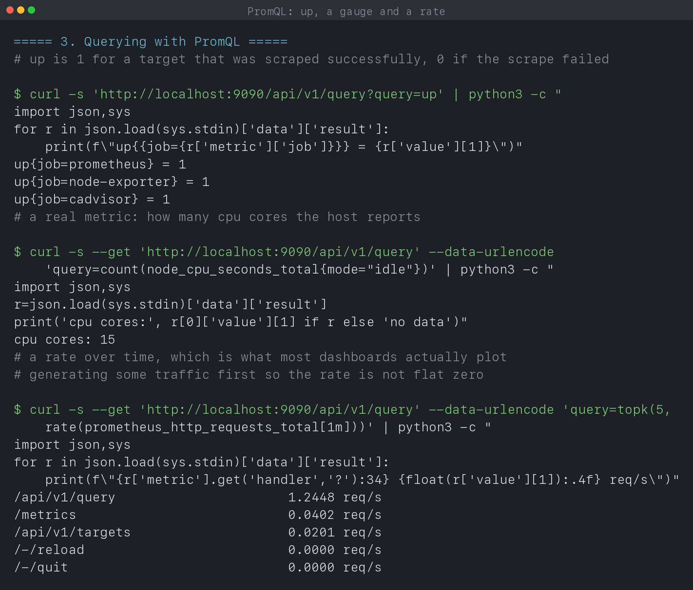
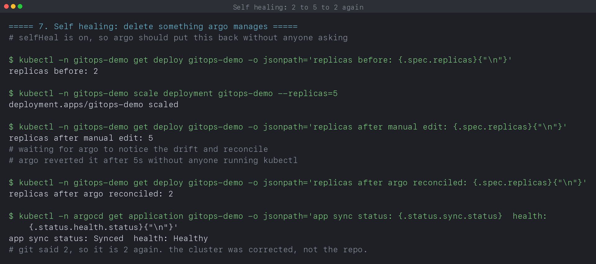
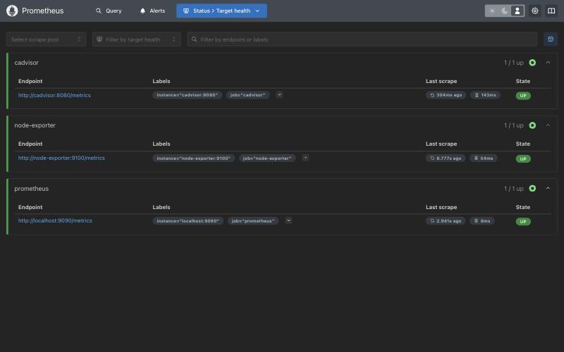
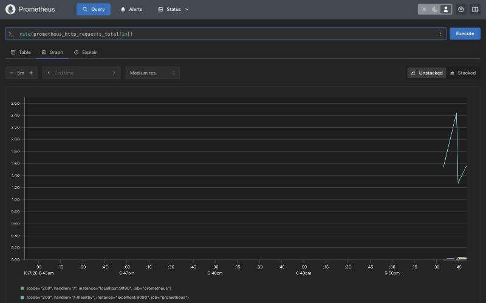
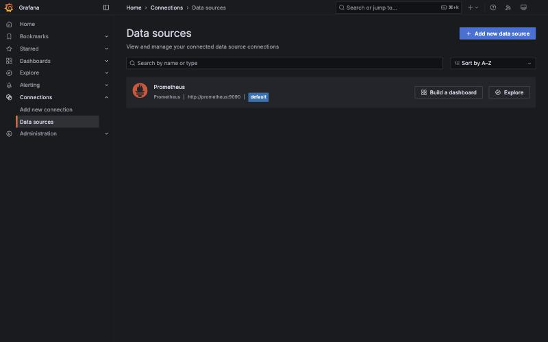
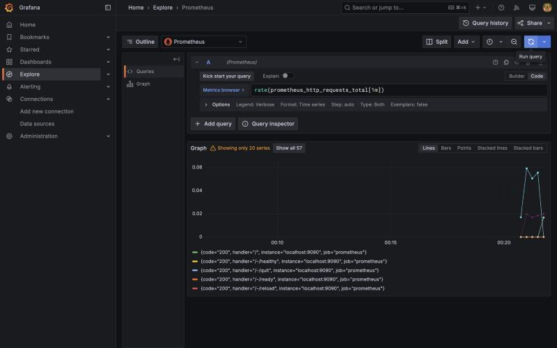

# Monitoring, Observability and GitOps

**Name:** Manasvi Sabbarwal
**Roll No:** 24BCS10406
**Cluster:** kind v0.33.0, 3 nodes (1 control-plane + 2 workers), Kubernetes v1.37.0

Covers Lecture 20. A Prometheus and Grafana stack scraping real targets, and
Argo CD reconciling this repository onto the cluster, including a self healing
drill where I break the cluster on purpose and watch Argo put it back.

Every output block below is quoted from [`output.log`](output.log), written by
[`verify.sh`](verify.sh). Nothing here is typed from memory.

The monitoring stack runs in Docker Compose rather than in the cluster. That is
deliberate: the point of this section is how scraping works, and keeping
Prometheus outside kind means the targets are plain hostnames on a compose
network rather than service discovery I would then have to explain separately.

---

## 1. Monitoring versus observability

**Monitoring** is watching things you already decided to watch. You pick the
signals in advance, you graph them, you alert on them. It answers questions you
wrote down before the incident: is it up, is it slow, is the disk filling.

**Observability** is whether the system emits enough for you to answer a
question you did **not** anticipate. Nobody writes a dashboard for "why are
checkouts failing only for users on the new mobile build". You either have the
raw material to find that out, or you do not.

Monitoring is the dashboard. Observability is whether the dashboard can be
rebuilt into a different shape at 3am without shipping new code first.

### Metrics, logs and traces

| | What it is | Cost | Good at | Bad at |
|---|---|---|---|---|
| Metrics | numbers sampled on an interval | cheap, fixed per series | trend, rate, alert threshold | "which request" |
| Logs | one text record per event | grows with traffic | the detail of a single event | aggregating, cardinality |
| Traces | one request stitched across services | expensive, usually sampled | where the latency went | overall rates |

The split is really about cardinality. A metric is cheap because it is a small
fixed set of label combinations and Prometheus only stores a number per scrape.
The moment you put a user ID in a label you have one series per user, and the
thing that made metrics cheap is gone. That is exactly the information a log
line carries happily, because a log is not retained as a time series.

So in practice: metrics tell you something is wrong and roughly when, traces
tell you which hop, logs tell you what the hop actually said. This lab is the
metrics third.

---

## 2. The stack

```text
$ cd prometheus-grafana && docker compose ps --format 'table {{.Service}}\t{{.Status}}\t{{.Ports}}' && cd ..
SERVICE         STATUS                                     PORTS
cadvisor        Up Less than a second (health: starting)   0.0.0.0:8081->8080/tcp, [::]:8081->8080/tcp
grafana         Up Less than a second                      0.0.0.0:3001->3000/tcp, [::]:3001->3000/tcp
node-exporter   Up Less than a second                      0.0.0.0:9100->9100/tcp, [::]:9100->9100/tcp
prometheus      Up Less than a second                      0.0.0.0:9090->9090/tcp, [::]:9090->9090/tcp
```

Four containers. Prometheus stores and queries, node-exporter publishes host
metrics, cadvisor publishes per-container metrics, Grafana draws.

Note that neither exporter knows Prometheus exists. They expose `/metrics` over
HTTP and that is the whole contract.

---

## 3. How scraping actually works

Prometheus **pulls**. It is configured with a list of targets, and on an
interval it makes an HTTP GET to `/metrics` on each one and parses the text it
gets back. Nothing is pushed to it.

```yaml
global:
  scrape_interval: 10s

scrape_configs:
  - job_name: node-exporter
    static_configs:
      - targets: ['node-exporter:9100']
```

Pull instead of push matters more than it first looks:

- **The scrape is itself a health check.** If the GET fails, Prometheus records
  that as a data point. You get failure detection for free, with no heartbeat
  protocol to write.
- **The monitored thing stays dumb.** node-exporter has no idea where its data
  goes. You can point two Prometheus servers at it and neither needs to know.
- **Backpressure is the right way round.** A struggling Prometheus scrapes less
  often. A struggling push-based collector gets flooded by exactly the services
  that are having a bad time.
- **The target list is the source of truth.** With push you cannot distinguish
  "healthy and quiet" from "dead", because both look like silence. With pull,
  a target that is configured and not answering is unambiguously broken.

The cost is that Prometheus has to be able to reach the target, which is why
short lived batch jobs need a pushgateway. They die before anyone can scrape
them.

### What the targets output shows

```text
$ curl -s 'http://localhost:9090/api/v1/targets' | python3 -c "..."
JOB              HEALTH   ENDPOINT
cadvisor         up       http://cadvisor:8080/metrics
node-exporter    up       http://node-exporter:9100/metrics
prometheus       up       http://localhost:9090/metrics
```

Three jobs, all `up`, each with the exact URL being fetched. Two details worth
pulling out:

- The endpoints use **compose service names**, not localhost. Prometheus is
  inside the compose network, so `node-exporter:9100` resolves there. The ports
  published to my Mac (9100, 8081) are for me, not for Prometheus.
- `prometheus` scrapes **itself**, at `localhost:9090`, because from inside its
  own container that is correct. Self scraping is the first thing to check when
  nothing else works: if even that target is down, the problem is Prometheus,
  not the network.

`HEALTH` here is the scrape result, not the application's opinion of itself. A
target is `up` if the HTTP fetch succeeded and parsed, nothing more.

---

## 4. PromQL

### `up`

```text
# up is 1 for a target that was scraped successfully, 0 if the scrape failed
$ curl -s 'http://localhost:9090/api/v1/query?query=up' | python3 -c "..."
up{job=prometheus} = 1
up{job=node-exporter} = 1
up{job=cadvisor} = 1
```

`up` is not exported by anything. **Prometheus synthesises it** after every
scrape: 1 if the scrape worked, 0 if it did not, one series per target, carrying
that target's labels. It is the only metric guaranteed to exist for a target
even when the target is completely broken, which is what makes it the backbone
of almost every real alert. `up == 0 for 5m` is the first rule most teams write.

The important subtlety is that when a scrape fails, `up` goes to 0 but the
series does **not** disappear. A missing series and a series reporting 0 mean
very different things: 0 means "I tried and it failed", missing means "this
target is not in my config at all". An alert on `up == 0` catches the first and
silently ignores the second, which is a good way to not get paged when someone
deletes a scrape config.

### A gauge

```text
# a real metric: how many cpu cores the host reports
$ curl -s --get 'http://localhost:9090/api/v1/query' --data-urlencode 'query=count(node_cpu_seconds_total{mode="idle"})' | python3 -c "..."
cpu cores: 15
```

`node_cpu_seconds_total` is one counter per core per mode. Filtering to a single
mode and counting the series gives the core count, which is a nice illustration
that in PromQL the **label set is the data**, not just decoration.

### A rate

```text
$ curl -s --get 'http://localhost:9090/api/v1/query' --data-urlencode 'query=topk(5, rate(prometheus_http_requests_total[1m]))' | python3 -c "..."
/api/v1/query                      1.2448 req/s
/metrics                           0.0402 req/s
/api/v1/targets                    0.0201 req/s
/-/reload                          0.0000 req/s
/-/quit                            0.0000 req/s
```

`prometheus_http_requests_total` is a **counter**, so its raw value is a number
that only ever goes up and tells you nothing on its own. `rate(...[1m])` turns
it into per-second change over the trailing minute, which is the shape every
dashboard actually plots.

Those numbers are real traffic: `verify.sh` fires 60 queries at the API before
asking this question, and 1.24 req/s averaged over a 1m window is what that
looks like. `/metrics` at 0.04/s is Prometheus scraping itself every 10s, and
the lifecycle endpoints sit at exactly zero because nobody called them.

The first version of this run printed every handler at `0.0000 req/s`, which was
true and useless. Generating load first is the difference between a command that
executes and a command that demonstrates something.

---

## 5. Grafana, and provisioning the datasource

```text
$ curl -s http://localhost:3001/api/health; echo
{
  "database": "ok",
  "version": "11.5.1",
  "commit": "c6c701cf5be984b088b9d51690b474ab63ca86ff"
}
```

Grafana queries, it does not store. All the data stays in Prometheus. The
`database: ok` above is Grafana's own small database of dashboards, users and
datasource definitions, not the metrics.

The datasource is defined in a file that gets mounted into the provisioning
directory:

```yaml
apiVersion: 1
datasources:
  - name: Prometheus
    type: prometheus
    access: proxy
    url: http://prometheus:9090
    isDefault: true
```

```text
# the prometheus datasource was provisioned from a file, not clicked in:
$ curl -s -u admin:admin http://localhost:3001/api/datasources | python3 -c "..."
Prometheus   prometheus   http://prometheus:9090  default=True
```

Grafana came up with that already configured. Nobody opened the UI.

### Why a file beats clicking

Clicking it in works exactly once, on one machine, and leaves no record. A
provisioned file is:

- **Reproducible.** `docker compose down && up` gives an identical Grafana. A
  hand-configured one gives an empty Grafana and a confused person.
- **Reviewable.** Changing the Prometheus URL becomes a diff someone can read
  in a pull request, instead of a thing that happened in a browser.
- **Honest about drift.** Provisioned datasources are read-only in the UI, so
  the file cannot quietly stop matching reality.

This is the same argument section 6 makes for GitOps, one layer down. A config
that exists only as the current state of a running system is a config nobody
can rebuild.

`access: proxy` is the other detail worth noting: queries go browser to Grafana
to Prometheus, server side. The alternative, `direct`, would have the browser
hit Prometheus itself, which only works if Prometheus is reachable from the
user's machine. Here it is not, because `prometheus:9090` is a compose-internal
name. Proxy mode is also what lets the next check work at all:

```text
# and grafana can actually reach it:
$ curl -s -u admin:admin 'http://localhost:3001/api/datasources/proxy/1/api/v1/query?query=up' | python3 -c "..."
status: success  series returned: 3
```

That is a PromQL query executed **through** Grafana, returning the same 3 series
Prometheus reported directly. A datasource can exist and still be unreachable,
so configured and working are two separate claims and this checks the second one.

---

## 6. GitOps

GitOps is one rule: **the desired state of the cluster lives in Git, and a
controller inside the cluster continuously makes reality match it.**

The contrast is with push based CI/CD, where a pipeline holds cluster
credentials and runs `kubectl apply` at the end of a build. That works, but:

- The cluster's actual state is whatever the last successful pipeline left plus
  whatever anyone has done by hand since. There is no authority to compare
  against.
- Your CI system needs admin credentials to production, permanently.
- Rollback means re-running an old pipeline and hoping it is still green.

With GitOps the flow inverts. The pipeline's job ends at pushing a commit. An
agent **inside** the cluster pulls, so no external system holds credentials, the
repo is the authority on what should be running, and rollback is `git revert`.

### What Argo CD's reconciliation loop does

Argo CD runs this continuously, per Application:

1. **Fetch desired state.** Clone the repo at `targetRevision`, render the
   manifests at `path`.
2. **Fetch live state.** Read the corresponding objects from the cluster.
3. **Diff.** Compare them field by field. Equal means `Synced`, different means
   `OutOfSync`.
4. **Act.** With `automated.selfHeal`, apply the desired state over the live
   state. With `automated.prune`, delete live objects that no longer exist in
   Git.
5. **Assess health.** Separately from sync, judge whether the objects are
   actually working (a Deployment with its replicas available is `Healthy`).

Sync and health being two different axes is the part worth internalising.
`Synced` means the cluster matches Git. `Healthy` means the thing works. An app
can be perfectly `Synced` and `Degraded` because the image named in Git does not
exist, and Argo will keep faithfully applying the broken manifest. Argo
guarantees fidelity to Git, not correctness of Git.

Argo re-polls the repository every 3 minutes by default, but it **watches**
cluster objects, so drift originating in the cluster is seen almost
immediately. That asymmetry is exactly what section 8 measures.

```text
$ kubectl -n argocd get pods --no-headers
argocd-application-controller-0                     1/1   Running   0     60m
argocd-applicationset-controller-76fd8cdd4f-zmxpz   1/1   Running   0     60m
argocd-dex-server-66c78cf887-z25dc                  1/1   Running   0     60m
argocd-notifications-controller-7fb9868fd6-tqwsd    1/1   Running   0     60m
argocd-redis-bdbdffcb4-z7lm7                        1/1   Running   0     60m
argocd-repo-server-d89c7967d-9wzzw                  1/1   Running   0     60m
argocd-server-776b7cdd4d-8gfbm                      1/1   Running   0     60m

$ kubectl -n argocd get crd | grep argoproj
applications.argoproj.io      Namespaced   v1alpha1(storage)   2026-10-07T17:02:53Z
applicationsets.argoproj.io   Namespaced   v1alpha1(storage)   2026-10-07T17:02:59Z
appprojects.argoproj.io       Namespaced   v1alpha1(storage)   2026-10-07T17:02:54Z
```

The split is informative. `repo-server` clones and renders, `application-controller`
does the diff and the apply, `server` is the API and UI, `redis` is a cache.
Note that `argocd-server` being down would cost you the dashboard but not
reconciliation, because the controller does that job independently.

The CRDs are why `kubectl` can talk about Applications at all. Argo is a
controller plus three custom resource types, which is the standard Kubernetes
extension shape rather than anything special.

---

## 7. An Application pointing at this repository

```yaml
spec:
  source:
    repoURL: https://github.com/Manasvi-247/devops-assignment-2.git
    targetRevision: main
    path: 12_Monitoring_Observability_GitOps/gitops/app
  destination:
    server: https://kubernetes.default.svc
    namespace: gitops-demo
  syncPolicy:
    automated: {prune: true, selfHeal: true}
    syncOptions: [CreateNamespace=true]
```

The `source` is three fields: which repo, which revision, which subdirectory.
`destination` is which cluster and which namespace. Everything else is policy.

```text
$ kubectl apply -f gitops/argocd-application.yaml
application.argoproj.io/gitops-demo created
```

That one object is the **only** thing applied by hand in this entire section.

```text
$ kubectl -n argocd get application gitops-demo -o custom-columns=...
NAME          SYNC     HEALTH    REVISION
gitops-demo   Synced   Healthy   18d69b41375bc8dcba0032ac546c73e7db5f9b21

$ kubectl -n gitops-demo rollout status deployment/gitops-demo --timeout=120s
deployment "gitops-demo" successfully rolled out

$ kubectl -n gitops-demo get deploy,svc,pods --no-headers
deployment.apps/gitops-demo   2/2   2     2     10s
service/gitops-demo   ClusterIP   10.96.80.53   <none>   80/TCP   10s
pod/gitops-demo-8f4d87654-45wk4   1/1   Running   0     10s
pod/gitops-demo-8f4d87654-f562k   1/1   Running   0     10s
```

A namespace, a Deployment, a Service and two running pods, none of which I
created. The `REVISION` is a real commit SHA on `main`, which is the state Argo
reports having synced to.

Two checks that this is genuinely Argo's doing and not a leftover:

```text
# argo claims these objects as its own, so they came from git, not from kubectl apply
$ kubectl -n argocd get application gitops-demo -o jsonpath='...'
Namespace/gitops-demo Synced
Service/gitops-demo Synced
Deployment/gitops-demo Synced

$ kubectl -n gitops-demo get deploy gitops-demo -o jsonpath='field manager: {.metadata.managedFields[0].manager}'
field manager: argocd-controller
```

The Application's status lists the three objects as resources it owns, and the
Deployment's server-side-apply field manager is `argocd-controller`, not
`kubectl-client-side-apply`. Kubernetes records who last wrote each field, so
this is the cluster's own answer to "who made this", not mine.

Also worth noting that the Namespace appears as a managed resource. That is
`CreateNamespace=true` plus `namespace.yaml` actually being in the repo path, so
the namespace is part of the desired state rather than a prerequisite I had to
arrange first.

---

## 8. The self healing drill

The idea is to do the thing GitOps is supposed to make impossible: change the
cluster by hand, behind Git's back.

Git says 2 replicas. I set 5.

```text
$ kubectl -n gitops-demo get deploy gitops-demo -o jsonpath='replicas before: {.spec.replicas}'
replicas before: 2

$ kubectl -n gitops-demo scale deployment gitops-demo --replicas=5
deployment.apps/gitops-demo scaled

$ kubectl -n gitops-demo get deploy gitops-demo -o jsonpath='replicas after manual edit: {.spec.replicas}'
replicas after manual edit: 5

# waiting for argo to notice the drift and reconcile
# argo reverted it after 5s without anyone running kubectl

$ kubectl -n gitops-demo get deploy gitops-demo -o jsonpath='replicas after argo reconciled: {.spec.replicas}'
replicas after argo reconciled: 2

$ kubectl -n argocd get application gitops-demo -o jsonpath='...'
app sync status: Synced  health: Healthy
```

**2, then 5, then 2 again, in 5 seconds**, with no second command from me. The
script polls every 5s and the first poll already found it back at 2, so 5s is an
upper bound rather than a measurement. The real latency is however long the
Kubernetes watch event took to reach the application controller.

That speed is the point made at the end of section 6. Argo polls the **repo**
every 3 minutes, but it **watches** cluster objects, so a change made in the
cluster is noticed almost at once. Drift introduced by a human is corrected far
faster than a legitimate commit is deployed, which is the right way round for a
system whose job is to defend the declared state.

The direction of the correction is the real lesson. Argo did not open a pull
request, and it did not record that production now wants 5. It **overwrote the
cluster**. Git is not a mirror of what is running, it is the instruction for
what should be running, and anything else loses.

The practical consequence is that under `selfHeal`, `kubectl scale` against a
managed app is not a quick fix, it is a change with a five second lifespan. If
you genuinely need 5 replicas, you edit `deployment.yaml` and push. There is no
other door, and that is deliberate. The flip side, honestly, is that this makes
emergency manual intervention awkward: you either disable auto-sync first or you
fight the controller.

---

## 9. What went wrong

### A PromQL query that silently returned nothing

Section 3 of the first run died on this:

```text
$ curl -s 'http://localhost:9090/api/v1/query?query=count(node_cpu_seconds_total{mode=\"idle\"})' | python3 -c "..."
Traceback (most recent call last):
  KeyError: 'data'
```

The traceback is misleading. Python was fine; Prometheus had returned an error
object with no `data` key, because the query it received was malformed.

The cause was escaping, three layers deep. `verify.sh` builds each command as a
double quoted string and runs it through `eval`, so every quote is parsed twice.
The source had `mode=\\\"idle\\\"`, which the first parse reduces to
`mode=\"idle\"`, and that sits inside **single** quotes by the time `eval` sees
it. Backslashes are literal inside single quotes, so Prometheus was asked for
`mode=\"idle\"`, backslashes included, and rejected it.

Dropping one level of escaping in the source fixed it:

```text
cpu cores: 15
```

My first instinct was that the URL needed encoding, so I switched to
`--get --data-urlencode`. That was a reasonable habit and a genuinely better way
to send a query, but it was not the bug, and the run failed again identically.
What actually found it was reading the echoed command in the log rather than the
source: the log showed `mode=\"idle\"` with the backslashes still attached,
which is the string Prometheus really got.

The wider lesson is that `curl -s` without a status check hands malformed JSON
straight down the pipe and lets the next tool produce the confusing error. The
failure surfaced as a Python `KeyError` three steps away from its cause.

### Flat zeroes in the rate query

Covered in section 4: the rate query was correct and returned all zeros, because
there had been no traffic. I added a loop of 60 real queries before it. The
numbers are measured, not staged.

### Waiting for Synced is not waiting for running

The Application reaches `Synced` as soon as Argo has applied the manifests,
which is before any pod is ready. The original wait loop only checked
`sync.status`, so `get pods` could print `ContainerCreating`. I changed the loop
to require both `Synced` and `Healthy`, and added an explicit
`kubectl rollout status`.

I used `rollout status` rather than `kubectl wait --for=condition=Ready pod -l app=...`
on purpose. A label selector matches terminating pods too, so `wait` will sit
there until timeout on a pod that is already on its way out. `rollout status`
asks the Deployment controller instead, which has an opinion about the rollout
as a whole.

### Argo adopting pods it had not created

A subtler one, and the kind of thing that quietly weakens evidence. Deleting the
Application with `kubectl delete` removes only the Application; without a
deletion finalizer, the namespace, Deployment and Service it created are
orphaned and stay running. On the next run Argo found them already matching Git
and **adopted** them, so the log showed `Synced` with pods already nearly three
minutes old.

Nothing was broken, but the output no longer demonstrated what it claimed. I
deleted the `gitops-demo` namespace before the final run so Argo had to create
everything from scratch, which is why the pods above are 10s old.

### Shell variables under `set -u`

The script runs under `set -u`, where reading an unset variable is fatal. The
polling loops read `kubectl -o jsonpath` output into a variable and leaned on
`|| echo ""` to cover failure, which does not fire when `kubectl` succeeds but
prints nothing (exactly what happens while an Application has no status yet). I
switched those to `|| true` and `${VAR:-}` at the point of use, so an empty
result is a failed comparison instead of the script exiting mid-drill.

---

## 10. What I took away

- Prometheus **pulls**, and that single choice is why the scrape doubles as a
  health check and why exporters can stay completely ignorant of who reads them.
- `up` is synthesised by Prometheus, not exported by the target, which is why it
  still exists when the target does not.
- `up == 0` and a missing `up` series are different failures. Only the first one
  pages you.
- Counters are useless raw. `rate()` is what makes a counter a graph.
- A correct command can still produce an empty demonstration. The zero-rate run
  was not a bug, it was a missing setup step.
- `curl -s` piped into a parser turns an HTTP error into an exception in an
  unrelated tool three steps downstream.
- When a command built by string interpolation misbehaves, read the **echoed**
  command, not the source. One layer of escaping was invisible until I did.
- Provisioning Grafana from a file is the same argument as GitOps, one layer
  down: config that exists only as the running state of a system cannot be
  rebuilt or reviewed.
- A configured datasource and a reachable one are separate claims, and only the
  proxy query tests the second.
- Argo's `Synced` and `Healthy` are independent. Argo guarantees fidelity to
  Git, never that Git is correct.
- Argo watches the cluster but polls the repo, so drift is corrected in seconds
  while a legitimate commit can take minutes. That asymmetry is the right way
  round.
- `managedFields[0].manager` is the cluster's own record of who wrote an object.
  It settles "did Argo really create this" without taking anyone's word.
- Deleting an Argo Application does not delete what it deployed, which is
  convenient in production and quietly misleading in a lab.
- Under `selfHeal`, `kubectl scale` on a managed app is not an intervention, it
  is a five second event.

---

## 11. Screenshots

| What it shows | Capture |
|---|---|
| Four containers created and running, ports published | [s20-01-monitoring-stack.png](screenshots/s20-01-monitoring-stack.png) |
| All three scrape targets `up`, with their real endpoints | [s20-02-targets.png](screenshots/s20-02-targets.png) |
| `up`, a gauge and a rate, all returning data | [s20-03-promql.png](screenshots/s20-03-promql.png) |
| Grafana healthy, datasource provisioned and queried through | [s20-04-grafana.png](screenshots/s20-04-grafana.png) |
| Argo CD's seven pods and its three CRDs | [s20-05-argocd.png](screenshots/s20-05-argocd.png) |
| Application `Synced` and `Healthy`, objects owned by `argocd-controller` | [s20-06-app-synced.png](screenshots/s20-06-app-synced.png) |
| The self healing drill: 2, then 5, then 2 again | [s20-07-self-healing.png](screenshots/s20-07-self-healing.png) |
| Prometheus target health in its own UI | [s20-08-ui-prometheus-targets.png](screenshots/s20-08-ui-prometheus-targets.png) |
| A rate query drawn over time | [s20-09-ui-prometheus-graph.png](screenshots/s20-09-ui-prometheus-graph.png) |
| The provisioned datasource in Grafana | [s20-10-ui-grafana-datasource.png](screenshots/s20-10-ui-grafana-datasource.png) |
| Grafana querying Prometheus in Explore | [s20-11-ui-grafana-explore.png](screenshots/s20-11-ui-grafana-explore.png) |





### The web interfaces

Prometheus and Grafana both ship a UI, and some of this is easier to see there
than in a terminal.

Prometheus tracks each target's health itself. Scrape duration is on the right,
which is the first number to look at when a target starts flapping.



The same rate query from section 4, drawn over time. The climb at the right is
the burst of API requests the script fires before querying, which is why the
rate is non zero at all.



The datasource was never added by hand. It came from
[`grafana-datasource.yml`](prometheus-grafana/grafana-datasource.yml), mounted
into Grafana's provisioning directory, which is why it is already there and
already marked default on a container that has only just started.



Grafana querying through that datasource in Explore. Worth noting the warning
above the graph: `Showing only 20 series` out of 57. Each distinct combination
of labels is its own series, so one metric with a `handler` label becomes a
series per endpoint. That is cardinality, and it is the thing that makes a
Prometheus instance run out of memory when someone puts a user ID in a label.



---

## 12. Reproducing this

Needs the kind cluster and Argo CD already installed:

```bash
kind create cluster --name svc-lab --config ../cluster/kind-cluster.yaml
kubectl create namespace argocd
kubectl -n argocd apply -f https://raw.githubusercontent.com/argoproj/argo-cd/stable/manifests/install.yaml
kubectl -n argocd rollout status deployment/argocd-server --timeout=300s
```

Then:

```bash
cd 12_Monitoring_Observability_GitOps
chmod +x verify.sh && ./verify.sh
```

The script takes a few minutes: it waits for Prometheus to report ready, gives
the scrapers an interval, generates query traffic for the rate, then waits for
Argo to sync and for the self healing drill to complete.

Two things to know before running it:

- `gitops/argocd-application.yaml` points at the **GitHub** copy of this repo,
  not your working tree. Local edits under `gitops/app` do nothing until they
  are pushed to `main`.
- If a previous run left the `gitops-demo` namespace behind, Argo will adopt it
  instead of creating it. `kubectl delete namespace gitops-demo` first for a
  clean demonstration.

Once up, the UIs are at `localhost:9090` for Prometheus and `localhost:3001` for
Grafana (admin/admin). Argo CD needs a port-forward:

```bash
kubectl -n argocd port-forward svc/argocd-server 8080:443
kubectl -n argocd get secret argocd-initial-admin-secret \
  -o jsonpath='{.data.password}' | base64 -d
```

## 13. Cleanup

`verify.sh` tears down both halves itself, in section 8. To do it by hand:

```bash
cd prometheus-grafana && docker compose down && cd ..
kubectl delete -f gitops/argocd-application.yaml
kubectl delete namespace gitops-demo
```

The namespace delete is the part people forget. Removing the Application leaves
everything it deployed still running, because Argo only cascades the delete if
the Application carries a deletion finalizer.

Argo CD itself and the kind cluster are left running. To remove those too:

```bash
kubectl delete namespace argocd
kind delete cluster --name svc-lab
```

## Contents

| Path | What it is |
|---|---|
| [`verify.sh`](verify.sh) | Runs everything and writes `output.log` |
| [`output.log`](output.log) | The captured run every block above is quoted from |
| [`prometheus-grafana/`](prometheus-grafana) | Compose stack, scrape config, provisioned datasource |
| [`gitops/app/`](gitops/app) | The manifests Argo CD deploys, read from GitHub |
| [`gitops/argocd-application.yaml`](gitops/argocd-application.yaml) | The one object applied by hand |
| [`screenshots/`](screenshots) | Rendered slices of `output.log` |
